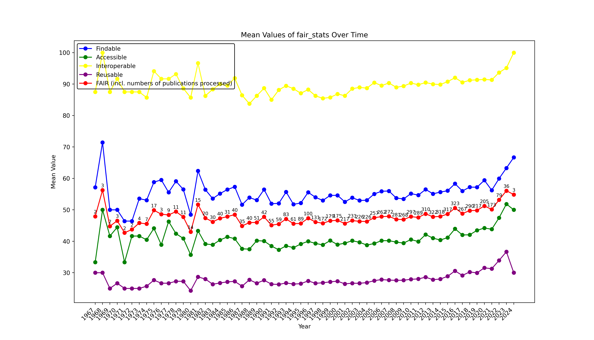
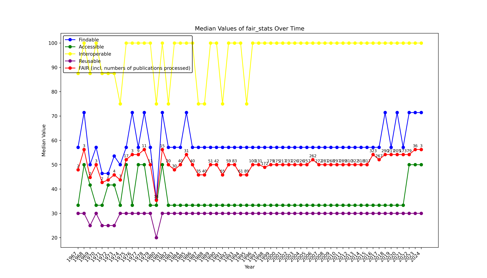

# Research Institute Summaries

## summary_hhu

[Back to top](#table-of-contents)

[Back to top](#table-of-contents)

### failure_explanations.csv

| metric       | explanation                                                                                                                                 |   count |
|:-------------|:--------------------------------------------------------------------------------------------------------------------------------------------|--------:|
| FsF-F3-01M   | WARNING: Valid data  identifier missing.                                                                                                    |    9901 |
| FsF-F4-01M   | INFO: Will exclusively consider community specific metadata standards for FsF-F4-01M-1 which are specified in metrics -:                    |    4649 |
| FsF-F4-01M   | INFO: Will exclusively consider community specific metadata offering methods for FsF-F4-01M-1 which are specified in metrics -:             |    4649 |
| FsF-F4-01M   | WARNING: Metadata is NOT found through -:                                                                                                   |    4649 |
| FsF-F4-01M   | INFO: Querying DataCite API for -:                                                                                                          |    4636 |
| FsF-F4-01M   | INFO: Identifier not listed in DataCite catalogue -:                                                                                        |    4636 |
| FsF-F4-01M   | WARNING: Google Search Cache DB does not exist, see F-UJI installation instructions                                                         |    4649 |
| FsF-F4-01M   | INFO: Identifier not listed in Google Dataset Search cache -:['                                                                             |    1647 |
| FsF-F4-01M   | INFO: Querying Mendeley Data API for -:                                                                                                     |    7580 |
| FsF-F4-01M   | INFO: Identifier not listed in Mendeley Data catalogue -:                                                                                   |    4578 |
| FsF-F4-01M   | WARNING: Metadata is NOT found through registries considered by the assessment service  -:                                                  |    4649 |
| FsF-A1-01M   | WARNING: NO access information is available in metadata                                                                                     |    7384 |
| FsF-A1-01M   | INFO: Skipping standard terms test since NO access information is available in metadata                                                     |   14768 |
| FsF-A1-01M   | INFO: Skipping machine readablility test since NO access information is available in metadata                                               |    7384 |
| FsF-A1-01M   | WARNING: Unable to determine the access level                                                                                               |    7384 |
| FsF-A1-03D   | WARNING: Skipping protocol test for data since NO content  identifier is given in metadata                                                  |    9901 |
| FsF-I3-01M   | WARNING: Could not identify qualified related resources in metadata                                                                         |    3051 |
| FsF-R1-01MD  | INFO: Invalid resource type  specified -:                                                                                                   |    2245 |
| FsF-R1-01MD  | ERROR: The evaluated resource does not identify itself as a “dataset” but as , so F-UJI may not be the right tool for this type of resource |    2245 |
| FsF-R1-01MD  | WARNING: NO data object content available/accessible to perform file descriptors  tests                                                     |    4454 |
| FsF-R1.1-01M | WARNING: License information unavailable in metadata                                                                                        |    9484 |
| FsF-R1.1-01M | INFO: Will consider all SPDX licenses as community specific licenses for FsF-R1.1-01M                                                       |    9484 |
| FsF-R1.1-01M | WARNING: Skipping SPDX and community license verification since license information unavailable in metadata                                 |    9484 |
| FsF-R1.2-01M | INFO: Check if provenance information is available in descriptive metadata                                                                  |    2272 |
| FsF-R1.2-01M | INFO: Check if provenance information is available in metadata about related resources                                                      |    2272 |
| FsF-R1.2-01M | WARNING: No provenance information found in metadata about related resources                                                                |    2272 |
| FsF-R1.2-01M | INFO: Check if provenance specific namespaces are listed in metadata                                                                        |    2272 |
| FsF-R1.2-01M | WARNING: Formal provenance metadata is unavailable                                                                                          |    2272 |
| FsF-R1.3-02D | WARNING: Could not perform file format checks as data content identifier unavailable/inaccesible                                            |    9901 |
| FsF-F4-01M   | INFO: Identifier not listed in Google Dataset Search cache -:[' '                                                                           |    3002 |
| FsF-R1-01MD  | WARNING: No resource type given                                                                                                             |    2209 |
| FsF-R1-01MD  | ERROR: The evaluated resource does not identify itself as a “dataset” so F-UJI may not be the right tool for this type of resource          |    2209 |
| FsF-I3-01M   | INFO: No related resource found in Dublin Core metadata                                                                                     |     704 |
| FsF-A1-01M   | INFO: Found CreativeCommons license -:                                                                                                      |      68 |
| FsF-A1-01M   | WARNING: Access condition looks like license, therefore the following is ignored -:                                                         |      68 |
| FsF-R1.1-01M | INFO: License expressed as access condition , therefore moved from FsF-A1-01M -:                                                            |      71 |
| FsF-I1-01M   | INFO: Check of structured data  embedded in the data page                                                                                   |     108 |
| FsF-I1-01M   | INFO: RDFa like  serialization found in the data page - RDFa                                                                                |      67 |
| FsF-I1-01M   | SUCCESS: Found structured data  in the data page                                                                                            |      67 |
| FsF-I1-01M   | INFO: Check if RDF-based typed link included                                                                                                |     108 |
| FsF-I1-01M   | INFO: NO RDF-based typed link found                                                                                                         |     108 |
| FsF-I1-01M   | INFO: Check if RDF metadata available through content negotiation                                                                           |     108 |
| FsF-I1-01M   | INFO: NO RDF metadata available through content negotiation                                                                                 |     108 |
| FsF-I1-01M   | INFO: NO SPARQL endpoint found through re3data based on the object URI provided                                                             |     108 |
| FsF-I2-01M   | INFO: Removing default namespaces from 2 vocabulary namespaces found in structured metadata                                                 |      64 |
| FsF-I2-01M   | INFO: Default vocabulary namespace excluded -: [' '                                                                                         |      64 |
| FsF-I2-01M   | WARNING: NO namespaces of semantic vocabularies found in the metadata                                                                       |     103 |
| FsF-I2-01M   | INFO: Skipping namespace lookup in LOD registry list since no namespaces available                                                          |     103 |
| FsF-I2-01M   | WARNING: NO known vocabulary namespace URI is found which is listed in  the LOD registry                                                    |     103 |
| FsF-F4-01M   | ERROR: Mendeley Data API not available or returns errors: HTTPSConnectionPool: Read timed out.                                              |      71 |
| FsF-I1-01M   | INFO: NO structured data  embedded in the data page                                                                                         |      41 |
| FsF-R1.3-01M | INFO: re3data/datacite client id -: None                                                                                                    |      39 |
| FsF-R1.3-01M | WARNING: Skipped external ressources  checks since landing page could not be resolved                                                       |      39 |
| FsF-R1.3-01M | WARNING: Unable to determine community standard                                                                                             |      39 |
| FsF-F4-01M   | ERROR: DataCite API not available or returns errors -:HTTPSConnectionPool: Read timed out.                                                  |      13 |
| FsF-I3-01M   | INFO: No related resource found in Datacite metadata                                                                                        |       5 |
| FsF-I1-01M   | INFO: JSON-LD  serialization found in the data page - JSON-LD                                                                               |       1 |
| FsF-R1.3-02D | INFO: Data content identifier provided -: ['                                                                                                |       1 |
| FsF-R1.3-02D | INFO: No mime type given in metadata, therefore the mime type given in HTTP header is used -: text/html                                     |       1 |

[Back to top](#table-of-contents)

### publisher_failures.csv

| publisher                                                                                                                | metric       |   count |
|:-------------------------------------------------------------------------------------------------------------------------|:-------------|--------:|
| American Chemical Society                                                                                                | FsF-F3-01M   |     115 |
| American Chemical Society                                                                                                | FsF-A1-03D   |     115 |
| American Chemical Society                                                                                                | FsF-R1.1-01M |     115 |
| American Chemical Society                                                                                                | FsF-R1.3-02D |     115 |
| American Chemical Society                                                                                                | FsF-I3-01M   |      50 |
| American Chemical Society                                                                                                | FsF-A1-01M   |       1 |
| ACS Publications                                                                                                         | FsF-F3-01M   |     250 |
| ACS Publications                                                                                                         | FsF-A1-03D   |     250 |
| ACS Publications                                                                                                         | FsF-R1.1-01M |     250 |
| ACS Publications                                                                                                         | FsF-R1.3-02D |     250 |
| ACS Publications                                                                                                         | FsF-I3-01M   |     110 |
| ACS Publications                                                                                                         | FsF-A1-01M   |       2 |
| American Chemical Society (ACS)                                                                                          | FsF-F3-01M   |     182 |
| American Chemical Society (ACS)                                                                                          | FsF-A1-03D   |     182 |
| American Chemical Society (ACS)                                                                                          | FsF-R1.1-01M |     182 |
| American Chemical Society (ACS)                                                                                          | FsF-R1.3-02D |     182 |
| American Chemical Society (ACS)                                                                                          | FsF-F4-01M   |      40 |
| American Chemical Society (ACS)                                                                                          | FsF-A1-01M   |      44 |
| American Chemical Society (ACS)                                                                                          | FsF-R1-01MD  |      40 |
| American Chemical Society (ACS)                                                                                          | FsF-I3-01M   |       2 |
| Society for Neuroscience                                                                                                 | FsF-F3-01M   |     120 |
| Society for Neuroscience                                                                                                 | FsF-A1-03D   |     120 |
| Society for Neuroscience                                                                                                 | FsF-R1.1-01M |     120 |
| Society for Neuroscience                                                                                                 | FsF-R1.3-02D |     120 |
| Society for Neuroscience                                                                                                 | FsF-I3-01M   |       2 |
| Journal of Neuroscience                                                                                                  | FsF-F3-01M   |      35 |
| Journal of Neuroscience                                                                                                  | FsF-A1-03D   |      35 |
| Journal of Neuroscience                                                                                                  | FsF-R1.1-01M |      35 |
| Journal of Neuroscience                                                                                                  | FsF-R1.3-02D |      35 |
| Journal of Neuroscience                                                                                                  | FsF-I3-01M   |       1 |
| Elsevier BV                                                                                                              | FsF-F3-01M   |    2687 |
| Elsevier BV                                                                                                              | FsF-F4-01M   |    2669 |
| Elsevier BV                                                                                                              | FsF-A1-01M   |    2687 |
| Elsevier BV                                                                                                              | FsF-A1-03D   |    2687 |
| Elsevier BV                                                                                                              | FsF-R1-01MD  |    2683 |
| Elsevier BV                                                                                                              | FsF-R1.1-01M |    2687 |
| Elsevier BV                                                                                                              | FsF-R1.3-02D |    2687 |
| Springer-Verlag                                                                                                          | FsF-F3-01M   |     968 |
| Springer-Verlag                                                                                                          | FsF-A1-03D   |     968 |
| Springer-Verlag                                                                                                          | FsF-R1.1-01M |     942 |
| Springer-Verlag                                                                                                          | FsF-R1.3-02D |     968 |
| Springer-Verlag                                                                                                          | FsF-A1-01M   |       2 |
| Springer                                                                                                                 | FsF-F3-01M   |     860 |
| Springer                                                                                                                 | FsF-A1-03D   |     860 |
| Springer                                                                                                                 | FsF-R1.1-01M |     798 |
| Springer                                                                                                                 | FsF-R1.3-02D |     860 |
| SpringerLink                                                                                                             | FsF-F3-01M   |     968 |
| SpringerLink                                                                                                             | FsF-A1-03D   |     968 |
| SpringerLink                                                                                                             | FsF-R1.1-01M |     906 |
| SpringerLink                                                                                                             | FsF-R1.3-02D |     968 |
| SpringerLink                                                                                                             | FsF-A1-01M   |     102 |
| SpringerLink                                                                                                             | FsF-I3-01M   |       4 |
| Springer Science and Business Media LLC                                                                                  | FsF-F3-01M   |    1508 |
| Springer Science and Business Media LLC                                                                                  | FsF-A1-03D   |    1508 |
| Springer Science and Business Media LLC                                                                                  | FsF-R1.1-01M |    1140 |
| Springer Science and Business Media LLC                                                                                  | FsF-R1.3-02D |    1508 |
| Springer Science and Business Media LLC                                                                                  | FsF-F4-01M   |       6 |
| Springer Science and Business Media LLC                                                                                  | FsF-A1-01M   |       8 |
| Springer Science and Business Media LLC                                                                                  | FsF-R1-01MD  |       6 |
| Nature Publishing Group US                                                                                               | FsF-F3-01M   |     145 |
| Nature Publishing Group US                                                                                               | FsF-A1-03D   |     145 |
| Nature Publishing Group US                                                                                               | FsF-R1.1-01M |     132 |
| Nature Publishing Group US                                                                                               | FsF-R1.3-02D |     145 |
| Nature Publishing Group                                                                                                  | FsF-F3-01M   |    1188 |
| Nature Publishing Group                                                                                                  | FsF-A1-03D   |    1188 |
| Nature Publishing Group                                                                                                  | FsF-R1.1-01M |     884 |
| Nature Publishing Group                                                                                                  | FsF-R1.3-02D |    1188 |
| Springer Nature                                                                                                          | FsF-F3-01M   |     594 |
| Springer Nature                                                                                                          | FsF-A1-03D   |     594 |
| Springer Nature                                                                                                          | FsF-R1.1-01M |     442 |
| Springer Nature                                                                                                          | FsF-R1.3-02D |     594 |
| Nature                                                                                                                   | FsF-F3-01M   |     594 |
| Nature                                                                                                                   | FsF-A1-03D   |     594 |
| Nature                                                                                                                   | FsF-R1.1-01M |     442 |
| Nature                                                                                                                   | FsF-R1.3-02D |     594 |
| Nature Publishing Group UK                                                                                               | FsF-F3-01M   |     435 |
| Nature Publishing Group UK                                                                                               | FsF-A1-03D   |     435 |
| Nature Publishing Group UK                                                                                               | FsF-R1.1-01M |     296 |
| Nature Publishing Group UK                                                                                               | FsF-R1.3-02D |     435 |
| Society of Nuclear Medicine                                                                                              | FsF-F3-01M   |      34 |
| Society of Nuclear Medicine                                                                                              | FsF-A1-03D   |      34 |
| Society of Nuclear Medicine                                                                                              | FsF-R1.1-01M |      34 |
| Society of Nuclear Medicine                                                                                              | FsF-R1.3-02D |      34 |
| Society of Nuclear Medicine                                                                                              | FsF-I3-01M   |       2 |
| Journal of Nuclear Medicine                                                                                              | FsF-F3-01M   |      16 |
| Journal of Nuclear Medicine                                                                                              | FsF-A1-03D   |      16 |
| Journal of Nuclear Medicine                                                                                              | FsF-R1.1-01M |      16 |
| Journal of Nuclear Medicine                                                                                              | FsF-R1.3-02D |      16 |
| Journal of Nuclear Medicine                                                                                              | FsF-I3-01M   |       1 |
| S. Karger AG                                                                                                             | FsF-F3-01M   |     104 |
| S. Karger AG                                                                                                             | FsF-A1-01M   |     104 |
| S. Karger AG                                                                                                             | FsF-A1-03D   |     104 |
| S. Karger AG                                                                                                             | FsF-R1.1-01M |     104 |
| S. Karger AG                                                                                                             | FsF-R1.3-02D |     104 |
| S. Karger AG                                                                                                             | FsF-F4-01M   |       1 |
| S. Karger AG                                                                                                             | FsF-R1-01MD  |       1 |
| Karger Publishers                                                                                                        | FsF-F3-01M   |      54 |
| Karger Publishers                                                                                                        | FsF-A1-01M   |      54 |
| Karger Publishers                                                                                                        | FsF-A1-03D   |      54 |
| Karger Publishers                                                                                                        | FsF-R1.1-01M |      54 |
| Karger Publishers                                                                                                        | FsF-R1.3-02D |      54 |
| ACM Conferences                                                                                                          | FsF-F3-01M   |       6 |
| ACM Conferences                                                                                                          | FsF-A1-01M   |       6 |
| ACM Conferences                                                                                                          | FsF-A1-03D   |       6 |
| ACM Conferences                                                                                                          | FsF-R1.1-01M |       6 |
| ACM Conferences                                                                                                          | FsF-R1.3-02D |       6 |
| ACM                                                                                                                      | FsF-F3-01M   |      17 |
| ACM                                                                                                                      | FsF-A1-01M   |      17 |
| ACM                                                                                                                      | FsF-A1-03D   |      17 |
| ACM                                                                                                                      | FsF-R1.1-01M |      17 |
| ACM                                                                                                                      | FsF-R1.3-02D |      17 |
| ACM                                                                                                                      | FsF-F4-01M   |       3 |
| ACM                                                                                                                      | FsF-I3-01M   |       3 |
| ACM                                                                                                                      | FsF-R1-01MD  |       3 |
| Springer Netherlands                                                                                                     | FsF-F3-01M   |      93 |
| Springer Netherlands                                                                                                     | FsF-A1-01M   |      23 |
| Springer Netherlands                                                                                                     | FsF-A1-03D   |      93 |
| Springer Netherlands                                                                                                     | FsF-R1.1-01M |      83 |
| Springer Netherlands                                                                                                     | FsF-R1.3-02D |      93 |
| Kluwer Academic Publishers                                                                                               | FsF-F3-01M   |      82 |
| Kluwer Academic Publishers                                                                                               | FsF-A1-03D   |      82 |
| Kluwer Academic Publishers                                                                                               | FsF-R1.1-01M |      82 |
| Kluwer Academic Publishers                                                                                               | FsF-R1.3-02D |      82 |
| BioMed Central                                                                                                           | FsF-F3-01M   |     711 |
| BioMed Central                                                                                                           | FsF-A1-03D   |     711 |
| BioMed Central                                                                                                           | FsF-R1.3-02D |     711 |
| BioMed Central                                                                                                           | FsF-R1.1-01M |      55 |
| BioMed Central                                                                                                           | FsF-A1-01M   |       3 |
| Springer Berlin Heidelberg                                                                                               | FsF-F3-01M   |     424 |
| Springer Berlin Heidelberg                                                                                               | FsF-A1-03D   |     424 |
| Springer Berlin Heidelberg                                                                                               | FsF-R1.1-01M |     373 |
| Springer Berlin Heidelberg                                                                                               | FsF-R1.3-02D |     424 |
| Springer Berlin Heidelberg                                                                                               | FsF-A1-01M   |     145 |
| Springer Berlin Heidelberg                                                                                               | FsF-I3-01M   |       3 |
| Springer Berlin Heidelberg                                                                                               | FsF-F4-01M   |       1 |
| Springer Berlin Heidelberg                                                                                               | FsF-R1-01MD  |       1 |
| Radiological Society of North America                                                                                    | FsF-F3-01M   |       7 |
| Radiological Society of North America                                                                                    | FsF-A1-01M   |       1 |
| Radiological Society of North America                                                                                    | FsF-A1-03D   |       7 |
| Radiological Society of North America                                                                                    | FsF-R1.1-01M |       7 |
| Radiological Society of North America                                                                                    | FsF-R1.3-02D |       7 |
| Radiology                                                                                                                | FsF-F3-01M   |      13 |
| Radiology                                                                                                                | FsF-A1-01M   |       4 |
| Radiology                                                                                                                | FsF-A1-03D   |      13 |
| Radiology                                                                                                                | FsF-R1.1-01M |      13 |
| Radiology                                                                                                                | FsF-R1.3-02D |      13 |
| Radiological Society of North America (RSNA)                                                                             | FsF-F3-01M   |      12 |
| Radiological Society of North America (RSNA)                                                                             | FsF-A1-01M   |       4 |
| Radiological Society of North America (RSNA)                                                                             | FsF-A1-03D   |      12 |
| Radiological Society of North America (RSNA)                                                                             | FsF-R1.1-01M |      12 |
| Radiological Society of North America (RSNA)                                                                             | FsF-R1.3-02D |      12 |
| Ovid Technologies (Wolters Kluwer Health)                                                                                | FsF-F3-01M   |     388 |
| Ovid Technologies (Wolters Kluwer Health)                                                                                | FsF-F4-01M   |     288 |
| Ovid Technologies (Wolters Kluwer Health)                                                                                | FsF-A1-01M   |     340 |
| Ovid Technologies (Wolters Kluwer Health)                                                                                | FsF-A1-03D   |     388 |
| Ovid Technologies (Wolters Kluwer Health)                                                                                | FsF-R1-01MD  |      32 |
| Ovid Technologies (Wolters Kluwer Health)                                                                                | FsF-R1.1-01M |     382 |
| Ovid Technologies (Wolters Kluwer Health)                                                                                | FsF-R1.3-02D |     388 |
| LWW                                                                                                                      | FsF-F3-01M   |     200 |
| LWW                                                                                                                      | FsF-F4-01M   |     200 |
| LWW                                                                                                                      | FsF-A1-01M   |     200 |
| LWW                                                                                                                      | FsF-A1-03D   |     200 |
| LWW                                                                                                                      | FsF-R1.1-01M |     200 |
| LWW                                                                                                                      | FsF-R1.3-02D |     200 |
| LWW                                                                                                                      | FsF-I3-01M   |      72 |
| American Society of Clinical Oncology                                                                                    | FsF-F3-01M   |      37 |
| American Society of Clinical Oncology                                                                                    | FsF-A1-03D   |      37 |
| American Society of Clinical Oncology                                                                                    | FsF-R1.3-02D |      37 |
| American Society of Clinical Oncology                                                                                    | FsF-R1.1-01M |      36 |
| Journal of Clinical Oncology                                                                                             | FsF-F3-01M   |      41 |
| Journal of Clinical Oncology                                                                                             | FsF-A1-03D   |      41 |
| Journal of Clinical Oncology                                                                                             | FsF-R1.3-02D |      41 |
| Journal of Clinical Oncology                                                                                             | FsF-R1.1-01M |      37 |
| Oxford University Press                                                                                                  | FsF-F3-01M   |     456 |
| Oxford University Press                                                                                                  | FsF-A1-01M   |     456 |
| Oxford University Press                                                                                                  | FsF-A1-03D   |     456 |
| Oxford University Press                                                                                                  | FsF-R1.1-01M |     456 |
| Oxford University Press                                                                                                  | FsF-R1.3-02D |     456 |
| Oxford Academic                                                                                                          | FsF-F3-01M   |     452 |
| Oxford Academic                                                                                                          | FsF-A1-01M   |     452 |
| Oxford Academic                                                                                                          | FsF-A1-03D   |     452 |
| Oxford Academic                                                                                                          | FsF-R1.1-01M |     452 |
| Oxford Academic                                                                                                          | FsF-R1.3-02D |     452 |
| OUP Academic                                                                                                             | FsF-F3-01M   |     454 |
| OUP Academic                                                                                                             | FsF-A1-01M   |     454 |
| OUP Academic                                                                                                             | FsF-A1-03D   |     454 |
| OUP Academic                                                                                                             | FsF-R1.1-01M |     454 |
| OUP Academic                                                                                                             | FsF-R1.3-02D |     454 |
| Oxford University Press (OUP)                                                                                            | FsF-F3-01M   |     583 |
| Oxford University Press (OUP)                                                                                            | FsF-A1-01M   |     583 |
| Oxford University Press (OUP)                                                                                            | FsF-A1-03D   |     583 |
| Oxford University Press (OUP)                                                                                            | FsF-R1.1-01M |     583 |
| Oxford University Press (OUP)                                                                                            | FsF-R1.3-02D |     583 |
| Oxford University Press (OUP)                                                                                            | FsF-F4-01M   |     111 |
| Oxford University Press (OUP)                                                                                            | FsF-R1-01MD  |     111 |
| American Diabetes Association                                                                                            | FsF-F3-01M   |     499 |
| American Diabetes Association                                                                                            | FsF-A1-01M   |     499 |
| American Diabetes Association                                                                                            | FsF-A1-03D   |     499 |
| American Diabetes Association                                                                                            | FsF-R1.1-01M |     499 |
| American Diabetes Association                                                                                            | FsF-R1.3-02D |     499 |
| American Diabetes Association                                                                                            | FsF-I3-01M   |       5 |
| American Diabetes Association                                                                                            | FsF-F4-01M   |       2 |
| American Diabetes Association                                                                                            | FsF-R1-01MD  |       2 |
| The Company of Biologists                                                                                                | FsF-F3-01M   |      84 |
| The Company of Biologists                                                                                                | FsF-A1-01M   |      84 |
| The Company of Biologists                                                                                                | FsF-A1-03D   |      84 |
| The Company of Biologists                                                                                                | FsF-R1.1-01M |      84 |
| The Company of Biologists                                                                                                | FsF-R1.3-02D |      84 |
| The Rockefeller University Press                                                                                         | FsF-F3-01M   |      36 |
| The Rockefeller University Press                                                                                         | FsF-A1-01M   |      36 |
| The Rockefeller University Press                                                                                         | FsF-A1-03D   |      36 |
| The Rockefeller University Press                                                                                         | FsF-R1.1-01M |      36 |
| The Rockefeller University Press                                                                                         | FsF-R1.3-02D |      36 |
| Rockefeller University Press                                                                                             | FsF-F3-01M   |      45 |
| Rockefeller University Press                                                                                             | FsF-A1-01M   |      45 |
| Rockefeller University Press                                                                                             | FsF-A1-03D   |      45 |
| Rockefeller University Press                                                                                             | FsF-R1.1-01M |      45 |
| Rockefeller University Press                                                                                             | FsF-R1.3-02D |      45 |
| Rockefeller University Press                                                                                             | FsF-F4-01M   |       1 |
| Rockefeller University Press                                                                                             | FsF-R1-01MD  |       1 |
| Lippincott Williams & Wilkins                                                                                            | FsF-F3-01M   |      43 |
| Lippincott Williams & Wilkins                                                                                            | FsF-A1-03D   |      43 |
| Lippincott Williams & Wilkins                                                                                            | FsF-R1.1-01M |      43 |
| Lippincott Williams & Wilkins                                                                                            | FsF-R1.3-02D |      43 |
| Lippincott Williams & Wilkins                                                                                            | FsF-A1-01M   |      27 |
| Stroke                                                                                                                   | FsF-F3-01M   |      16 |
| Stroke                                                                                                                   | FsF-A1-03D   |      16 |
| Stroke                                                                                                                   | FsF-R1.1-01M |      16 |
| Stroke                                                                                                                   | FsF-R1.3-02D |      16 |
| Stroke                                                                                                                   | FsF-A1-01M   |       3 |
| eLife Sciences Publications, Ltd                                                                                         | FsF-F3-01M   |      45 |
| eLife Sciences Publications, Ltd                                                                                         | FsF-A1-03D   |      45 |
| eLife Sciences Publications, Ltd                                                                                         | FsF-R1.1-01M |      45 |
| eLife Sciences Publications, Ltd                                                                                         | FsF-R1.3-02D |      45 |
| eLife Sciences Publications Limited                                                                                      | FsF-F3-01M   |      15 |
| eLife Sciences Publications Limited                                                                                      | FsF-A1-03D   |      15 |
| eLife Sciences Publications Limited                                                                                      | FsF-R1.1-01M |      15 |
| eLife Sciences Publications Limited                                                                                      | FsF-R1.3-02D |      15 |
| eLife                                                                                                                    | FsF-F3-01M   |      15 |
| eLife                                                                                                                    | FsF-A1-03D   |      15 |
| eLife                                                                                                                    | FsF-R1.1-01M |      15 |
| eLife                                                                                                                    | FsF-R1.3-02D |      15 |
| Institute of Mathematical Statistics                                                                                     | FsF-F3-01M   |       6 |
| Institute of Mathematical Statistics                                                                                     | FsF-F4-01M   |       6 |
| Institute of Mathematical Statistics                                                                                     | FsF-A1-01M   |       6 |
| Institute of Mathematical Statistics                                                                                     | FsF-A1-03D   |       6 |
| Institute of Mathematical Statistics                                                                                     | FsF-R1-01MD  |       6 |
| Institute of Mathematical Statistics                                                                                     | FsF-R1.1-01M |       6 |
| Institute of Mathematical Statistics                                                                                     | FsF-R1.3-02D |       6 |
| Springer, Berlin, Heidelberg                                                                                             | FsF-F3-01M   |      27 |
| Springer, Berlin, Heidelberg                                                                                             | FsF-A1-01M   |      27 |
| Springer, Berlin, Heidelberg                                                                                             | FsF-A1-03D   |      27 |
| Springer, Berlin, Heidelberg                                                                                             | FsF-R1.1-01M |      27 |
| Springer, Berlin, Heidelberg                                                                                             | FsF-R1.3-02D |      27 |
| Mary Ann Liebert, Inc.  140 Huguenot Street, 3rd Floor New Rochelle, NY 10801 USA                                        | FsF-F3-01M   |      21 |
| Mary Ann Liebert, Inc.  140 Huguenot Street, 3rd Floor New Rochelle, NY 10801 USA                                        | FsF-A1-01M   |      15 |
| Mary Ann Liebert, Inc.  140 Huguenot Street, 3rd Floor New Rochelle, NY 10801 USA                                        | FsF-A1-03D   |      21 |
| Mary Ann Liebert, Inc.  140 Huguenot Street, 3rd Floor New Rochelle, NY 10801 USA                                        | FsF-R1.1-01M |      21 |
| Mary Ann Liebert, Inc.  140 Huguenot Street, 3rd Floor New Rochelle, NY 10801 USA                                        | FsF-R1.3-02D |      21 |
| Astrobiology                                                                                                             | FsF-F3-01M   |       4 |
| Astrobiology                                                                                                             | FsF-A1-01M   |       3 |
| Astrobiology                                                                                                             | FsF-A1-03D   |       4 |
| Astrobiology                                                                                                             | FsF-R1.1-01M |       3 |
| Astrobiology                                                                                                             | FsF-R1.3-02D |       4 |
| Proceedings of the National Academy of Sciences                                                                          | FsF-F3-01M   |     125 |
| Proceedings of the National Academy of Sciences                                                                          | FsF-F4-01M   |      14 |
| Proceedings of the National Academy of Sciences                                                                          | FsF-A1-01M   |      67 |
| Proceedings of the National Academy of Sciences                                                                          | FsF-A1-03D   |     125 |
| Proceedings of the National Academy of Sciences                                                                          | FsF-R1-01MD  |      14 |
| Proceedings of the National Academy of Sciences                                                                          | FsF-R1.1-01M |     125 |
| Proceedings of the National Academy of Sciences                                                                          | FsF-R1.3-02D |     125 |
| Wiley                                                                                                                    | FsF-F3-01M   |     925 |
| Wiley                                                                                                                    | FsF-F4-01M   |     259 |
| Wiley                                                                                                                    | FsF-A1-01M   |     923 |
| Wiley                                                                                                                    | FsF-A1-03D   |     925 |
| Wiley                                                                                                                    | FsF-R1-01MD  |     259 |
| Wiley                                                                                                                    | FsF-R1.1-01M |     923 |
| Wiley                                                                                                                    | FsF-R1.3-02D |     925 |
| SAGE Publications                                                                                                        | FsF-F3-01M   |     107 |
| SAGE Publications                                                                                                        | FsF-F4-01M   |      24 |
| SAGE Publications                                                                                                        | FsF-A1-01M   |      36 |
| SAGE Publications                                                                                                        | FsF-A1-03D   |     107 |
| SAGE Publications                                                                                                        | FsF-R1-01MD  |      24 |
| SAGE Publications                                                                                                        | FsF-R1.1-01M |      97 |
| SAGE Publications                                                                                                        | FsF-R1.3-02D |     107 |
| John Wiley & Sons, Ltd                                                                                                   | FsF-F3-01M   |     762 |
| John Wiley & Sons, Ltd                                                                                                   | FsF-A1-01M   |     762 |
| John Wiley & Sons, Ltd                                                                                                   | FsF-A1-03D   |     762 |
| John Wiley & Sons, Ltd                                                                                                   | FsF-R1.1-01M |     762 |
| John Wiley & Sons, Ltd                                                                                                   | FsF-R1.3-02D |     762 |
| John Wiley & Sons, Ltd                                                                                                   | FsF-I3-01M   |     417 |
| John Wiley & Sons, Ltd                                                                                                   | FsF-I1-01M   |      63 |
| John Wiley & Sons, Ltd                                                                                                   | FsF-I2-01M   |      63 |
| Wiley Online Library                                                                                                     | FsF-F3-01M   |     541 |
| Wiley Online Library                                                                                                     | FsF-A1-01M   |     541 |
| Wiley Online Library                                                                                                     | FsF-A1-03D   |     541 |
| Wiley Online Library                                                                                                     | FsF-R1.1-01M |     541 |
| Wiley Online Library                                                                                                     | FsF-R1.3-02D |     541 |
| Wiley Online Library                                                                                                     | FsF-I3-01M   |     296 |
| Wiley Online Library                                                                                                     | FsF-I1-01M   |      43 |
| Wiley Online Library                                                                                                     | FsF-I2-01M   |      43 |
| http://www.eurekaselect.com                                                                                              | FsF-F3-01M   |      11 |
| http://www.eurekaselect.com                                                                                              | FsF-A1-01M   |      11 |
| http://www.eurekaselect.com                                                                                              | FsF-A1-03D   |      11 |
| http://www.eurekaselect.com                                                                                              | FsF-R1.1-01M |      11 |
| http://www.eurekaselect.com                                                                                              | FsF-R1.3-02D |      11 |
| http://www.eurekaselect.com                                                                                              | FsF-I3-01M   |       3 |
| Bentham Science Publishers Ltd.                                                                                          | FsF-F3-01M   |      16 |
| Bentham Science Publishers Ltd.                                                                                          | FsF-A1-01M   |      16 |
| Bentham Science Publishers Ltd.                                                                                          | FsF-A1-03D   |      16 |
| Bentham Science Publishers Ltd.                                                                                          | FsF-R1.1-01M |      16 |
| Bentham Science Publishers Ltd.                                                                                          | FsF-R1.3-02D |      16 |
| Microbiology Society                                                                                                     | FsF-F3-01M   |      32 |
| Microbiology Society                                                                                                     | FsF-A1-01M   |      32 |
| Microbiology Society                                                                                                     | FsF-A1-03D   |      32 |
| Microbiology Society                                                                                                     | FsF-R1.1-01M |      32 |
| Microbiology Society                                                                                                     | FsF-R1.3-02D |      32 |
| Microbiology Society                                                                                                     | FsF-I3-01M   |       8 |
| microbiologyresearch.org                                                                                                 | FsF-F3-01M   |      10 |
| microbiologyresearch.org                                                                                                 | FsF-A1-01M   |      10 |
| microbiologyresearch.org                                                                                                 | FsF-A1-03D   |      10 |
| microbiologyresearch.org                                                                                                 | FsF-R1.1-01M |      10 |
| microbiologyresearch.org                                                                                                 | FsF-R1.3-02D |      10 |
| microbiologyresearch.org                                                                                                 | FsF-I3-01M   |       4 |
| National Academy of Sciences                                                                                             | FsF-F3-01M   |      64 |
| National Academy of Sciences                                                                                             | FsF-A1-01M   |      37 |
| National Academy of Sciences                                                                                             | FsF-A1-03D   |      64 |
| National Academy of Sciences                                                                                             | FsF-R1.1-01M |      64 |
| National Academy of Sciences                                                                                             | FsF-R1.3-02D |      64 |
| PNAS                                                                                                                     | FsF-F3-01M   |      81 |
| PNAS                                                                                                                     | FsF-A1-01M   |      41 |
| PNAS                                                                                                                     | FsF-A1-03D   |      81 |
| PNAS                                                                                                                     | FsF-R1.1-01M |      81 |
| PNAS                                                                                                                     | FsF-R1.3-02D |      81 |
| Optica Publishing Group                                                                                                  | FsF-F3-01M   |      28 |
| Optica Publishing Group                                                                                                  | FsF-A1-03D   |      28 |
| Optica Publishing Group                                                                                                  | FsF-R1.1-01M |      28 |
| Optica Publishing Group                                                                                                  | FsF-R1.3-02D |      28 |
| Optica Publishing Group                                                                                                  | FsF-F4-01M   |       2 |
| Optica Publishing Group                                                                                                  | FsF-A1-01M   |       2 |
| Optica Publishing Group                                                                                                  | FsF-R1-01MD  |       2 |
| Annual Reviews                                                                                                           | FsF-F3-01M   |      62 |
| Annual Reviews                                                                                                           | FsF-A1-01M   |      62 |
| Annual Reviews                                                                                                           | FsF-A1-03D   |      62 |
| Annual Reviews                                                                                                           | FsF-R1.1-01M |      62 |
| Annual Reviews                                                                                                           | FsF-R1.3-02D |      62 |
| Annual Reviews                                                                                                           | FsF-I3-01M   |      14 |
| American Association for Cancer Research                                                                                 | FsF-F3-01M   |     102 |
| American Association for Cancer Research                                                                                 | FsF-A1-01M   |     102 |
| American Association for Cancer Research                                                                                 | FsF-A1-03D   |     102 |
| American Association for Cancer Research                                                                                 | FsF-R1.1-01M |     102 |
| American Association for Cancer Research                                                                                 | FsF-R1.3-02D |     102 |
| American Association for Cancer Research (AACR)                                                                          | FsF-F3-01M   |      24 |
| American Association for Cancer Research (AACR)                                                                          | FsF-A1-01M   |      24 |
| American Association for Cancer Research (AACR)                                                                          | FsF-A1-03D   |      24 |
| American Association for Cancer Research (AACR)                                                                          | FsF-R1.1-01M |      24 |
| American Association for Cancer Research (AACR)                                                                          | FsF-R1.3-02D |      24 |
| American Association for Cancer Research (AACR)                                                                          | FsF-F4-01M   |       2 |
| American Association for Cancer Research (AACR)                                                                          | FsF-R1-01MD  |       2 |
| SAGE PublicationsSage UK: London, England                                                                                | FsF-F3-01M   |      49 |
| SAGE PublicationsSage UK: London, England                                                                                | FsF-A1-03D   |      49 |
| SAGE PublicationsSage UK: London, England                                                                                | FsF-R1.1-01M |      43 |
| SAGE PublicationsSage UK: London, England                                                                                | FsF-R1.3-02D |      49 |
| SAGE PublicationsSage UK: London, England                                                                                | FsF-A1-01M   |       3 |
| Sage Journals                                                                                                            | FsF-F3-01M   |      75 |
| Sage Journals                                                                                                            | FsF-A1-03D   |      75 |
| Sage Journals                                                                                                            | FsF-R1.1-01M |      67 |
| Sage Journals                                                                                                            | FsF-R1.3-02D |      75 |
| Sage Journals                                                                                                            | FsF-A1-01M   |      10 |
| BMJ Publishing Group Ltd                                                                                                 | FsF-F3-01M   |     104 |
| BMJ Publishing Group Ltd                                                                                                 | FsF-A1-03D   |     104 |
| BMJ Publishing Group Ltd                                                                                                 | FsF-R1.1-01M |     104 |
| BMJ Publishing Group Ltd                                                                                                 | FsF-R1.3-02D |     104 |
| BMJ Publishing Group Ltd                                                                                                 | FsF-I3-01M   |       2 |
| Journal of Medical Genetics                                                                                              | FsF-F3-01M   |       7 |
| Journal of Medical Genetics                                                                                              | FsF-A1-03D   |       7 |
| Journal of Medical Genetics                                                                                              | FsF-R1.1-01M |       7 |
| Journal of Medical Genetics                                                                                              | FsF-R1.3-02D |       7 |
| BMJ                                                                                                                      | FsF-F3-01M   |      89 |
| BMJ                                                                                                                      | FsF-A1-03D   |      89 |
| BMJ                                                                                                                      | FsF-R1.1-01M |      89 |
| BMJ                                                                                                                      | FsF-R1.3-02D |      89 |
| BMJ                                                                                                                      | FsF-F4-01M   |       1 |
| BMJ                                                                                                                      | FsF-A1-01M   |       1 |
| BMJ                                                                                                                      | FsF-R1-01MD  |       1 |
| The University of Chicago PressChicago, IL                                                                               | FsF-F3-01M   |       2 |
| The University of Chicago PressChicago, IL                                                                               | FsF-A1-03D   |       2 |
| The University of Chicago PressChicago, IL                                                                               | FsF-R1.1-01M |       2 |
| The University of Chicago PressChicago, IL                                                                               | FsF-R1.3-02D |       2 |
| Journal of Political Economy                                                                                             | FsF-F3-01M   |       2 |
| Journal of Political Economy                                                                                             | FsF-A1-03D   |       2 |
| Journal of Political Economy                                                                                             | FsF-R1.1-01M |       2 |
| Journal of Political Economy                                                                                             | FsF-R1.3-02D |       2 |
| Informa UK Limited                                                                                                       | FsF-F3-01M   |      71 |
| Informa UK Limited                                                                                                       | FsF-F4-01M   |      67 |
| Informa UK Limited                                                                                                       | FsF-A1-01M   |      71 |
| Informa UK Limited                                                                                                       | FsF-A1-03D   |      71 |
| Informa UK Limited                                                                                                       | FsF-R1-01MD  |      67 |
| Informa UK Limited                                                                                                       | FsF-R1.1-01M |      71 |
| Informa UK Limited                                                                                                       | FsF-R1.3-02D |      71 |
| JAMA Network                                                                                                             | FsF-F3-01M   |      28 |
| JAMA Network                                                                                                             | FsF-A1-01M   |      28 |
| JAMA Network                                                                                                             | FsF-A1-03D   |      28 |
| JAMA Network                                                                                                             | FsF-R1.1-01M |      28 |
| JAMA Network                                                                                                             | FsF-R1.3-02D |      28 |
| American Medical Association                                                                                             | FsF-F3-01M   |      28 |
| American Medical Association                                                                                             | FsF-A1-01M   |      28 |
| American Medical Association                                                                                             | FsF-A1-03D   |      28 |
| American Medical Association                                                                                             | FsF-R1.1-01M |      28 |
| American Medical Association                                                                                             | FsF-R1.3-02D |      28 |
| American Medical Association (AMA)                                                                                       | FsF-F3-01M   |      36 |
| American Medical Association (AMA)                                                                                       | FsF-A1-01M   |      36 |
| American Medical Association (AMA)                                                                                       | FsF-A1-03D   |      36 |
| American Medical Association (AMA)                                                                                       | FsF-R1.1-01M |      36 |
| American Medical Association (AMA)                                                                                       | FsF-R1.3-02D |      36 |
| American Medical Association (AMA)                                                                                       | FsF-F4-01M   |      12 |
| American Medical Association (AMA)                                                                                       | FsF-R1-01MD  |      12 |
| Sage PublicationsSage CA: Thousand Oaks, CA                                                                              | FsF-F3-01M   |       6 |
| Sage PublicationsSage CA: Thousand Oaks, CA                                                                              | FsF-A1-01M   |       6 |
| Sage PublicationsSage CA: Thousand Oaks, CA                                                                              | FsF-A1-03D   |       6 |
| Sage PublicationsSage CA: Thousand Oaks, CA                                                                              | FsF-R1.1-01M |       6 |
| Sage PublicationsSage CA: Thousand Oaks, CA                                                                              | FsF-R1.3-02D |       6 |
| Neurology                                                                                                                | FsF-F3-01M   |      17 |
| Neurology                                                                                                                | FsF-A1-01M   |      17 |
| Neurology                                                                                                                | FsF-A1-03D   |      17 |
| Neurology                                                                                                                | FsF-R1.1-01M |      17 |
| Neurology                                                                                                                | FsF-R1.3-02D |      17 |
| American Society for Microbiology                                                                                        | FsF-F3-01M   |      94 |
| American Society for Microbiology                                                                                        | FsF-A1-03D   |      94 |
| American Society for Microbiology                                                                                        | FsF-R1.1-01M |      94 |
| American Society for Microbiology                                                                                        | FsF-R1.3-02D |      94 |
| American Society for Microbiology                                                                                        | FsF-F4-01M   |      19 |
| American Society for Microbiology                                                                                        | FsF-A1-01M   |      23 |
| American Society for Microbiology                                                                                        | FsF-R1-01MD  |      19 |
| Applied and Environmental Microbiology                                                                                   | FsF-F3-01M   |       7 |
| Applied and Environmental Microbiology                                                                                   | FsF-A1-03D   |       7 |
| Applied and Environmental Microbiology                                                                                   | FsF-R1.1-01M |       7 |
| Applied and Environmental Microbiology                                                                                   | FsF-R1.3-02D |       7 |
| © Georg Thieme Verlag Stuttgart · New York                                                                               | FsF-F3-01M   |      24 |
| © Georg Thieme Verlag Stuttgart · New York                                                                               | FsF-A1-01M   |      24 |
| © Georg Thieme Verlag Stuttgart · New York                                                                               | FsF-A1-03D   |      24 |
| © Georg Thieme Verlag Stuttgart · New York                                                                               | FsF-R1.1-01M |      24 |
| © Georg Thieme Verlag Stuttgart · New York                                                                               | FsF-R1.3-02D |      24 |
| © Georg Thieme Verlag Stuttgart · New York                                                                               | FsF-I3-01M   |      17 |
| Georg Thieme Verlag KG                                                                                                   | FsF-F3-01M   |      90 |
| Georg Thieme Verlag KG                                                                                                   | FsF-A1-01M   |      90 |
| Georg Thieme Verlag KG                                                                                                   | FsF-A1-03D   |      90 |
| Georg Thieme Verlag KG                                                                                                   | FsF-R1.1-01M |      90 |
| Georg Thieme Verlag KG                                                                                                   | FsF-R1.3-02D |      90 |
| Georg Thieme Verlag KG                                                                                                   | FsF-I3-01M   |       1 |
| Multidisciplinary Digital Publishing Institute                                                                           | FsF-F3-01M   |     156 |
| Multidisciplinary Digital Publishing Institute                                                                           | FsF-A1-01M   |     156 |
| Multidisciplinary Digital Publishing Institute                                                                           | FsF-A1-03D   |     156 |
| Multidisciplinary Digital Publishing Institute                                                                           | FsF-R1.1-01M |     156 |
| Multidisciplinary Digital Publishing Institute                                                                           | FsF-R1.3-02D |     156 |
| MDPI                                                                                                                     | FsF-F3-01M   |      59 |
| MDPI                                                                                                                     | FsF-A1-01M   |      59 |
| MDPI                                                                                                                     | FsF-A1-03D   |      59 |
| MDPI                                                                                                                     | FsF-R1.1-01M |      59 |
| MDPI                                                                                                                     | FsF-R1.3-02D |      59 |
| MDPI AG                                                                                                                  | FsF-F3-01M   |      74 |
| MDPI AG                                                                                                                  | FsF-A1-01M   |      74 |
| MDPI AG                                                                                                                  | FsF-A1-03D   |      74 |
| MDPI AG                                                                                                                  | FsF-R1.1-01M |      74 |
| MDPI AG                                                                                                                  | FsF-R1.3-02D |      74 |
| Korea Institute of Science and Technology Information                                                                    | FsF-F3-01M   |       2 |
| Korea Institute of Science and Technology Information                                                                    | FsF-A1-01M   |       2 |
| Korea Institute of Science and Technology Information                                                                    | FsF-A1-03D   |       2 |
| Korea Institute of Science and Technology Information                                                                    | FsF-I1-01M   |       2 |
| Korea Institute of Science and Technology Information                                                                    | FsF-I2-01M   |       2 |
| Korea Institute of Science and Technology Information                                                                    | FsF-R1.1-01M |       2 |
| Korea Institute of Science and Technology Information                                                                    | FsF-R1.3-02D |       2 |
| JOURNAL OF INFORMATION SCIENCE THEORY AND PRACTICE                                                                       | FsF-F3-01M   |       1 |
| JOURNAL OF INFORMATION SCIENCE THEORY AND PRACTICE                                                                       | FsF-A1-01M   |       1 |
| JOURNAL OF INFORMATION SCIENCE THEORY AND PRACTICE                                                                       | FsF-A1-03D   |       1 |
| JOURNAL OF INFORMATION SCIENCE THEORY AND PRACTICE                                                                       | FsF-I1-01M   |       1 |
| JOURNAL OF INFORMATION SCIENCE THEORY AND PRACTICE                                                                       | FsF-I2-01M   |       1 |
| JOURNAL OF INFORMATION SCIENCE THEORY AND PRACTICE                                                                       | FsF-R1.1-01M |       1 |
| JOURNAL OF INFORMATION SCIENCE THEORY AND PRACTICE                                                                       | FsF-R1.3-02D |       1 |
| American Physical Society                                                                                                | FsF-F3-01M   |      59 |
| American Physical Society                                                                                                | FsF-A1-01M   |      59 |
| American Physical Society                                                                                                | FsF-A1-03D   |      59 |
| American Physical Society                                                                                                | FsF-I3-01M   |      31 |
| American Physical Society                                                                                                | FsF-R1.1-01M |      59 |
| American Physical Society                                                                                                | FsF-R1.3-02D |      59 |
| Physical Review Letters                                                                                                  | FsF-F3-01M   |      36 |
| Physical Review Letters                                                                                                  | FsF-A1-01M   |      36 |
| Physical Review Letters                                                                                                  | FsF-A1-03D   |      36 |
| Physical Review Letters                                                                                                  | FsF-I3-01M   |      18 |
| Physical Review Letters                                                                                                  | FsF-R1.1-01M |      36 |
| Physical Review Letters                                                                                                  | FsF-R1.3-02D |      36 |
| Public Library of Science                                                                                                | FsF-F3-01M   |     151 |
| Public Library of Science                                                                                                | FsF-A1-01M   |     151 |
| Public Library of Science                                                                                                | FsF-A1-03D   |     151 |
| Public Library of Science                                                                                                | FsF-R1.1-01M |     151 |
| Public Library of Science                                                                                                | FsF-R1.3-02D |     151 |
| Cambridge University Press                                                                                               | FsF-F3-01M   |      68 |
| Cambridge University Press                                                                                               | FsF-A1-01M   |      68 |
| Cambridge University Press                                                                                               | FsF-A1-03D   |      68 |
| Cambridge University Press                                                                                               | FsF-R1.1-01M |      68 |
| Cambridge University Press                                                                                               | FsF-R1.3-02D |      68 |
| Cambridge University Press                                                                                               | FsF-I3-01M   |       4 |
| Cambridge Core                                                                                                           | FsF-F3-01M   |      51 |
| Cambridge Core                                                                                                           | FsF-A1-01M   |      51 |
| Cambridge Core                                                                                                           | FsF-A1-03D   |      51 |
| Cambridge Core                                                                                                           | FsF-R1.1-01M |      51 |
| Cambridge Core                                                                                                           | FsF-R1.3-02D |      51 |
| Cambridge Core                                                                                                           | FsF-I3-01M   |       2 |
| Royal College of Psychiatrists                                                                                           | FsF-F3-01M   |      10 |
| Royal College of Psychiatrists                                                                                           | FsF-A1-01M   |      10 |
| Royal College of Psychiatrists                                                                                           | FsF-A1-03D   |      10 |
| Royal College of Psychiatrists                                                                                           | FsF-R1.1-01M |      10 |
| Royal College of Psychiatrists                                                                                           | FsF-R1.3-02D |      10 |
| American Society of Hematology                                                                                           | FsF-F3-01M   |     126 |
| American Society of Hematology                                                                                           | FsF-F4-01M   |      65 |
| American Society of Hematology                                                                                           | FsF-A1-01M   |     126 |
| American Society of Hematology                                                                                           | FsF-A1-03D   |     126 |
| American Society of Hematology                                                                                           | FsF-R1-01MD  |      65 |
| American Society of Hematology                                                                                           | FsF-R1.1-01M |     126 |
| American Society of Hematology                                                                                           | FsF-R1.3-02D |     126 |
| The Royal Society of Chemistry                                                                                           | FsF-F3-01M   |     154 |
| The Royal Society of Chemistry                                                                                           | FsF-A1-03D   |     154 |
| The Royal Society of Chemistry                                                                                           | FsF-R1.1-01M |     154 |
| The Royal Society of Chemistry                                                                                           | FsF-R1.3-02D |     154 |
| Royal Society of Chemistry (RSC)                                                                                         | FsF-F3-01M   |      82 |
| Royal Society of Chemistry (RSC)                                                                                         | FsF-A1-03D   |      82 |
| Royal Society of Chemistry (RSC)                                                                                         | FsF-R1.1-01M |      82 |
| Royal Society of Chemistry (RSC)                                                                                         | FsF-R1.3-02D |      82 |
| Lippincott Williams & WilkinsHagerstown, MD                                                                              | FsF-F3-01M   |      29 |
| Lippincott Williams & WilkinsHagerstown, MD                                                                              | FsF-A1-03D   |      29 |
| Lippincott Williams & WilkinsHagerstown, MD                                                                              | FsF-R1.1-01M |      26 |
| Lippincott Williams & WilkinsHagerstown, MD                                                                              | FsF-R1.3-02D |      29 |
| Arteriosclerosis, Thrombosis, and Vascular Biology                                                                       | FsF-F3-01M   |       9 |
| Arteriosclerosis, Thrombosis, and Vascular Biology                                                                       | FsF-A1-03D   |       9 |
| Arteriosclerosis, Thrombosis, and Vascular Biology                                                                       | FsF-R1.1-01M |       9 |
| Arteriosclerosis, Thrombosis, and Vascular Biology                                                                       | FsF-R1.3-02D |       9 |
| Arteriosclerosis, Thrombosis, and Vascular Biology                                                                       | FsF-A1-01M   |       6 |
| Chemistry Europe                                                                                                         | FsF-F3-01M   |      26 |
| Chemistry Europe                                                                                                         | FsF-A1-01M   |      26 |
| Chemistry Europe                                                                                                         | FsF-A1-03D   |      26 |
| Chemistry Europe                                                                                                         | FsF-I3-01M   |      17 |
| Chemistry Europe                                                                                                         | FsF-R1.1-01M |      26 |
| Chemistry Europe                                                                                                         | FsF-R1.3-02D |      26 |
| Chemistry Europe                                                                                                         | FsF-I1-01M   |       4 |
| Chemistry Europe                                                                                                         | FsF-I2-01M   |       4 |
| International Parkinson and Movement Disorder Society                                                                    | FsF-F3-01M   |      14 |
| International Parkinson and Movement Disorder Society                                                                    | FsF-A1-01M   |      14 |
| International Parkinson and Movement Disorder Society                                                                    | FsF-A1-03D   |      14 |
| International Parkinson and Movement Disorder Society                                                                    | FsF-R1.1-01M |      14 |
| International Parkinson and Movement Disorder Society                                                                    | FsF-R1.3-02D |      14 |
| International Parkinson and Movement Disorder Society                                                                    | FsF-I3-01M   |      10 |
| International Parkinson and Movement Disorder Society                                                                    | FsF-I1-01M   |       1 |
| International Parkinson and Movement Disorder Society                                                                    | FsF-I2-01M   |       1 |
| Kluwer Academic Publishers-Plenum Publishers                                                                             | FsF-F3-01M   |      36 |
| Kluwer Academic Publishers-Plenum Publishers                                                                             | FsF-A1-03D   |      36 |
| Kluwer Academic Publishers-Plenum Publishers                                                                             | FsF-R1.1-01M |      36 |
| Kluwer Academic Publishers-Plenum Publishers                                                                             | FsF-R1.3-02D |      36 |
| American Association for the Advancement of Science (AAAS)                                                               | FsF-F3-01M   |      43 |
| American Association for the Advancement of Science (AAAS)                                                               | FsF-F4-01M   |       9 |
| American Association for the Advancement of Science (AAAS)                                                               | FsF-A1-01M   |      13 |
| American Association for the Advancement of Science (AAAS)                                                               | FsF-A1-03D   |      43 |
| American Association for the Advancement of Science (AAAS)                                                               | FsF-R1-01MD  |       9 |
| American Association for the Advancement of Science (AAAS)                                                               | FsF-R1.1-01M |      43 |
| American Association for the Advancement of Science (AAAS)                                                               | FsF-R1.3-02D |      43 |
| Circulation Research                                                                                                     | FsF-F3-01M   |      13 |
| Circulation Research                                                                                                     | FsF-A1-03D   |      13 |
| Circulation Research                                                                                                     | FsF-R1.1-01M |      13 |
| Circulation Research                                                                                                     | FsF-R1.3-02D |      13 |
| Circulation Research                                                                                                     | FsF-A1-01M   |       3 |
| British Medical Journal Publishing Group                                                                                 | FsF-F3-01M   |      30 |
| British Medical Journal Publishing Group                                                                                 | FsF-A1-03D   |      30 |
| British Medical Journal Publishing Group                                                                                 | FsF-R1.1-01M |      30 |
| British Medical Journal Publishing Group                                                                                 | FsF-R1.3-02D |      30 |
| The BMJ                                                                                                                  | FsF-F3-01M   |      13 |
| The BMJ                                                                                                                  | FsF-A1-03D   |      13 |
| The BMJ                                                                                                                  | FsF-R1.1-01M |      13 |
| The BMJ                                                                                                                  | FsF-R1.3-02D |      13 |
| Diagnostic and Interventional Radiology                                                                                  | FsF-F3-01M   |       1 |
| Diagnostic and Interventional Radiology                                                                                  | FsF-A1-01M   |       1 |
| Diagnostic and Interventional Radiology                                                                                  | FsF-A1-03D   |       1 |
| Diagnostic and Interventional Radiology                                                                                  | FsF-R1.1-01M |       1 |
| Diagnostic and Interventional Radiology                                                                                  | FsF-R1.3-02D |       1 |
| Galenos Yayinevi                                                                                                         | FsF-F3-01M   |       2 |
| Galenos Yayinevi                                                                                                         | FsF-A1-01M   |       2 |
| Galenos Yayinevi                                                                                                         | FsF-A1-03D   |       2 |
| Galenos Yayinevi                                                                                                         | FsF-R1.1-01M |       2 |
| Galenos Yayinevi                                                                                                         | FsF-R1.3-02D |       2 |
| American Physical Society (APS)                                                                                          | FsF-F3-01M   |     114 |
| American Physical Society (APS)                                                                                          | FsF-A1-01M   |     114 |
| American Physical Society (APS)                                                                                          | FsF-A1-03D   |     114 |
| American Physical Society (APS)                                                                                          | FsF-R1.1-01M |     114 |
| American Physical Society (APS)                                                                                          | FsF-R1.3-02D |     114 |
| American Physical Society (APS)                                                                                          | FsF-F4-01M   |      58 |
| American Physical Society (APS)                                                                                          | FsF-R1-01MD  |      58 |
| Springer Vienna                                                                                                          | FsF-F3-01M   |      36 |
| Springer Vienna                                                                                                          | FsF-A1-01M   |      14 |
| Springer Vienna                                                                                                          | FsF-A1-03D   |      36 |
| Springer Vienna                                                                                                          | FsF-R1.1-01M |      30 |
| Springer Vienna                                                                                                          | FsF-R1.3-02D |      36 |
| Springer, Vienna                                                                                                         | FsF-F3-01M   |       8 |
| Springer, Vienna                                                                                                         | FsF-A1-01M   |       8 |
| Springer, Vienna                                                                                                         | FsF-A1-03D   |       8 |
| Springer, Vienna                                                                                                         | FsF-R1.1-01M |       8 |
| Springer, Vienna                                                                                                         | FsF-R1.3-02D |       8 |
| Public Library of Science (PLoS)                                                                                         | FsF-F3-01M   |     218 |
| Public Library of Science (PLoS)                                                                                         | FsF-A1-01M   |     218 |
| Public Library of Science (PLoS)                                                                                         | FsF-A1-03D   |     218 |
| Public Library of Science (PLoS)                                                                                         | FsF-R1.1-01M |     218 |
| Public Library of Science (PLoS)                                                                                         | FsF-R1.3-02D |     218 |
| AIP Publishing                                                                                                           | FsF-F3-01M   |     174 |
| AIP Publishing                                                                                                           | FsF-A1-01M   |     174 |
| AIP Publishing                                                                                                           | FsF-A1-03D   |     174 |
| AIP Publishing                                                                                                           | FsF-R1.1-01M |     174 |
| AIP Publishing                                                                                                           | FsF-R1.3-02D |     174 |
| American Society for Clinical Investigation                                                                              | FsF-F3-01M   |     170 |
| American Society for Clinical Investigation                                                                              | FsF-A1-01M   |     170 |
| American Society for Clinical Investigation                                                                              | FsF-A1-03D   |     170 |
| American Society for Clinical Investigation                                                                              | FsF-R1.1-01M |     170 |
| American Society for Clinical Investigation                                                                              | FsF-R1.3-02D |     170 |
| American Society for Clinical Investigation                                                                              | FsF-I3-01M   |       4 |
| Cambridge University Press (CUP)                                                                                         | FsF-F3-01M   |      38 |
| Cambridge University Press (CUP)                                                                                         | FsF-A1-01M   |      36 |
| Cambridge University Press (CUP)                                                                                         | FsF-A1-03D   |      38 |
| Cambridge University Press (CUP)                                                                                         | FsF-R1.1-01M |      38 |
| Cambridge University Press (CUP)                                                                                         | FsF-R1.3-02D |      38 |
| Cambridge University Press (CUP)                                                                                         | FsF-F4-01M   |       2 |
| Cambridge University Press (CUP)                                                                                         | FsF-R1-01MD  |       2 |
| Emerald Group Publishing Limited                                                                                         | FsF-F3-01M   |       9 |
| Emerald Group Publishing Limited                                                                                         | FsF-A1-01M   |       9 |
| Emerald Group Publishing Limited                                                                                         | FsF-A1-03D   |       9 |
| Emerald Group Publishing Limited                                                                                         | FsF-R1.1-01M |       9 |
| Emerald Group Publishing Limited                                                                                         | FsF-R1.3-02D |       9 |
| Hogrefe & Huber Publishers                                                                                               | FsF-F3-01M   |       3 |
| Hogrefe & Huber Publishers                                                                                               | FsF-A1-01M   |       3 |
| Hogrefe & Huber Publishers                                                                                               | FsF-A1-03D   |       3 |
| Hogrefe & Huber Publishers                                                                                               | FsF-R1.1-01M |       3 |
| Hogrefe & Huber Publishers                                                                                               | FsF-R1.3-02D |       3 |
| European Psychologist                                                                                                    | FsF-F3-01M   |       2 |
| European Psychologist                                                                                                    | FsF-A1-01M   |       2 |
| European Psychologist                                                                                                    | FsF-A1-03D   |       2 |
| European Psychologist                                                                                                    | FsF-R1.1-01M |       2 |
| European Psychologist                                                                                                    | FsF-R1.3-02D |       2 |
| Hogrefe Publishing Group                                                                                                 | FsF-F3-01M   |      14 |
| Hogrefe Publishing Group                                                                                                 | FsF-A1-01M   |      14 |
| Hogrefe Publishing Group                                                                                                 | FsF-A1-03D   |      14 |
| Hogrefe Publishing Group                                                                                                 | FsF-R1.1-01M |      14 |
| Hogrefe Publishing Group                                                                                                 | FsF-R1.3-02D |      14 |
| BioScientifica                                                                                                           | FsF-F3-01M   |       3 |
| BioScientifica                                                                                                           | FsF-A1-01M   |       3 |
| BioScientifica                                                                                                           | FsF-A1-03D   |       3 |
| BioScientifica                                                                                                           | FsF-I3-01M   |       2 |
| BioScientifica                                                                                                           | FsF-R1.1-01M |       3 |
| BioScientifica                                                                                                           | FsF-R1.3-02D |       3 |
| erc                                                                                                                      | FsF-F3-01M   |       4 |
| erc                                                                                                                      | FsF-A1-01M   |       4 |
| erc                                                                                                                      | FsF-A1-03D   |       4 |
| erc                                                                                                                      | FsF-I3-01M   |       2 |
| erc                                                                                                                      | FsF-R1.1-01M |       4 |
| erc                                                                                                                      | FsF-R1.3-02D |       4 |
| Radiological Society of North America, Inc.                                                                              | FsF-F3-01M   |       3 |
| Radiological Society of North America, Inc.                                                                              | FsF-A1-03D   |       3 |
| Radiological Society of North America, Inc.                                                                              | FsF-R1.1-01M |       3 |
| Radiological Society of North America, Inc.                                                                              | FsF-R1.3-02D |       3 |
| Federation of American Societies for Experimental Biology                                                                | FsF-F3-01M   |      13 |
| Federation of American Societies for Experimental Biology                                                                | FsF-A1-01M   |      13 |
| Federation of American Societies for Experimental Biology                                                                | FsF-A1-03D   |      13 |
| Federation of American Societies for Experimental Biology                                                                | FsF-R1.1-01M |      13 |
| Federation of American Societies for Experimental Biology                                                                | FsF-R1.3-02D |      13 |
| Federation of American Societies for Experimental Biology                                                                | FsF-I3-01M   |       7 |
| IOP Publishing                                                                                                           | FsF-F3-01M   |      37 |
| IOP Publishing                                                                                                           | FsF-F4-01M   |      33 |
| IOP Publishing                                                                                                           | FsF-A1-01M   |      37 |
| IOP Publishing                                                                                                           | FsF-A1-03D   |      37 |
| IOP Publishing                                                                                                           | FsF-R1-01MD  |      33 |
| IOP Publishing                                                                                                           | FsF-R1.1-01M |      37 |
| IOP Publishing                                                                                                           | FsF-R1.3-02D |      37 |
| BMJ Quality & Safety                                                                                                     | FsF-F3-01M   |       2 |
| BMJ Quality & Safety                                                                                                     | FsF-A1-03D   |       2 |
| BMJ Quality & Safety                                                                                                     | FsF-R1.1-01M |       2 |
| BMJ Quality & Safety                                                                                                     | FsF-R1.3-02D |       2 |
| Diabetes, Obesity and Metabolism                                                                                         | FsF-F3-01M   |       5 |
| Diabetes, Obesity and Metabolism                                                                                         | FsF-A1-01M   |       5 |
| Diabetes, Obesity and Metabolism                                                                                         | FsF-A1-03D   |       5 |
| Diabetes, Obesity and Metabolism                                                                                         | FsF-R1.1-01M |       5 |
| Diabetes, Obesity and Metabolism                                                                                         | FsF-R1.3-02D |       5 |
| The American Society of Plant Biologists                                                                                 | FsF-F3-01M   |       2 |
| The American Society of Plant Biologists                                                                                 | FsF-A1-01M   |       2 |
| The American Society of Plant Biologists                                                                                 | FsF-A1-03D   |       2 |
| The American Society of Plant Biologists                                                                                 | FsF-R1.1-01M |       2 |
| The American Society of Plant Biologists                                                                                 | FsF-R1.3-02D |       2 |
| BioOne Complete                                                                                                          | FsF-F3-01M   |       1 |
| BioOne Complete                                                                                                          | FsF-A1-01M   |       1 |
| BioOne Complete                                                                                                          | FsF-A1-03D   |       1 |
| BioOne Complete                                                                                                          | FsF-R1.1-01M |       1 |
| BioOne Complete                                                                                                          | FsF-R1.3-02D |       1 |
| BioOne                                                                                                                   | FsF-F3-01M   |       2 |
| BioOne                                                                                                                   | FsF-A1-01M   |       2 |
| BioOne                                                                                                                   | FsF-A1-03D   |       2 |
| BioOne                                                                                                                   | FsF-R1.1-01M |       2 |
| BioOne                                                                                                                   | FsF-R1.3-02D |       2 |
| The Endocrine Society                                                                                                    | FsF-F3-01M   |      64 |
| The Endocrine Society                                                                                                    | FsF-F4-01M   |       8 |
| The Endocrine Society                                                                                                    | FsF-A1-01M   |      64 |
| The Endocrine Society                                                                                                    | FsF-A1-03D   |      64 |
| The Endocrine Society                                                                                                    | FsF-R1-01MD  |       8 |
| The Endocrine Society                                                                                                    | FsF-R1.1-01M |      64 |
| The Endocrine Society                                                                                                    | FsF-R1.3-02D |      64 |
| Schattauer GmbH                                                                                                          | FsF-F3-01M   |       4 |
| Schattauer GmbH                                                                                                          | FsF-A1-01M   |       4 |
| Schattauer GmbH                                                                                                          | FsF-A1-03D   |       4 |
| Schattauer GmbH                                                                                                          | FsF-R1.1-01M |       4 |
| Schattauer GmbH                                                                                                          | FsF-R1.3-02D |       4 |
| The Association for Research in Vision and Ophthalmology                                                                 | FsF-F3-01M   |       1 |
| The Association for Research in Vision and Ophthalmology                                                                 | FsF-F4-01M   |       1 |
| The Association for Research in Vision and Ophthalmology                                                                 | FsF-A1-01M   |       1 |
| The Association for Research in Vision and Ophthalmology                                                                 | FsF-A1-03D   |       1 |
| The Association for Research in Vision and Ophthalmology                                                                 | FsF-R1.1-01M |       1 |
| The Association for Research in Vision and Ophthalmology                                                                 | FsF-R1.3-02D |       1 |
| Association for Research in Vision and Ophthalmology (ARVO)                                                              | FsF-F3-01M   |       2 |
| Association for Research in Vision and Ophthalmology (ARVO)                                                              | FsF-F4-01M   |       2 |
| Association for Research in Vision and Ophthalmology (ARVO)                                                              | FsF-A1-01M   |       2 |
| Association for Research in Vision and Ophthalmology (ARVO)                                                              | FsF-A1-03D   |       2 |
| Association for Research in Vision and Ophthalmology (ARVO)                                                              | FsF-R1.1-01M |       2 |
| Association for Research in Vision and Ophthalmology (ARVO)                                                              | FsF-R1.3-02D |       2 |
| De Gruyter                                                                                                               | FsF-F3-01M   |     160 |
| De Gruyter                                                                                                               | FsF-A1-03D   |     160 |
| De Gruyter                                                                                                               | FsF-I3-01M   |      90 |
| De Gruyter                                                                                                               | FsF-R1.1-01M |     160 |
| De Gruyter                                                                                                               | FsF-R1.3-02D |     160 |
| American Physiological Society Bethesda, MD                                                                              | FsF-F3-01M   |      11 |
| American Physiological Society Bethesda, MD                                                                              | FsF-A1-03D   |      11 |
| American Physiological Society Bethesda, MD                                                                              | FsF-R1.1-01M |      11 |
| American Physiological Society Bethesda, MD                                                                              | FsF-R1.3-02D |      11 |
| American Journal of Physiology-Endocrinology and Metabolism                                                              | FsF-F3-01M   |       3 |
| American Journal of Physiology-Endocrinology and Metabolism                                                              | FsF-A1-03D   |       3 |
| American Journal of Physiology-Endocrinology and Metabolism                                                              | FsF-R1.1-01M |       3 |
| American Journal of Physiology-Endocrinology and Metabolism                                                              | FsF-R1.3-02D |       3 |
| American Association of Immunologists                                                                                    | FsF-F3-01M   |      93 |
| American Association of Immunologists                                                                                    | FsF-A1-01M   |      93 |
| American Association of Immunologists                                                                                    | FsF-A1-03D   |      93 |
| American Association of Immunologists                                                                                    | FsF-R1.1-01M |      93 |
| American Association of Immunologists                                                                                    | FsF-R1.3-02D |      93 |
| Journal of Medical Internet Research                                                                                     | FsF-F3-01M   |       8 |
| Journal of Medical Internet Research                                                                                     | FsF-A1-01M   |       8 |
| Journal of Medical Internet Research                                                                                     | FsF-A1-03D   |       8 |
| Journal of Medical Internet Research                                                                                     | FsF-R1.1-01M |       8 |
| Journal of Medical Internet Research                                                                                     | FsF-R1.3-02D |       8 |
| JMIR Publications // 130 Queens Quay East, Unit 1100 // Toronto, ON, M5A 0P6                                             | FsF-F3-01M   |       5 |
| JMIR Publications // 130 Queens Quay East, Unit 1100 // Toronto, ON, M5A 0P6                                             | FsF-A1-01M   |       4 |
| JMIR Publications // 130 Queens Quay East, Unit 1100 // Toronto, ON, M5A 0P6                                             | FsF-A1-03D   |       5 |
| JMIR Publications // 130 Queens Quay East, Unit 1100 // Toronto, ON, M5A 0P6                                             | FsF-R1.1-01M |       5 |
| JMIR Publications // 130 Queens Quay East, Unit 1100 // Toronto, ON, M5A 0P6                                             | FsF-R1.3-02D |       5 |
| JMIR Publications Inc., Toronto, Canada                                                                                  | FsF-F3-01M   |       5 |
| JMIR Publications Inc., Toronto, Canada                                                                                  | FsF-A1-01M   |       4 |
| JMIR Publications Inc., Toronto, Canada                                                                                  | FsF-A1-03D   |       5 |
| JMIR Publications Inc., Toronto, Canada                                                                                  | FsF-R1.1-01M |       5 |
| JMIR Publications Inc., Toronto, Canada                                                                                  | FsF-R1.3-02D |       5 |
| Springer, Dordrecht                                                                                                      | FsF-F3-01M   |       9 |
| Springer, Dordrecht                                                                                                      | FsF-A1-01M   |       9 |
| Springer, Dordrecht                                                                                                      | FsF-A1-03D   |       9 |
| Springer, Dordrecht                                                                                                      | FsF-R1.1-01M |       9 |
| Springer, Dordrecht                                                                                                      | FsF-R1.3-02D |       9 |
| Cold Spring Harbor Laboratory Press                                                                                      | FsF-F3-01M   |      22 |
| Cold Spring Harbor Laboratory Press                                                                                      | FsF-A1-01M   |      20 |
| Cold Spring Harbor Laboratory Press                                                                                      | FsF-A1-03D   |      22 |
| Cold Spring Harbor Laboratory Press                                                                                      | FsF-I3-01M   |      10 |
| Cold Spring Harbor Laboratory Press                                                                                      | FsF-R1.1-01M |      22 |
| Cold Spring Harbor Laboratory Press                                                                                      | FsF-R1.3-02D |      22 |
| Cold Spring Harbor Lab                                                                                                   | FsF-F3-01M   |      19 |
| Cold Spring Harbor Lab                                                                                                   | FsF-A1-01M   |      19 |
| Cold Spring Harbor Lab                                                                                                   | FsF-A1-03D   |      19 |
| Cold Spring Harbor Lab                                                                                                   | FsF-I3-01M   |      10 |
| Cold Spring Harbor Lab                                                                                                   | FsF-R1.1-01M |      19 |
| Cold Spring Harbor Lab                                                                                                   | FsF-R1.3-02D |      19 |
| FEBS Press                                                                                                               | FsF-F3-01M   |      40 |
| FEBS Press                                                                                                               | FsF-A1-01M   |      40 |
| FEBS Press                                                                                                               | FsF-A1-03D   |      40 |
| FEBS Press                                                                                                               | FsF-I3-01M   |      29 |
| FEBS Press                                                                                                               | FsF-R1.1-01M |      40 |
| FEBS Press                                                                                                               | FsF-R1.3-02D |      40 |
| Thieme Medical Publishers                                                                                                | FsF-F3-01M   |       4 |
| Thieme Medical Publishers                                                                                                | FsF-A1-01M   |       4 |
| Thieme Medical Publishers                                                                                                | FsF-A1-03D   |       4 |
| Thieme Medical Publishers                                                                                                | FsF-I3-01M   |       2 |
| Thieme Medical Publishers                                                                                                | FsF-R1.1-01M |       4 |
| Thieme Medical Publishers                                                                                                | FsF-R1.3-02D |       4 |
| American Cancer Society Journals                                                                                         | FsF-F3-01M   |      21 |
| American Cancer Society Journals                                                                                         | FsF-A1-01M   |      21 |
| American Cancer Society Journals                                                                                         | FsF-A1-03D   |      21 |
| American Cancer Society Journals                                                                                         | FsF-R1.1-01M |      21 |
| American Cancer Society Journals                                                                                         | FsF-R1.3-02D |      21 |
| American Cancer Society Journals                                                                                         | FsF-I1-01M   |      10 |
| American Cancer Society Journals                                                                                         | FsF-I2-01M   |      10 |
| American Cancer Society Journals                                                                                         | FsF-I3-01M   |      18 |
| Physical Review A                                                                                                        | FsF-F3-01M   |       6 |
| Physical Review A                                                                                                        | FsF-A1-01M   |       6 |
| Physical Review A                                                                                                        | FsF-A1-03D   |       6 |
| Physical Review A                                                                                                        | FsF-I3-01M   |       5 |
| Physical Review A                                                                                                        | FsF-R1.1-01M |       6 |
| Physical Review A                                                                                                        | FsF-R1.3-02D |       6 |
| British Association of Sport and Excercise Medicine                                                                      | FsF-F3-01M   |       2 |
| British Association of Sport and Excercise Medicine                                                                      | FsF-A1-03D   |       2 |
| British Association of Sport and Excercise Medicine                                                                      | FsF-R1.1-01M |       2 |
| British Association of Sport and Excercise Medicine                                                                      | FsF-R1.3-02D |       2 |
| British Journal of Sports Medicine                                                                                       | FsF-F3-01M   |       1 |
| British Journal of Sports Medicine                                                                                       | FsF-A1-03D   |       1 |
| British Journal of Sports Medicine                                                                                       | FsF-R1.1-01M |       1 |
| British Journal of Sports Medicine                                                                                       | FsF-R1.3-02D |       1 |
| Physical Review E                                                                                                        | FsF-F3-01M   |       9 |
| Physical Review E                                                                                                        | FsF-A1-01M   |       9 |
| Physical Review E                                                                                                        | FsF-A1-03D   |       9 |
| Physical Review E                                                                                                        | FsF-R1.1-01M |       9 |
| Physical Review E                                                                                                        | FsF-R1.3-02D |       9 |
| Physical Review E                                                                                                        | FsF-I3-01M   |       5 |
| BMJ Publishing Group                                                                                                     | FsF-F3-01M   |      42 |
| BMJ Publishing Group                                                                                                     | FsF-A1-03D   |      42 |
| BMJ Publishing Group                                                                                                     | FsF-R1.1-01M |      42 |
| BMJ Publishing Group                                                                                                     | FsF-R1.3-02D |      42 |
| BMJ Publishing Group                                                                                                     | FsF-I3-01M   |       6 |
| Gut                                                                                                                      | FsF-F3-01M   |      19 |
| Gut                                                                                                                      | FsF-A1-03D   |      19 |
| Gut                                                                                                                      | FsF-R1.1-01M |      19 |
| Gut                                                                                                                      | FsF-R1.3-02D |      19 |
| Gut                                                                                                                      | FsF-I3-01M   |       2 |
| Deutsches �rzteblatt                                                                                                     | FsF-F3-01M   |      15 |
| Deutsches �rzteblatt                                                                                                     | FsF-A1-01M   |      15 |
| Deutsches �rzteblatt                                                                                                     | FsF-A1-03D   |      15 |
| Deutsches �rzteblatt                                                                                                     | FsF-I3-01M   |       8 |
| Deutsches �rzteblatt                                                                                                     | FsF-R1.1-01M |      15 |
| Deutsches �rzteblatt                                                                                                     | FsF-R1.3-02D |      15 |
| Oncotarget                                                                                                               | FsF-F3-01M   |       6 |
| Oncotarget                                                                                                               | FsF-A1-01M   |       6 |
| Oncotarget                                                                                                               | FsF-A1-03D   |       6 |
| Oncotarget                                                                                                               | FsF-R1.3-02D |       6 |
| Impact Journals                                                                                                          | FsF-F3-01M   |       6 |
| Impact Journals                                                                                                          | FsF-A1-01M   |       6 |
| Impact Journals                                                                                                          | FsF-A1-03D   |       6 |
| Impact Journals                                                                                                          | FsF-R1.3-02D |       6 |
| Portland Press                                                                                                           | FsF-F3-01M   |      63 |
| Portland Press                                                                                                           | FsF-A1-01M   |      63 |
| Portland Press                                                                                                           | FsF-A1-03D   |      63 |
| Portland Press                                                                                                           | FsF-R1.1-01M |      63 |
| Portland Press                                                                                                           | FsF-R1.3-02D |      63 |
| Portland Press                                                                                                           | FsF-I3-01M   |       1 |
| SpringerOpen                                                                                                             | FsF-F3-01M   |      18 |
| SpringerOpen                                                                                                             | FsF-A1-03D   |      18 |
| SpringerOpen                                                                                                             | FsF-R1.3-02D |      18 |
| Frontiers                                                                                                                | FsF-F3-01M   |     116 |
| Frontiers                                                                                                                | FsF-A1-01M   |     116 |
| Frontiers                                                                                                                | FsF-A1-03D   |     116 |
| Frontiers                                                                                                                | FsF-R1.1-01M |     116 |
| Frontiers                                                                                                                | FsF-R1.3-02D |     116 |
| Frontiers                                                                                                                | FsF-I3-01M   |      50 |
| Frontiers Media SA                                                                                                       | FsF-F3-01M   |      76 |
| Frontiers Media SA                                                                                                       | FsF-A1-01M   |      76 |
| Frontiers Media SA                                                                                                       | FsF-A1-03D   |      76 |
| Frontiers Media SA                                                                                                       | FsF-R1.1-01M |      76 |
| Frontiers Media SA                                                                                                       | FsF-R1.3-02D |      76 |
| Frontiers Media SA                                                                                                       | FsF-F4-01M   |       4 |
| Frontiers Media SA                                                                                                       | FsF-R1-01MD  |       4 |
| British Journal of Ophthalmology                                                                                         | FsF-F3-01M   |       7 |
| British Journal of Ophthalmology                                                                                         | FsF-A1-03D   |       7 |
| British Journal of Ophthalmology                                                                                         | FsF-R1.1-01M |       7 |
| British Journal of Ophthalmology                                                                                         | FsF-R1.3-02D |       7 |
| Humana Press                                                                                                             | FsF-F3-01M   |       8 |
| Humana Press                                                                                                             | FsF-A1-03D   |       8 |
| Humana Press                                                                                                             | FsF-R1.1-01M |       8 |
| Humana Press                                                                                                             | FsF-R1.3-02D |       8 |
| Humana Press                                                                                                             | FsF-A1-01M   |       2 |
| © J. A. Barth Verlag in Georg Thieme Verlag KG Stuttgart · New York                                                      | FsF-F3-01M   |       5 |
| © J. A. Barth Verlag in Georg Thieme Verlag KG Stuttgart · New York                                                      | FsF-A1-01M   |       5 |
| © J. A. Barth Verlag in Georg Thieme Verlag KG Stuttgart · New York                                                      | FsF-A1-03D   |       5 |
| © J. A. Barth Verlag in Georg Thieme Verlag KG Stuttgart · New York                                                      | FsF-R1.1-01M |       5 |
| © J. A. Barth Verlag in Georg Thieme Verlag KG Stuttgart · New York                                                      | FsF-R1.3-02D |       5 |
| © J. A. Barth Verlag in Georg Thieme Verlag KG Stuttgart · New York                                                      | FsF-I3-01M   |       2 |
| Verlag Hans Huber, Hogrefe AG                                                                                            | FsF-F3-01M   |       2 |
| Verlag Hans Huber, Hogrefe AG                                                                                            | FsF-A1-01M   |       2 |
| Verlag Hans Huber, Hogrefe AG                                                                                            | FsF-A1-03D   |       2 |
| Verlag Hans Huber, Hogrefe AG                                                                                            | FsF-R1.1-01M |       2 |
| Verlag Hans Huber, Hogrefe AG                                                                                            | FsF-R1.3-02D |       2 |
| Zeitschrift für Psychiatrie, Psychologie und Psychotherapie                                                              | FsF-F3-01M   |       1 |
| Zeitschrift für Psychiatrie, Psychologie und Psychotherapie                                                              | FsF-A1-01M   |       1 |
| Zeitschrift für Psychiatrie, Psychologie und Psychotherapie                                                              | FsF-A1-03D   |       1 |
| Zeitschrift für Psychiatrie, Psychologie und Psychotherapie                                                              | FsF-R1.1-01M |       1 |
| Zeitschrift für Psychiatrie, Psychologie und Psychotherapie                                                              | FsF-R1.3-02D |       1 |
| Springer Japan                                                                                                           | FsF-F3-01M   |       4 |
| Springer Japan                                                                                                           | FsF-A1-03D   |       4 |
| Springer Japan                                                                                                           | FsF-R1.1-01M |       4 |
| Springer Japan                                                                                                           | FsF-R1.3-02D |       4 |
| Zeitschrift für Psychologie / Journal of Psychology                                                                      | FsF-F3-01M   |       1 |
| Zeitschrift für Psychologie / Journal of Psychology                                                                      | FsF-A1-01M   |       1 |
| Zeitschrift für Psychologie / Journal of Psychology                                                                      | FsF-A1-03D   |       1 |
| Zeitschrift für Psychologie / Journal of Psychology                                                                      | FsF-R1.1-01M |       1 |
| Zeitschrift für Psychologie / Journal of Psychology                                                                      | FsF-R1.3-02D |       1 |
| American College of Physicians                                                                                           | FsF-F3-01M   |       3 |
| American College of Physicians                                                                                           | FsF-A1-01M   |       3 |
| American College of Physicians                                                                                           | FsF-A1-03D   |       3 |
| American College of Physicians                                                                                           | FsF-R1.1-01M |       3 |
| American College of Physicians                                                                                           | FsF-R1.3-02D |       3 |
| Annals of Internal Medicine                                                                                              | FsF-F3-01M   |       3 |
| Annals of Internal Medicine                                                                                              | FsF-A1-01M   |       3 |
| Annals of Internal Medicine                                                                                              | FsF-A1-03D   |       3 |
| Annals of Internal Medicine                                                                                              | FsF-R1.1-01M |       3 |
| Annals of Internal Medicine                                                                                              | FsF-R1.3-02D |       3 |
| Springer US                                                                                                              | FsF-F3-01M   |      80 |
| Springer US                                                                                                              | FsF-A1-03D   |      80 |
| Springer US                                                                                                              | FsF-R1.1-01M |      64 |
| Springer US                                                                                                              | FsF-R1.3-02D |      80 |
| Springer US                                                                                                              | FsF-A1-01M   |       8 |
| Cold Spring Harbor Laboratory                                                                                            | FsF-F3-01M   |      46 |
| Cold Spring Harbor Laboratory                                                                                            | FsF-A1-01M   |      20 |
| Cold Spring Harbor Laboratory                                                                                            | FsF-A1-03D   |      46 |
| Cold Spring Harbor Laboratory                                                                                            | FsF-R1.1-01M |      46 |
| Cold Spring Harbor Laboratory                                                                                            | FsF-R1.3-02D |      46 |
| Cold Spring Harbor Laboratory                                                                                            | FsF-F4-01M   |       2 |
| Cold Spring Harbor Laboratory                                                                                            | FsF-R1-01MD  |       2 |
| Wolters KluwerPhiladelphia, PA                                                                                           | FsF-F3-01M   |       4 |
| Wolters KluwerPhiladelphia, PA                                                                                           | FsF-A1-03D   |       4 |
| Wolters KluwerPhiladelphia, PA                                                                                           | FsF-I3-01M   |       3 |
| Wolters KluwerPhiladelphia, PA                                                                                           | FsF-R1.1-01M |       4 |
| Wolters KluwerPhiladelphia, PA                                                                                           | FsF-R1.3-02D |       4 |
| Journal of Urology                                                                                                       | FsF-F3-01M   |       4 |
| Journal of Urology                                                                                                       | FsF-A1-03D   |       4 |
| Journal of Urology                                                                                                       | FsF-I3-01M   |       3 |
| Journal of Urology                                                                                                       | FsF-R1.1-01M |       4 |
| Journal of Urology                                                                                                       | FsF-R1.3-02D |       4 |
| Analytical Science Journals                                                                                              | FsF-F3-01M   |      13 |
| Analytical Science Journals                                                                                              | FsF-A1-01M   |      13 |
| Analytical Science Journals                                                                                              | FsF-A1-03D   |      13 |
| Analytical Science Journals                                                                                              | FsF-I3-01M   |       9 |
| Analytical Science Journals                                                                                              | FsF-R1.1-01M |      13 |
| Analytical Science Journals                                                                                              | FsF-R1.3-02D |      13 |
| Analytical Science Journals                                                                                              | FsF-I1-01M   |       3 |
| Analytical Science Journals                                                                                              | FsF-I2-01M   |       3 |
| NLM-Export                                                                                                               | FsF-F3-01M   |       3 |
| NLM-Export                                                                                                               | FsF-A1-01M   |       3 |
| NLM-Export                                                                                                               | FsF-A1-03D   |       3 |
| NLM-Export                                                                                                               | FsF-R1.1-01M |       3 |
| NLM-Export                                                                                                               | FsF-R1.3-02D |       3 |
| Environmental Health Perspectives                                                                                        | FsF-F3-01M   |      22 |
| Environmental Health Perspectives                                                                                        | FsF-A1-01M   |      22 |
| Environmental Health Perspectives                                                                                        | FsF-A1-03D   |      22 |
| Environmental Health Perspectives                                                                                        | FsF-R1.1-01M |      22 |
| Environmental Health Perspectives                                                                                        | FsF-R1.3-02D |      22 |
| Environmental Health Perspectives                                                                                        | FsF-F4-01M   |       4 |
| Environmental Health Perspectives                                                                                        | FsF-R1-01MD  |       4 |
| British Pharmacological Society | Journals                                                                               | FsF-F3-01M   |       4 |
| British Pharmacological Society | Journals                                                                               | FsF-A1-01M   |       4 |
| British Pharmacological Society | Journals                                                                               | FsF-A1-03D   |       4 |
| British Pharmacological Society | Journals                                                                               | FsF-R1.1-01M |       4 |
| British Pharmacological Society | Journals                                                                               | FsF-R1.3-02D |       4 |
| Ferrata Storti Foundation (Haematologica)                                                                                | FsF-F3-01M   |      20 |
| Ferrata Storti Foundation (Haematologica)                                                                                | FsF-A1-03D   |      20 |
| Ferrata Storti Foundation (Haematologica)                                                                                | FsF-R1.1-01M |      20 |
| Ferrata Storti Foundation (Haematologica)                                                                                | FsF-R1.3-02D |      20 |
| Occupational & Environmental Medicine                                                                                    | FsF-F3-01M   |      10 |
| Occupational & Environmental Medicine                                                                                    | FsF-A1-03D   |      10 |
| Occupational & Environmental Medicine                                                                                    | FsF-R1.1-01M |      10 |
| Occupational & Environmental Medicine                                                                                    | FsF-R1.3-02D |      10 |
| American Academy of Periodontology                                                                                       | FsF-F3-01M   |       3 |
| American Academy of Periodontology                                                                                       | FsF-A1-01M   |       3 |
| American Academy of Periodontology                                                                                       | FsF-A1-03D   |       3 |
| American Academy of Periodontology                                                                                       | FsF-R1.1-01M |       3 |
| American Academy of Periodontology                                                                                       | FsF-R1.3-02D |       3 |
| Circulation: Cardiovascular Imaging                                                                                      | FsF-F3-01M   |       1 |
| Circulation: Cardiovascular Imaging                                                                                      | FsF-A1-01M   |       1 |
| Circulation: Cardiovascular Imaging                                                                                      | FsF-A1-03D   |       1 |
| Circulation: Cardiovascular Imaging                                                                                      | FsF-R1.1-01M |       1 |
| Circulation: Cardiovascular Imaging                                                                                      | FsF-R1.3-02D |       1 |
| American Association for the Advancement of Science                                                                      | FsF-F3-01M   |      33 |
| American Association for the Advancement of Science                                                                      | FsF-A1-03D   |      33 |
| American Association for the Advancement of Science                                                                      | FsF-R1.1-01M |      33 |
| American Association for the Advancement of Science                                                                      | FsF-R1.3-02D |      33 |
| American Association for the Advancement of Science                                                                      | FsF-A1-01M   |       4 |
| Science                                                                                                                  | FsF-F3-01M   |      20 |
| Science                                                                                                                  | FsF-A1-03D   |      20 |
| Science                                                                                                                  | FsF-R1.1-01M |      20 |
| Science                                                                                                                  | FsF-R1.3-02D |      20 |
| Science                                                                                                                  | FsF-A1-01M   |       4 |
| The American Society for Cell Biology                                                                                    | FsF-F3-01M   |       5 |
| The American Society for Cell Biology                                                                                    | FsF-A1-03D   |       5 |
| The American Society for Cell Biology                                                                                    | FsF-R1.1-01M |       5 |
| The American Society for Cell Biology                                                                                    | FsF-R1.3-02D |       5 |
| Molecular Biology of the Cell                                                                                            | FsF-F3-01M   |       6 |
| Molecular Biology of the Cell                                                                                            | FsF-A1-03D   |       6 |
| Molecular Biology of the Cell                                                                                            | FsF-R1.1-01M |       6 |
| Molecular Biology of the Cell                                                                                            | FsF-R1.3-02D |       6 |
| Pathological Society                                                                                                     | FsF-F3-01M   |       3 |
| Pathological Society                                                                                                     | FsF-A1-01M   |       3 |
| Pathological Society                                                                                                     | FsF-A1-03D   |       3 |
| Pathological Society                                                                                                     | FsF-I3-01M   |       3 |
| Pathological Society                                                                                                     | FsF-R1.1-01M |       3 |
| Pathological Society                                                                                                     | FsF-R1.3-02D |       3 |
| Pathological Society                                                                                                     | FsF-I1-01M   |       1 |
| Pathological Society                                                                                                     | FsF-I2-01M   |       1 |
| American Society of Clinical Oncology (ASCO)                                                                             | FsF-F3-01M   |      47 |
| American Society of Clinical Oncology (ASCO)                                                                             | FsF-F4-01M   |      15 |
| American Society of Clinical Oncology (ASCO)                                                                             | FsF-A1-01M   |      15 |
| American Society of Clinical Oncology (ASCO)                                                                             | FsF-A1-03D   |      47 |
| American Society of Clinical Oncology (ASCO)                                                                             | FsF-R1-01MD  |      15 |
| American Society of Clinical Oncology (ASCO)                                                                             | FsF-R1.1-01M |      47 |
| American Society of Clinical Oncology (ASCO)                                                                             | FsF-R1.3-02D |      47 |
| Journal of Neurosurgery Publishing Group                                                                                 | FsF-F3-01M   |       2 |
| Journal of Neurosurgery Publishing Group                                                                                 | FsF-A1-01M   |       2 |
| Journal of Neurosurgery Publishing Group                                                                                 | FsF-A1-03D   |       2 |
| Journal of Neurosurgery Publishing Group                                                                                 | FsF-I3-01M   |       2 |
| Journal of Neurosurgery Publishing Group                                                                                 | FsF-R1.1-01M |       2 |
| Journal of Neurosurgery Publishing Group                                                                                 | FsF-R1.3-02D |       2 |
| jns                                                                                                                      | FsF-F3-01M   |       3 |
| jns                                                                                                                      | FsF-A1-01M   |       3 |
| jns                                                                                                                      | FsF-A1-03D   |       3 |
| jns                                                                                                                      | FsF-I3-01M   |       3 |
| jns                                                                                                                      | FsF-R1.1-01M |       3 |
| jns                                                                                                                      | FsF-R1.3-02D |       3 |
| Hogrefe Verlag                                                                                                           | FsF-F3-01M   |       1 |
| Hogrefe Verlag                                                                                                           | FsF-A1-01M   |       1 |
| Hogrefe Verlag                                                                                                           | FsF-A1-03D   |       1 |
| Hogrefe Verlag                                                                                                           | FsF-R1.1-01M |       1 |
| Hogrefe Verlag                                                                                                           | FsF-R1.3-02D |       1 |
| Zeitschrift für Klinische Psychologie und Psychotherapie                                                                 | FsF-F3-01M   |       1 |
| Zeitschrift für Klinische Psychologie und Psychotherapie                                                                 | FsF-A1-01M   |       1 |
| Zeitschrift für Klinische Psychologie und Psychotherapie                                                                 | FsF-A1-03D   |       1 |
| Zeitschrift für Klinische Psychologie und Psychotherapie                                                                 | FsF-R1.1-01M |       1 |
| Zeitschrift für Klinische Psychologie und Psychotherapie                                                                 | FsF-R1.3-02D |       1 |
| Tissue Engineering Part C: Methods                                                                                       | FsF-F3-01M   |       1 |
| Tissue Engineering Part C: Methods                                                                                       | FsF-A1-01M   |       1 |
| Tissue Engineering Part C: Methods                                                                                       | FsF-A1-03D   |       1 |
| Tissue Engineering Part C: Methods                                                                                       | FsF-R1.1-01M |       1 |
| Tissue Engineering Part C: Methods                                                                                       | FsF-R1.3-02D |       1 |
| Mary Ann Liebert Inc                                                                                                     | FsF-F3-01M   |      33 |
| Mary Ann Liebert Inc                                                                                                     | FsF-A1-01M   |      21 |
| Mary Ann Liebert Inc                                                                                                     | FsF-A1-03D   |      33 |
| Mary Ann Liebert Inc                                                                                                     | FsF-R1.1-01M |      29 |
| Mary Ann Liebert Inc                                                                                                     | FsF-R1.3-02D |      33 |
| Mary Ann Liebert Inc                                                                                                     | FsF-F4-01M   |       3 |
| Mary Ann Liebert Inc                                                                                                     | FsF-R1-01MD  |       3 |
| Steinkopff-Verlag                                                                                                        | FsF-F3-01M   |      32 |
| Steinkopff-Verlag                                                                                                        | FsF-A1-03D   |      32 |
| Steinkopff-Verlag                                                                                                        | FsF-R1.1-01M |      32 |
| Steinkopff-Verlag                                                                                                        | FsF-R1.3-02D |      32 |
| Mary Ann Liebert, Inc., publishers  140 Huguenot Street, 3rd Floor New Rochelle, NY 10801 USA                            | FsF-F3-01M   |       3 |
| Mary Ann Liebert, Inc., publishers  140 Huguenot Street, 3rd Floor New Rochelle, NY 10801 USA                            | FsF-A1-03D   |       3 |
| Mary Ann Liebert, Inc., publishers  140 Huguenot Street, 3rd Floor New Rochelle, NY 10801 USA                            | FsF-R1.3-02D |       3 |
| Mary Ann Liebert, Inc., publishers  140 Huguenot Street, 3rd Floor New Rochelle, NY 10801 USA                            | FsF-R1.1-01M |       1 |
| D. Steinkopff-Verlag                                                                                                     | FsF-F3-01M   |      10 |
| D. Steinkopff-Verlag                                                                                                     | FsF-A1-03D   |      10 |
| D. Steinkopff-Verlag                                                                                                     | FsF-R1.1-01M |      10 |
| D. Steinkopff-Verlag                                                                                                     | FsF-R1.3-02D |      10 |
| © Georg Thieme Verlag KG Stuttgart · New York                                                                            | FsF-F3-01M   |      21 |
| © Georg Thieme Verlag KG Stuttgart · New York                                                                            | FsF-A1-01M   |      21 |
| © Georg Thieme Verlag KG Stuttgart · New York                                                                            | FsF-A1-03D   |      21 |
| © Georg Thieme Verlag KG Stuttgart · New York                                                                            | FsF-R1.1-01M |      21 |
| © Georg Thieme Verlag KG Stuttgart · New York                                                                            | FsF-R1.3-02D |      21 |
| © Georg Thieme Verlag KG Stuttgart · New York                                                                            | FsF-I3-01M   |      11 |
| Springer International Publishing                                                                                        | FsF-F3-01M   |      90 |
| Springer International Publishing                                                                                        | FsF-A1-03D   |      90 |
| Springer International Publishing                                                                                        | FsF-R1.1-01M |      77 |
| Springer International Publishing                                                                                        | FsF-R1.3-02D |      90 |
| Springer International Publishing                                                                                        | FsF-A1-01M   |      10 |
| Springer International Publishing                                                                                        | FsF-I3-01M   |       1 |
| BMJ Open Sport & Exercise Medicine                                                                                       | FsF-F3-01M   |       1 |
| BMJ Open Sport & Exercise Medicine                                                                                       | FsF-A1-03D   |       1 |
| BMJ Open Sport & Exercise Medicine                                                                                       | FsF-R1.1-01M |       1 |
| BMJ Open Sport & Exercise Medicine                                                                                       | FsF-R1.3-02D |       1 |
| Copyright © 1993 by Thieme Medical Publishers, Inc.                                                                      | FsF-F3-01M   |       1 |
| Copyright © 1993 by Thieme Medical Publishers, Inc.                                                                      | FsF-A1-01M   |       1 |
| Copyright © 1993 by Thieme Medical Publishers, Inc.                                                                      | FsF-A1-03D   |       1 |
| Copyright © 1993 by Thieme Medical Publishers, Inc.                                                                      | FsF-I3-01M   |       1 |
| Copyright © 1993 by Thieme Medical Publishers, Inc.                                                                      | FsF-R1.1-01M |       1 |
| Copyright © 1993 by Thieme Medical Publishers, Inc.                                                                      | FsF-R1.3-02D |       1 |
| Tech Science Press                                                                                                       | FsF-F3-01M   |       1 |
| Tech Science Press                                                                                                       | FsF-F4-01M   |       1 |
| Tech Science Press                                                                                                       | FsF-A1-01M   |       1 |
| Tech Science Press                                                                                                       | FsF-A1-03D   |       1 |
| Tech Science Press                                                                                                       | FsF-R1-01MD  |       1 |
| Tech Science Press                                                                                                       | FsF-R1.1-01M |       1 |
| Tech Science Press                                                                                                       | FsF-R1.3-02D |       1 |
| BMJ Global Health                                                                                                        | FsF-F3-01M   |       1 |
| BMJ Global Health                                                                                                        | FsF-A1-03D   |       1 |
| BMJ Global Health                                                                                                        | FsF-R1.1-01M |       1 |
| BMJ Global Health                                                                                                        | FsF-R1.3-02D |       1 |
| John Wiley & Sons, LtdChichester, UK                                                                                     | FsF-F3-01M   |      15 |
| John Wiley & Sons, LtdChichester, UK                                                                                     | FsF-A1-03D   |      15 |
| John Wiley & Sons, LtdChichester, UK                                                                                     | FsF-R1.1-01M |      15 |
| John Wiley & Sons, LtdChichester, UK                                                                                     | FsF-R1.3-02D |      15 |
| The EMBO Journal                                                                                                         | FsF-F3-01M   |      17 |
| The EMBO Journal                                                                                                         | FsF-A1-03D   |      17 |
| The EMBO Journal                                                                                                         | FsF-R1.1-01M |      17 |
| The EMBO Journal                                                                                                         | FsF-R1.3-02D |      17 |
| Portland Press Ltd.                                                                                                      | FsF-F3-01M   |      12 |
| Portland Press Ltd.                                                                                                      | FsF-A1-01M   |      12 |
| Portland Press Ltd.                                                                                                      | FsF-A1-03D   |      12 |
| Portland Press Ltd.                                                                                                      | FsF-R1.1-01M |      12 |
| Portland Press Ltd.                                                                                                      | FsF-R1.3-02D |      12 |
| SAGE PublicationsSage CA: Los Angeles, CA                                                                                | FsF-F3-01M   |      18 |
| SAGE PublicationsSage CA: Los Angeles, CA                                                                                | FsF-A1-03D   |      18 |
| SAGE PublicationsSage CA: Los Angeles, CA                                                                                | FsF-R1.1-01M |      16 |
| SAGE PublicationsSage CA: Los Angeles, CA                                                                                | FsF-R1.3-02D |      18 |
| Nofer Institute of Occupational Medicine                                                                                 | FsF-F3-01M   |       4 |
| Nofer Institute of Occupational Medicine                                                                                 | FsF-A1-01M   |       4 |
| Nofer Institute of Occupational Medicine                                                                                 | FsF-A1-03D   |       4 |
| Nofer Institute of Occupational Medicine                                                                                 | FsF-R1.1-01M |       4 |
| Nofer Institute of Occupational Medicine                                                                                 | FsF-R1.3-02D |       4 |
| Nofer Institute of Occupational Medicine                                                                                 | FsF-F4-01M   |       1 |
| Nofer Institute of Occupational Medicine                                                                                 | FsF-R1-01MD  |       1 |
| Circulation                                                                                                              | FsF-F3-01M   |      25 |
| Circulation                                                                                                              | FsF-A1-01M   |      10 |
| Circulation                                                                                                              | FsF-A1-03D   |      25 |
| Circulation                                                                                                              | FsF-R1.1-01M |      22 |
| Circulation                                                                                                              | FsF-R1.3-02D |      25 |
| The Physiological Society                                                                                                | FsF-F3-01M   |      14 |
| The Physiological Society                                                                                                | FsF-A1-01M   |      14 |
| The Physiological Society                                                                                                | FsF-A1-03D   |      14 |
| The Physiological Society                                                                                                | FsF-I3-01M   |      10 |
| The Physiological Society                                                                                                | FsF-R1.1-01M |      14 |
| The Physiological Society                                                                                                | FsF-R1.3-02D |      14 |
| Science Translational Medicine                                                                                           | FsF-F3-01M   |       4 |
| Science Translational Medicine                                                                                           | FsF-A1-03D   |       4 |
| Science Translational Medicine                                                                                           | FsF-R1.1-01M |       4 |
| Science Translational Medicine                                                                                           | FsF-R1.3-02D |       4 |
| Science Advances                                                                                                         | FsF-F3-01M   |       7 |
| Science Advances                                                                                                         | FsF-A1-03D   |       7 |
| Science Advances                                                                                                         | FsF-R1.1-01M |       7 |
| Science Advances                                                                                                         | FsF-R1.3-02D |       7 |
| CSIRO PUBLISHING                                                                                                         | FsF-F3-01M   |       6 |
| CSIRO PUBLISHING                                                                                                         | FsF-A1-01M   |       6 |
| CSIRO PUBLISHING                                                                                                         | FsF-A1-03D   |       6 |
| CSIRO PUBLISHING                                                                                                         | FsF-R1.1-01M |       6 |
| CSIRO PUBLISHING                                                                                                         | FsF-R1.3-02D |       6 |
| Hindawi Limited                                                                                                          | FsF-F3-01M   |      21 |
| Hindawi Limited                                                                                                          | FsF-A1-01M   |      21 |
| Hindawi Limited                                                                                                          | FsF-A1-03D   |      21 |
| Hindawi Limited                                                                                                          | FsF-R1.1-01M |      21 |
| Hindawi Limited                                                                                                          | FsF-R1.3-02D |      21 |
| Hindawi Limited                                                                                                          | FsF-F4-01M   |       7 |
| Hindawi Limited                                                                                                          | FsF-R1-01MD  |       7 |
| Walter de Gruyter GmbH                                                                                                   | FsF-F3-01M   |      54 |
| Walter de Gruyter GmbH                                                                                                   | FsF-A1-03D   |      54 |
| Walter de Gruyter GmbH                                                                                                   | FsF-R1.1-01M |      54 |
| Walter de Gruyter GmbH                                                                                                   | FsF-R1.3-02D |      54 |
| Walter de Gruyter GmbH                                                                                                   | FsF-A1-01M   |       4 |
| UPV/EHU Press                                                                                                            | FsF-F3-01M   |       4 |
| UPV/EHU Press                                                                                                            | FsF-A1-01M   |       4 |
| UPV/EHU Press                                                                                                            | FsF-A1-03D   |       4 |
| UPV/EHU Press                                                                                                            | FsF-R1.1-01M |       4 |
| UPV/EHU Press                                                                                                            | FsF-R1.3-02D |       4 |
| The International Journal of Developmental Biology                                                                       | FsF-F3-01M   |       1 |
| The International Journal of Developmental Biology                                                                       | FsF-A1-01M   |       1 |
| The International Journal of Developmental Biology                                                                       | FsF-A1-03D   |       1 |
| The International Journal of Developmental Biology                                                                       | FsF-R1.1-01M |       1 |
| The International Journal of Developmental Biology                                                                       | FsF-R1.3-02D |       1 |
| Circulation: Cardiovascular Genetics                                                                                     | FsF-F3-01M   |       1 |
| Circulation: Cardiovascular Genetics                                                                                     | FsF-A1-03D   |       1 |
| Circulation: Cardiovascular Genetics                                                                                     | FsF-R1.1-01M |       1 |
| Circulation: Cardiovascular Genetics                                                                                     | FsF-R1.3-02D |       1 |
| Neurology Neuroimmunology & Neuroinflammation                                                                            | FsF-F3-01M   |       4 |
| Neurology Neuroimmunology & Neuroinflammation                                                                            | FsF-A1-01M   |       4 |
| Neurology Neuroimmunology & Neuroinflammation                                                                            | FsF-A1-03D   |       4 |
| Neurology Neuroimmunology & Neuroinflammation                                                                            | FsF-R1.1-01M |       4 |
| Neurology Neuroimmunology & Neuroinflammation                                                                            | FsF-R1.3-02D |       4 |
| VS Verlag für Sozialwissenschaften                                                                                       | FsF-F3-01M   |       9 |
| VS Verlag für Sozialwissenschaften                                                                                       | FsF-A1-01M   |       9 |
| VS Verlag für Sozialwissenschaften                                                                                       | FsF-A1-03D   |       9 |
| VS Verlag für Sozialwissenschaften                                                                                       | FsF-R1.1-01M |       9 |
| VS Verlag für Sozialwissenschaften                                                                                       | FsF-R1.3-02D |       9 |
| EMBO reports                                                                                                             | FsF-F3-01M   |       6 |
| EMBO reports                                                                                                             | FsF-A1-03D   |       6 |
| EMBO reports                                                                                                             | FsF-R1.1-01M |       6 |
| EMBO reports                                                                                                             | FsF-R1.3-02D |       6 |
| Impact Journals, LLC                                                                                                     | FsF-F3-01M   |      14 |
| Impact Journals, LLC                                                                                                     | FsF-A1-01M   |      14 |
| Impact Journals, LLC                                                                                                     | FsF-A1-03D   |      14 |
| Impact Journals, LLC                                                                                                     | FsF-R1.1-01M |      10 |
| Impact Journals, LLC                                                                                                     | FsF-R1.3-02D |      14 |
| Journal of Neurology, Neurosurgery & Psychiatry                                                                          | FsF-F3-01M   |      13 |
| Journal of Neurology, Neurosurgery & Psychiatry                                                                          | FsF-A1-03D   |      13 |
| Journal of Neurology, Neurosurgery & Psychiatry                                                                          | FsF-R1.1-01M |      13 |
| Journal of Neurology, Neurosurgery & Psychiatry                                                                          | FsF-R1.3-02D |      13 |
| Journal of Neurology, Neurosurgery & Psychiatry                                                                          | FsF-I3-01M   |       1 |
| Massachusetts Medical Society                                                                                            | FsF-F3-01M   |      84 |
| Massachusetts Medical Society                                                                                            | FsF-A1-03D   |      84 |
| Massachusetts Medical Society                                                                                            | FsF-R1.1-01M |      84 |
| Massachusetts Medical Society                                                                                            | FsF-R1.3-02D |      84 |
| Massachusetts Medical Society                                                                                            | FsF-A1-01M   |       5 |
| Massachusetts Medical Society                                                                                            | FsF-F4-01M   |       1 |
| Massachusetts Medical Society                                                                                            | FsF-R1-01MD  |       1 |
| NEJM Evidence                                                                                                            | FsF-F3-01M   |       1 |
| NEJM Evidence                                                                                                            | FsF-A1-03D   |       1 |
| NEJM Evidence                                                                                                            | FsF-R1.1-01M |       1 |
| NEJM Evidence                                                                                                            | FsF-R1.3-02D |       1 |
| Dove Press                                                                                                               | FsF-F3-01M   |       5 |
| Dove Press                                                                                                               | FsF-A1-01M   |       5 |
| Dove Press                                                                                                               | FsF-A1-03D   |       5 |
| Dove Press                                                                                                               | FsF-R1.1-01M |       5 |
| Dove Press                                                                                                               | FsF-R1.3-02D |       5 |
| Dove Press                                                                                                               | FsF-I3-01M   |       4 |
| American Journal of Neuroradiology                                                                                       | FsF-F3-01M   |       3 |
| American Journal of Neuroradiology                                                                                       | FsF-A1-03D   |       3 |
| American Journal of Neuroradiology                                                                                       | FsF-I3-01M   |       3 |
| American Journal of Neuroradiology                                                                                       | FsF-R1.1-01M |       3 |
| American Journal of Neuroradiology                                                                                       | FsF-R1.3-02D |       3 |
| The Royal Society                                                                                                        | FsF-F3-01M   |      26 |
| The Royal Society                                                                                                        | FsF-A1-03D   |      26 |
| The Royal Society                                                                                                        | FsF-I3-01M   |       4 |
| The Royal Society                                                                                                        | FsF-R1.1-01M |      26 |
| The Royal Society                                                                                                        | FsF-R1.3-02D |      26 |
| The Royal Society                                                                                                        | FsF-F4-01M   |       9 |
| The Royal Society                                                                                                        | FsF-A1-01M   |      14 |
| The Royal Society                                                                                                        | FsF-R1-01MD  |       9 |
| Open Biology                                                                                                             | FsF-F3-01M   |       1 |
| Open Biology                                                                                                             | FsF-A1-03D   |       1 |
| Open Biology                                                                                                             | FsF-I3-01M   |       1 |
| Open Biology                                                                                                             | FsF-R1.1-01M |       1 |
| Open Biology                                                                                                             | FsF-R1.3-02D |       1 |
| Hypertension                                                                                                             | FsF-F3-01M   |       6 |
| Hypertension                                                                                                             | FsF-A1-01M   |       4 |
| Hypertension                                                                                                             | FsF-A1-03D   |       6 |
| Hypertension                                                                                                             | FsF-R1.1-01M |       6 |
| Hypertension                                                                                                             | FsF-R1.3-02D |       6 |
| Allen Press                                                                                                              | FsF-F3-01M   |       6 |
| Allen Press                                                                                                              | FsF-A1-01M   |       6 |
| Allen Press                                                                                                              | FsF-A1-03D   |       6 |
| Allen Press                                                                                                              | FsF-R1.1-01M |       6 |
| Allen Press                                                                                                              | FsF-R1.3-02D |       6 |
| National Institute of Environmental Health Sciences                                                                      | FsF-F3-01M   |       9 |
| National Institute of Environmental Health Sciences                                                                      | FsF-A1-01M   |       9 |
| National Institute of Environmental Health Sciences                                                                      | FsF-A1-03D   |       9 |
| National Institute of Environmental Health Sciences                                                                      | FsF-R1.1-01M |       9 |
| National Institute of Environmental Health Sciences                                                                      | FsF-R1.3-02D |       9 |
| Antioxidants & Redox Signaling                                                                                           | FsF-F3-01M   |      14 |
| Antioxidants & Redox Signaling                                                                                           | FsF-A1-03D   |      14 |
| Antioxidants & Redox Signaling                                                                                           | FsF-R1.1-01M |      14 |
| Antioxidants & Redox Signaling                                                                                           | FsF-R1.3-02D |      14 |
| Antioxidants & Redox Signaling                                                                                           | FsF-A1-01M   |       8 |
| Urban & Vogel                                                                                                            | FsF-F3-01M   |      14 |
| Urban & Vogel                                                                                                            | FsF-A1-03D   |      14 |
| Urban & Vogel                                                                                                            | FsF-R1.1-01M |      14 |
| Urban & Vogel                                                                                                            | FsF-R1.3-02D |      14 |
| American Journal of Physiology-Cell Physiology                                                                           | FsF-F3-01M   |       5 |
| American Journal of Physiology-Cell Physiology                                                                           | FsF-A1-03D   |       5 |
| American Journal of Physiology-Cell Physiology                                                                           | FsF-R1.1-01M |       5 |
| American Journal of Physiology-Cell Physiology                                                                           | FsF-R1.3-02D |       5 |
| American Physiological Society                                                                                           | FsF-F3-01M   |      35 |
| American Physiological Society                                                                                           | FsF-A1-03D   |      35 |
| American Physiological Society                                                                                           | FsF-R1.1-01M |      35 |
| American Physiological Society                                                                                           | FsF-R1.3-02D |      35 |
| American Physiological Society                                                                                           | FsF-F4-01M   |       7 |
| American Physiological Society                                                                                           | FsF-A1-01M   |       7 |
| American Physiological Society                                                                                           | FsF-R1-01MD  |       7 |
| Eukaryotic Cell                                                                                                          | FsF-F3-01M   |       2 |
| Eukaryotic Cell                                                                                                          | FsF-A1-03D   |       2 |
| Eukaryotic Cell                                                                                                          | FsF-R1.1-01M |       2 |
| Eukaryotic Cell                                                                                                          | FsF-R1.3-02D |       2 |
| The New England Journal of Medicine                                                                                      | FsF-F3-01M   |      38 |
| The New England Journal of Medicine                                                                                      | FsF-A1-03D   |      38 |
| The New England Journal of Medicine                                                                                      | FsF-R1.1-01M |      38 |
| The New England Journal of Medicine                                                                                      | FsF-R1.3-02D |      38 |
| The New England Journal of Medicine                                                                                      | FsF-A1-01M   |       2 |
| American Physiological SocietyBethesda, MD                                                                               | FsF-F3-01M   |       6 |
| American Physiological SocietyBethesda, MD                                                                               | FsF-A1-03D   |       6 |
| American Physiological SocietyBethesda, MD                                                                               | FsF-R1.1-01M |       6 |
| American Physiological SocietyBethesda, MD                                                                               | FsF-R1.3-02D |       6 |
| American Physiological SocietyBethesda, MD                                                                               | FsF-A1-01M   |       1 |
| American Journal of Physiology-Lung Cellular and Molecular Physiology                                                    | FsF-F3-01M   |       2 |
| American Journal of Physiology-Lung Cellular and Molecular Physiology                                                    | FsF-A1-03D   |       2 |
| American Journal of Physiology-Lung Cellular and Molecular Physiology                                                    | FsF-R1.1-01M |       2 |
| American Journal of Physiology-Lung Cellular and Molecular Physiology                                                    | FsF-R1.3-02D |       2 |
| Operative Dentistry                                                                                                      | FsF-F3-01M   |       2 |
| Operative Dentistry                                                                                                      | FsF-A1-01M   |       2 |
| Operative Dentistry                                                                                                      | FsF-A1-03D   |       2 |
| Operative Dentistry                                                                                                      | FsF-R1.1-01M |       2 |
| Operative Dentistry                                                                                                      | FsF-R1.3-02D |       2 |
| The Journal of Clinical Psychiatry                                                                                       | FsF-F3-01M   |       3 |
| The Journal of Clinical Psychiatry                                                                                       | FsF-A1-01M   |       3 |
| The Journal of Clinical Psychiatry                                                                                       | FsF-A1-03D   |       3 |
| The Journal of Clinical Psychiatry                                                                                       | FsF-R1.1-01M |       3 |
| The Journal of Clinical Psychiatry                                                                                       | FsF-R1.3-02D |       3 |
| Psychiatrist.com                                                                                                         | FsF-F3-01M   |       3 |
| Psychiatrist.com                                                                                                         | FsF-A1-01M   |       3 |
| Psychiatrist.com                                                                                                         | FsF-A1-03D   |       3 |
| Psychiatrist.com                                                                                                         | FsF-R1.1-01M |       3 |
| Psychiatrist.com                                                                                                         | FsF-R1.3-02D |       3 |
| Physicians Postgraduate Press, Inc                                                                                       | FsF-F3-01M   |       6 |
| Physicians Postgraduate Press, Inc                                                                                       | FsF-A1-01M   |       6 |
| Physicians Postgraduate Press, Inc                                                                                       | FsF-A1-03D   |       6 |
| Physicians Postgraduate Press, Inc                                                                                       | FsF-R1.1-01M |       6 |
| Physicians Postgraduate Press, Inc                                                                                       | FsF-R1.3-02D |       6 |
| De Gruyter Mouton                                                                                                        | FsF-F3-01M   |      12 |
| De Gruyter Mouton                                                                                                        | FsF-A1-03D   |      12 |
| De Gruyter Mouton                                                                                                        | FsF-R1.1-01M |      12 |
| De Gruyter Mouton                                                                                                        | FsF-R1.3-02D |      12 |
| De Gruyter Mouton                                                                                                        | FsF-I3-01M   |       6 |
| © Georg Thieme Verlag KG Stuttgart · New York                                                                            | FsF-F3-01M   |       1 |
| © Georg Thieme Verlag KG Stuttgart · New York                                                                            | FsF-A1-01M   |       1 |
| © Georg Thieme Verlag KG Stuttgart · New York                                                                            | FsF-A1-03D   |       1 |
| © Georg Thieme Verlag KG Stuttgart · New York                                                                            | FsF-I3-01M   |       1 |
| © Georg Thieme Verlag KG Stuttgart · New York                                                                            | FsF-R1.1-01M |       1 |
| © Georg Thieme Verlag KG Stuttgart · New York                                                                            | FsF-R1.3-02D |       1 |
| Birkhäuser-Verlag                                                                                                        | FsF-F3-01M   |      10 |
| Birkhäuser-Verlag                                                                                                        | FsF-A1-03D   |      10 |
| Birkhäuser-Verlag                                                                                                        | FsF-R1.1-01M |      10 |
| Birkhäuser-Verlag                                                                                                        | FsF-R1.3-02D |      10 |
| Journal of Epidemiology & Community Health                                                                               | FsF-F3-01M   |       6 |
| Journal of Epidemiology & Community Health                                                                               | FsF-A1-03D   |       6 |
| Journal of Epidemiology & Community Health                                                                               | FsF-R1.1-01M |       6 |
| Journal of Epidemiology & Community Health                                                                               | FsF-R1.3-02D |       6 |
| The National Academy of Sciences                                                                                         | FsF-F3-01M   |      10 |
| The National Academy of Sciences                                                                                         | FsF-A1-03D   |      10 |
| The National Academy of Sciences                                                                                         | FsF-R1.1-01M |      10 |
| The National Academy of Sciences                                                                                         | FsF-R1.3-02D |      10 |
| The Angle Orthodontist (EH Angle Education & Research Foundation)                                                        | FsF-F3-01M   |       2 |
| The Angle Orthodontist (EH Angle Education & Research Foundation)                                                        | FsF-A1-01M   |       2 |
| The Angle Orthodontist (EH Angle Education & Research Foundation)                                                        | FsF-A1-03D   |       2 |
| The Angle Orthodontist (EH Angle Education & Research Foundation)                                                        | FsF-R1.1-01M |       2 |
| The Angle Orthodontist (EH Angle Education & Research Foundation)                                                        | FsF-R1.3-02D |       2 |
| Martinus Nijhoff/Dr. W. Junk Publishers                                                                                  | FsF-F3-01M   |       6 |
| Martinus Nijhoff/Dr. W. Junk Publishers                                                                                  | FsF-A1-03D   |       6 |
| Martinus Nijhoff/Dr. W. Junk Publishers                                                                                  | FsF-R1.1-01M |       6 |
| Martinus Nijhoff/Dr. W. Junk Publishers                                                                                  | FsF-R1.3-02D |       6 |
| American Association of Neurological Surgeons                                                                            | FsF-F3-01M   |       1 |
| American Association of Neurological Surgeons                                                                            | FsF-A1-01M   |       1 |
| American Association of Neurological Surgeons                                                                            | FsF-A1-03D   |       1 |
| American Association of Neurological Surgeons                                                                            | FsF-I3-01M   |       1 |
| American Association of Neurological Surgeons                                                                            | FsF-R1.1-01M |       1 |
| American Association of Neurological Surgeons                                                                            | FsF-R1.3-02D |       1 |
| Springer, Boston, MA                                                                                                     | FsF-F3-01M   |       3 |
| Springer, Boston, MA                                                                                                     | FsF-A1-01M   |       3 |
| Springer, Boston, MA                                                                                                     | FsF-A1-03D   |       3 |
| Springer, Boston, MA                                                                                                     | FsF-R1.1-01M |       3 |
| Springer, Boston, MA                                                                                                     | FsF-R1.3-02D |       3 |
| Mary Ann Liebert, Inc.  140 Huguenot Street, 3rd Floor New Rochelle, NY 10801-5215 USA                                   | FsF-F3-01M   |       1 |
| Mary Ann Liebert, Inc.  140 Huguenot Street, 3rd Floor New Rochelle, NY 10801-5215 USA                                   | FsF-A1-01M   |       1 |
| Mary Ann Liebert, Inc.  140 Huguenot Street, 3rd Floor New Rochelle, NY 10801-5215 USA                                   | FsF-A1-03D   |       1 |
| Mary Ann Liebert, Inc.  140 Huguenot Street, 3rd Floor New Rochelle, NY 10801-5215 USA                                   | FsF-R1.1-01M |       1 |
| Mary Ann Liebert, Inc.  140 Huguenot Street, 3rd Floor New Rochelle, NY 10801-5215 USA                                   | FsF-R1.3-02D |       1 |
| SP Birkhäuser Verlag Basel                                                                                               | FsF-F3-01M   |       4 |
| SP Birkhäuser Verlag Basel                                                                                               | FsF-A1-03D   |       4 |
| SP Birkhäuser Verlag Basel                                                                                               | FsF-R1.3-02D |       4 |
| The New York Academy of Sciences                                                                                         | FsF-F3-01M   |       3 |
| The New York Academy of Sciences                                                                                         | FsF-A1-01M   |       3 |
| The New York Academy of Sciences                                                                                         | FsF-A1-03D   |       3 |
| The New York Academy of Sciences                                                                                         | FsF-R1.1-01M |       3 |
| The New York Academy of Sciences                                                                                         | FsF-R1.3-02D |       3 |
| J. A. Barth Verlag in Georg Thieme Verlag KG Stuttgart · New York                                                        | FsF-F3-01M   |       3 |
| J. A. Barth Verlag in Georg Thieme Verlag KG Stuttgart · New York                                                        | FsF-A1-01M   |       3 |
| J. A. Barth Verlag in Georg Thieme Verlag KG Stuttgart · New York                                                        | FsF-A1-03D   |       3 |
| J. A. Barth Verlag in Georg Thieme Verlag KG Stuttgart · New York                                                        | FsF-I3-01M   |       2 |
| J. A. Barth Verlag in Georg Thieme Verlag KG Stuttgart · New York                                                        | FsF-R1.1-01M |       3 |
| J. A. Barth Verlag in Georg Thieme Verlag KG Stuttgart · New York                                                        | FsF-R1.3-02D |       3 |
| Springer, Cham                                                                                                           | FsF-F3-01M   |       8 |
| Springer, Cham                                                                                                           | FsF-A1-03D   |       8 |
| Springer, Cham                                                                                                           | FsF-R1.1-01M |       8 |
| Springer, Cham                                                                                                           | FsF-R1.3-02D |       8 |
| Springer, Cham                                                                                                           | FsF-A1-01M   |       4 |
| Wolters Kluwer Health                                                                                                    | FsF-F3-01M   |       3 |
| Wolters Kluwer Health                                                                                                    | FsF-A1-03D   |       3 |
| Wolters Kluwer Health                                                                                                    | FsF-R1.3-02D |       3 |
| Georg Thieme Verlag Stuttgart ·New York                                                                                  | FsF-F3-01M   |       1 |
| Georg Thieme Verlag Stuttgart ·New York                                                                                  | FsF-A1-01M   |       1 |
| Georg Thieme Verlag Stuttgart ·New York                                                                                  | FsF-A1-03D   |       1 |
| Georg Thieme Verlag Stuttgart ·New York                                                                                  | FsF-I3-01M   |       1 |
| Georg Thieme Verlag Stuttgart ·New York                                                                                  | FsF-R1.1-01M |       1 |
| Georg Thieme Verlag Stuttgart ·New York                                                                                  | FsF-R1.3-02D |       1 |
| American Chemical Society and American Society of Pharmacognosy                                                          | FsF-F3-01M   |       9 |
| American Chemical Society and American Society of Pharmacognosy                                                          | FsF-A1-03D   |       9 |
| American Chemical Society and American Society of Pharmacognosy                                                          | FsF-I3-01M   |       4 |
| American Chemical Society and American Society of Pharmacognosy                                                          | FsF-R1.1-01M |       9 |
| American Chemical Society and American Society of Pharmacognosy                                                          | FsF-R1.3-02D |       9 |
| American Thoracic Society                                                                                                | FsF-F3-01M   |      16 |
| American Thoracic Society                                                                                                | FsF-A1-03D   |      16 |
| American Thoracic Society                                                                                                | FsF-R1-01MD  |      16 |
| American Thoracic Society                                                                                                | FsF-R1.1-01M |      16 |
| American Thoracic Society                                                                                                | FsF-R1.3-02D |      16 |
| American Thoracic Society                                                                                                | FsF-F4-01M   |       4 |
| American Thoracic Society                                                                                                | FsF-A1-01M   |       4 |
| Copyright © 2002 by Thieme Medical Publishers, Inc., 333 Seventh Avenue, New York, NY 10001, USA. Tel.: +1(212) 584-4662 | FsF-F3-01M   |       1 |
| Copyright © 2002 by Thieme Medical Publishers, Inc., 333 Seventh Avenue, New York, NY 10001, USA. Tel.: +1(212) 584-4662 | FsF-A1-01M   |       1 |
| Copyright © 2002 by Thieme Medical Publishers, Inc., 333 Seventh Avenue, New York, NY 10001, USA. Tel.: +1(212) 584-4662 | FsF-A1-03D   |       1 |
| Copyright © 2002 by Thieme Medical Publishers, Inc., 333 Seventh Avenue, New York, NY 10001, USA. Tel.: +1(212) 584-4662 | FsF-R1.1-01M |       1 |
| Copyright © 2002 by Thieme Medical Publishers, Inc., 333 Seventh Avenue, New York, NY 10001, USA. Tel.: +1(212) 584-4662 | FsF-R1.3-02D |       1 |
| IEEE                                                                                                                     | FsF-F3-01M   |       6 |
| IEEE                                                                                                                     | FsF-F4-01M   |       6 |
| IEEE                                                                                                                     | FsF-A1-01M   |       6 |
| IEEE                                                                                                                     | FsF-A1-03D   |       6 |
| IEEE                                                                                                                     | FsF-I3-01M   |       6 |
| IEEE                                                                                                                     | FsF-R1-01MD  |       6 |
| IEEE                                                                                                                     | FsF-R1.1-01M |       6 |
| IEEE                                                                                                                     | FsF-R1.3-02D |       6 |
| Journal of Bacteriology                                                                                                  | FsF-F3-01M   |      10 |
| Journal of Bacteriology                                                                                                  | FsF-A1-03D   |      10 |
| Journal of Bacteriology                                                                                                  | FsF-R1.1-01M |      10 |
| Journal of Bacteriology                                                                                                  | FsF-R1.3-02D |      10 |
| Journal of Bacteriology                                                                                                  | FsF-A1-01M   |       2 |
| Science Signaling                                                                                                        | FsF-F3-01M   |       1 |
| Science Signaling                                                                                                        | FsF-A1-03D   |       1 |
| Science Signaling                                                                                                        | FsF-R1.1-01M |       1 |
| Science Signaling                                                                                                        | FsF-R1.3-02D |       1 |
| World Scientific Publishing Company                                                                                      | FsF-F3-01M   |       2 |
| World Scientific Publishing Company                                                                                      | FsF-A1-01M   |       2 |
| World Scientific Publishing Company                                                                                      | FsF-A1-03D   |       2 |
| World Scientific Publishing Company                                                                                      | FsF-R1.1-01M |       2 |
| World Scientific Publishing Company                                                                                      | FsF-R1.3-02D |       2 |
| World Scientific Publishing                                                                                              | FsF-F3-01M   |       2 |
| World Scientific Publishing                                                                                              | FsF-A1-01M   |       2 |
| World Scientific Publishing                                                                                              | FsF-A1-03D   |       2 |
| World Scientific Publishing                                                                                              | FsF-R1.1-01M |       2 |
| World Scientific Publishing                                                                                              | FsF-R1.3-02D |       2 |
| Mary Ann Liebert, Inc.  2 Madison Avenue Larchmont, NY 10538 USA                                                         | FsF-F3-01M   |       3 |
| Mary Ann Liebert, Inc.  2 Madison Avenue Larchmont, NY 10538 USA                                                         | FsF-A1-01M   |       3 |
| Mary Ann Liebert, Inc.  2 Madison Avenue Larchmont, NY 10538 USA                                                         | FsF-A1-03D   |       3 |
| Mary Ann Liebert, Inc.  2 Madison Avenue Larchmont, NY 10538 USA                                                         | FsF-R1.1-01M |       3 |
| Mary Ann Liebert, Inc.  2 Madison Avenue Larchmont, NY 10538 USA                                                         | FsF-R1.3-02D |       3 |
| Journal of Neurotrauma                                                                                                   | FsF-F3-01M   |       2 |
| Journal of Neurotrauma                                                                                                   | FsF-A1-01M   |       2 |
| Journal of Neurotrauma                                                                                                   | FsF-A1-03D   |       2 |
| Journal of Neurotrauma                                                                                                   | FsF-R1.1-01M |       2 |
| Journal of Neurotrauma                                                                                                   | FsF-R1.3-02D |       2 |
| Infection and Immunity                                                                                                   | FsF-F3-01M   |       6 |
| Infection and Immunity                                                                                                   | FsF-A1-03D   |       6 |
| Infection and Immunity                                                                                                   | FsF-R1.1-01M |       6 |
| Infection and Immunity                                                                                                   | FsF-R1.3-02D |       6 |
| Infection and Immunity                                                                                                   | FsF-A1-01M   |       3 |
| Diabetes Technology & Therapeutics                                                                                       | FsF-F3-01M   |       2 |
| Diabetes Technology & Therapeutics                                                                                       | FsF-A1-03D   |       2 |
| Diabetes Technology & Therapeutics                                                                                       | FsF-R1.1-01M |       1 |
| Diabetes Technology & Therapeutics                                                                                       | FsF-R1.3-02D |       2 |
| SPIE                                                                                                                     | FsF-F3-01M   |       2 |
| SPIE                                                                                                                     | FsF-F4-01M   |       2 |
| SPIE                                                                                                                     | FsF-A1-01M   |       2 |
| SPIE                                                                                                                     | FsF-A1-03D   |       2 |
| SPIE                                                                                                                     | FsF-R1-01MD  |       2 |
| SPIE                                                                                                                     | FsF-R1.1-01M |       2 |
| SPIE                                                                                                                     | FsF-R1.3-02D |       2 |
| Springer New York                                                                                                        | FsF-F3-01M   |       3 |
| Springer New York                                                                                                        | FsF-A1-01M   |       1 |
| Springer New York                                                                                                        | FsF-A1-03D   |       3 |
| Springer New York                                                                                                        | FsF-R1.1-01M |       3 |
| Springer New York                                                                                                        | FsF-R1.3-02D |       3 |
| Springer, Totowa, NJ                                                                                                     | FsF-F3-01M   |       1 |
| Springer, Totowa, NJ                                                                                                     | FsF-A1-01M   |       1 |
| Springer, Totowa, NJ                                                                                                     | FsF-A1-03D   |       1 |
| Springer, Totowa, NJ                                                                                                     | FsF-R1.1-01M |       1 |
| Springer, Totowa, NJ                                                                                                     | FsF-R1.3-02D |       1 |
| Elsevier                                                                                                                 | FsF-F3-01M   |      30 |
| Elsevier                                                                                                                 | FsF-F4-01M   |      30 |
| Elsevier                                                                                                                 | FsF-A1-01M   |      30 |
| Elsevier                                                                                                                 | FsF-A1-03D   |      30 |
| Elsevier                                                                                                                 | FsF-R1-01MD  |      30 |
| Elsevier                                                                                                                 | FsF-R1.1-01M |      30 |
| Elsevier                                                                                                                 | FsF-R1.3-02D |      30 |
| Steinkopff Verlag                                                                                                        | FsF-F3-01M   |      12 |
| Steinkopff Verlag                                                                                                        | FsF-A1-03D   |      12 |
| Steinkopff Verlag                                                                                                        | FsF-R1.1-01M |      12 |
| Steinkopff Verlag                                                                                                        | FsF-R1.3-02D |      12 |
| Journal of Applied Physiology                                                                                            | FsF-F3-01M   |       1 |
| Journal of Applied Physiology                                                                                            | FsF-A1-03D   |       1 |
| Journal of Applied Physiology                                                                                            | FsF-R1.1-01M |       1 |
| Journal of Applied Physiology                                                                                            | FsF-R1.3-02D |       1 |
| BMJ Specialist Journals                                                                                                  | FsF-F3-01M   |      10 |
| BMJ Specialist Journals                                                                                                  | FsF-A1-03D   |      10 |
| BMJ Specialist Journals                                                                                                  | FsF-R1.1-01M |      10 |
| BMJ Specialist Journals                                                                                                  | FsF-R1.3-02D |      10 |
| RMD Open                                                                                                                 | FsF-F3-01M   |       4 |
| RMD Open                                                                                                                 | FsF-A1-03D   |       4 |
| RMD Open                                                                                                                 | FsF-R1.1-01M |       4 |
| RMD Open                                                                                                                 | FsF-R1.3-02D |       4 |
| National Institute of Occupational Safety and Health                                                                     | FsF-F3-01M   |       1 |
| National Institute of Occupational Safety and Health                                                                     | FsF-A1-01M   |       1 |
| National Institute of Occupational Safety and Health                                                                     | FsF-A1-03D   |       1 |
| National Institute of Occupational Safety and Health                                                                     | FsF-R1.1-01M |       1 |
| National Institute of Occupational Safety and Health                                                                     | FsF-R1.3-02D |       1 |
| National Institute of Industrial Health                                                                                  | FsF-F3-01M   |       2 |
| National Institute of Industrial Health                                                                                  | FsF-A1-01M   |       2 |
| National Institute of Industrial Health                                                                                  | FsF-A1-03D   |       2 |
| National Institute of Industrial Health                                                                                  | FsF-R1.1-01M |       2 |
| National Institute of Industrial Health                                                                                  | FsF-R1.3-02D |       2 |
| The Royal SocietyLondon                                                                                                  | FsF-F3-01M   |       4 |
| The Royal SocietyLondon                                                                                                  | FsF-A1-03D   |       4 |
| The Royal SocietyLondon                                                                                                  | FsF-I3-01M   |       2 |
| The Royal SocietyLondon                                                                                                  | FsF-R1.1-01M |       4 |
| The Royal SocietyLondon                                                                                                  | FsF-R1.3-02D |       4 |
| Proceedings of the Royal Society of London. Series B: Biological Sciences                                                | FsF-F3-01M   |       1 |
| Proceedings of the Royal Society of London. Series B: Biological Sciences                                                | FsF-A1-03D   |       1 |
| Proceedings of the Royal Society of London. Series B: Biological Sciences                                                | FsF-I3-01M   |       1 |
| Proceedings of the Royal Society of London. Series B: Biological Sciences                                                | FsF-R1.1-01M |       1 |
| Proceedings of the Royal Society of London. Series B: Biological Sciences                                                | FsF-R1.3-02D |       1 |
| IMR Press                                                                                                                | FsF-F3-01M   |      13 |
| IMR Press                                                                                                                | FsF-A1-01M   |      13 |
| IMR Press                                                                                                                | FsF-A1-03D   |      13 |
| IMR Press                                                                                                                | FsF-R1.1-01M |      13 |
| IMR Press                                                                                                                | FsF-R1.3-02D |      13 |
| British Cardiovascular Society                                                                                           | FsF-F3-01M   |       2 |
| British Cardiovascular Society                                                                                           | FsF-A1-03D   |       2 |
| British Cardiovascular Society                                                                                           | FsF-R1.1-01M |       2 |
| British Cardiovascular Society                                                                                           | FsF-R1.3-02D |       2 |
| Open Heart                                                                                                               | FsF-F3-01M   |       1 |
| Open Heart                                                                                                               | FsF-A1-03D   |       1 |
| Open Heart                                                                                                               | FsF-R1.1-01M |       1 |
| Open Heart                                                                                                               | FsF-R1.3-02D |       1 |
| Palgrave Macmillan UK                                                                                                    | FsF-F3-01M   |      11 |
| Palgrave Macmillan UK                                                                                                    | FsF-A1-01M   |       7 |
| Palgrave Macmillan UK                                                                                                    | FsF-A1-03D   |      11 |
| Palgrave Macmillan UK                                                                                                    | FsF-R1.1-01M |      11 |
| Palgrave Macmillan UK                                                                                                    | FsF-R1.3-02D |      11 |
| © Karl Demeter Verlag im Georg Thieme Verlag Stuttgart                                                                   | FsF-F3-01M   |       1 |
| 		  · New York                                                                                                                          |              |         |
| © Karl Demeter Verlag im Georg Thieme Verlag Stuttgart                                                                   | FsF-A1-01M   |       1 |
| 		  · New York                                                                                                                          |              |         |
| © Karl Demeter Verlag im Georg Thieme Verlag Stuttgart                                                                   | FsF-A1-03D   |       1 |
| 		  · New York                                                                                                                          |              |         |
| © Karl Demeter Verlag im Georg Thieme Verlag Stuttgart                                                                   | FsF-R1.1-01M |       1 |
| 		  · New York                                                                                                                          |              |         |
| © Karl Demeter Verlag im Georg Thieme Verlag Stuttgart                                                                   | FsF-R1.3-02D |       1 |
| 		  · New York                                                                                                                          |              |         |
| Hogrefe Publishing                                                                                                       | FsF-F3-01M   |       3 |
| Hogrefe Publishing                                                                                                       | FsF-A1-01M   |       3 |
| Hogrefe Publishing                                                                                                       | FsF-A1-03D   |       3 |
| Hogrefe Publishing                                                                                                       | FsF-R1.1-01M |       3 |
| Hogrefe Publishing                                                                                                       | FsF-R1.3-02D |       3 |
| Journal of Virology                                                                                                      | FsF-F3-01M   |       6 |
| Journal of Virology                                                                                                      | FsF-A1-03D   |       6 |
| Journal of Virology                                                                                                      | FsF-R1.1-01M |       6 |
| Journal of Virology                                                                                                      | FsF-R1.3-02D |       6 |
| Journal of Virology                                                                                                      | FsF-A1-01M   |       1 |
| Stem Cells and Development                                                                                               | FsF-F3-01M   |       6 |
| Stem Cells and Development                                                                                               | FsF-A1-01M   |       6 |
| Stem Cells and Development                                                                                               | FsF-A1-03D   |       6 |
| Stem Cells and Development                                                                                               | FsF-R1.1-01M |       6 |
| Stem Cells and Development                                                                                               | FsF-R1.3-02D |       6 |
| SMW Supporting Association                                                                                               | FsF-F3-01M   |       2 |
| SMW Supporting Association                                                                                               | FsF-A1-03D   |       2 |
| SMW Supporting Association                                                                                               | FsF-R1.1-01M |       2 |
| SMW Supporting Association                                                                                               | FsF-R1.3-02D |       2 |
| Obstetrics and Gynecology                                                                                                | FsF-F3-01M   |       2 |
| Obstetrics and Gynecology                                                                                                | FsF-A1-01M   |       2 |
| Obstetrics and Gynecology                                                                                                | FsF-A1-03D   |       2 |
| Obstetrics and Gynecology                                                                                                | FsF-I3-01M   |       2 |
| Obstetrics and Gynecology                                                                                                | FsF-R1.1-01M |       2 |
| Obstetrics and Gynecology                                                                                                | FsF-R1.3-02D |       2 |
| American Psychiatric Publishing                                                                                          | FsF-F3-01M   |       2 |
| American Psychiatric Publishing                                                                                          | FsF-A1-01M   |       2 |
| American Psychiatric Publishing                                                                                          | FsF-A1-03D   |       2 |
| American Psychiatric Publishing                                                                                          | FsF-R1.1-01M |       2 |
| American Psychiatric Publishing                                                                                          | FsF-R1.3-02D |       2 |
| American Journal of Psychiatry                                                                                           | FsF-F3-01M   |       3 |
| American Journal of Psychiatry                                                                                           | FsF-A1-01M   |       2 |
| American Journal of Psychiatry                                                                                           | FsF-A1-03D   |       3 |
| American Journal of Psychiatry                                                                                           | FsF-R1.1-01M |       3 |
| American Journal of Psychiatry                                                                                           | FsF-R1.3-02D |       3 |
| American Psychiatric Association Publishing                                                                              | FsF-F3-01M   |       4 |
| American Psychiatric Association Publishing                                                                              | FsF-A1-01M   |       2 |
| American Psychiatric Association Publishing                                                                              | FsF-A1-03D   |       4 |
| American Psychiatric Association Publishing                                                                              | FsF-R1.1-01M |       4 |
| American Psychiatric Association Publishing                                                                              | FsF-R1.3-02D |       4 |
| EDP Sciences, Springer-Verlag, Società Italiana di Fisica                                                                | FsF-F3-01M   |       4 |
| EDP Sciences, Springer-Verlag, Società Italiana di Fisica                                                                | FsF-A1-03D   |       4 |
| EDP Sciences, Springer-Verlag, Società Italiana di Fisica                                                                | FsF-R1.1-01M |       4 |
| EDP Sciences, Springer-Verlag, Società Italiana di Fisica                                                                | FsF-R1.3-02D |       4 |
| Circulation: Heart Failure                                                                                               | FsF-F3-01M   |       1 |
| Circulation: Heart Failure                                                                                               | FsF-A1-03D   |       1 |
| Circulation: Heart Failure                                                                                               | FsF-R1.1-01M |       1 |
| Circulation: Heart Failure                                                                                               | FsF-R1.3-02D |       1 |
| © Georg Thieme Verlag KG                                                                                                 | FsF-F3-01M   |       3 |
| © Georg Thieme Verlag KG                                                                                                 | FsF-A1-01M   |       3 |
| © Georg Thieme Verlag KG                                                                                                 | FsF-A1-03D   |       3 |
| © Georg Thieme Verlag KG                                                                                                 | FsF-R1.1-01M |       3 |
| © Georg Thieme Verlag KG                                                                                                 | FsF-R1.3-02D |       3 |
| © Georg Thieme Verlag KG                                                                                                 | FsF-I3-01M   |       1 |
| Instytut Matematyczny Polskiej Akademii Nauk                                                                             | FsF-F3-01M   |       1 |
| Instytut Matematyczny Polskiej Akademii Nauk                                                                             | FsF-F4-01M   |       1 |
| Instytut Matematyczny Polskiej Akademii Nauk                                                                             | FsF-A1-01M   |       1 |
| Instytut Matematyczny Polskiej Akademii Nauk                                                                             | FsF-A1-03D   |       1 |
| Instytut Matematyczny Polskiej Akademii Nauk                                                                             | FsF-R1-01MD  |       1 |
| Instytut Matematyczny Polskiej Akademii Nauk                                                                             | FsF-R1.1-01M |       1 |
| Instytut Matematyczny Polskiej Akademii Nauk                                                                             | FsF-R1.3-02D |       1 |
| Institute of Mathematics, Polish Academy of Sciences                                                                     | FsF-F3-01M   |       2 |
| Institute of Mathematics, Polish Academy of Sciences                                                                     | FsF-F4-01M   |       2 |
| Institute of Mathematics, Polish Academy of Sciences                                                                     | FsF-A1-01M   |       2 |
| Institute of Mathematics, Polish Academy of Sciences                                                                     | FsF-A1-03D   |       2 |
| Institute of Mathematics, Polish Academy of Sciences                                                                     | FsF-R1-01MD  |       2 |
| Institute of Mathematics, Polish Academy of Sciences                                                                     | FsF-R1.1-01M |       2 |
| Institute of Mathematics, Polish Academy of Sciences                                                                     | FsF-R1.3-02D |       2 |
| Institute of Electrical and Electronics Engineers (IEEE)                                                                 | FsF-F3-01M   |      12 |
| Institute of Electrical and Electronics Engineers (IEEE)                                                                 | FsF-F4-01M   |      12 |
| Institute of Electrical and Electronics Engineers (IEEE)                                                                 | FsF-A1-01M   |      12 |
| Institute of Electrical and Electronics Engineers (IEEE)                                                                 | FsF-A1-03D   |      12 |
| Institute of Electrical and Electronics Engineers (IEEE)                                                                 | FsF-R1-01MD  |      12 |
| Institute of Electrical and Electronics Engineers (IEEE)                                                                 | FsF-R1.1-01M |      12 |
| Institute of Electrical and Electronics Engineers (IEEE)                                                                 | FsF-R1.3-02D |      12 |
| Verlag Hans Huber                                                                                                        | FsF-F3-01M   |       2 |
| Verlag Hans Huber                                                                                                        | FsF-A1-01M   |       2 |
| Verlag Hans Huber                                                                                                        | FsF-A1-03D   |       2 |
| Verlag Hans Huber                                                                                                        | FsF-R1.1-01M |       2 |
| Verlag Hans Huber                                                                                                        | FsF-R1.3-02D |       2 |
| Zeitschrift für Differentielle und Diagnostische Psychologie                                                             | FsF-F3-01M   |       2 |
| Zeitschrift für Differentielle und Diagnostische Psychologie                                                             | FsF-A1-01M   |       2 |
| Zeitschrift für Differentielle und Diagnostische Psychologie                                                             | FsF-A1-03D   |       2 |
| Zeitschrift für Differentielle und Diagnostische Psychologie                                                             | FsF-R1.1-01M |       2 |
| Zeitschrift für Differentielle und Diagnostische Psychologie                                                             | FsF-R1.3-02D |       2 |
| The Advanced Portfolio                                                                                                   | FsF-F3-01M   |       4 |
| The Advanced Portfolio                                                                                                   | FsF-A1-01M   |       4 |
| The Advanced Portfolio                                                                                                   | FsF-A1-03D   |       4 |
| The Advanced Portfolio                                                                                                   | FsF-R1.1-01M |       4 |
| The Advanced Portfolio                                                                                                   | FsF-R1.3-02D |       4 |
| The Advanced Portfolio                                                                                                   | FsF-I1-01M   |       1 |
| The Advanced Portfolio                                                                                                   | FsF-I2-01M   |       1 |
| The Advanced Portfolio                                                                                                   | FsF-I3-01M   |       1 |
| Proceedings of the Royal Society B: Biological Sciences                                                                  | FsF-F3-01M   |       1 |
| Proceedings of the Royal Society B: Biological Sciences                                                                  | FsF-A1-03D   |       1 |
| Proceedings of the Royal Society B: Biological Sciences                                                                  | FsF-R1.1-01M |       1 |
| Proceedings of the Royal Society B: Biological Sciences                                                                  | FsF-R1.3-02D |       1 |
| © Georg Thieme Verlag                                                                                                    | FsF-F3-01M   |       1 |
| © Georg Thieme Verlag                                                                                                    | FsF-A1-01M   |       1 |
| © Georg Thieme Verlag                                                                                                    | FsF-A1-03D   |       1 |
| © Georg Thieme Verlag                                                                                                    | FsF-I3-01M   |       1 |
| © Georg Thieme Verlag                                                                                                    | FsF-R1.1-01M |       1 |
| © Georg Thieme Verlag                                                                                                    | FsF-R1.3-02D |       1 |
| © Hippokrates Verlag GmbH Stuttgart                                                                                      | FsF-F3-01M   |       2 |
| © Hippokrates Verlag GmbH Stuttgart                                                                                      | FsF-A1-01M   |       2 |
| © Hippokrates Verlag GmbH Stuttgart                                                                                      | FsF-A1-03D   |       2 |
| © Hippokrates Verlag GmbH Stuttgart                                                                                      | FsF-I3-01M   |       1 |
| © Hippokrates Verlag GmbH Stuttgart                                                                                      | FsF-R1.1-01M |       2 |
| © Hippokrates Verlag GmbH Stuttgart                                                                                      | FsF-R1.3-02D |       2 |
| American Academy of Pediatrics                                                                                           | FsF-F3-01M   |       6 |
| American Academy of Pediatrics                                                                                           | FsF-A1-01M   |       6 |
| American Academy of Pediatrics                                                                                           | FsF-A1-03D   |       6 |
| American Academy of Pediatrics                                                                                           | FsF-R1.1-01M |       6 |
| American Academy of Pediatrics                                                                                           | FsF-R1.3-02D |       6 |
| American Academy of Pediatrics (AAP)                                                                                     | FsF-F3-01M   |       7 |
| American Academy of Pediatrics (AAP)                                                                                     | FsF-A1-01M   |       7 |
| American Academy of Pediatrics (AAP)                                                                                     | FsF-A1-03D   |       7 |
| American Academy of Pediatrics (AAP)                                                                                     | FsF-R1.1-01M |       7 |
| American Academy of Pediatrics (AAP)                                                                                     | FsF-R1.3-02D |       7 |
| American Academy of Pediatrics (AAP)                                                                                     | FsF-F4-01M   |       1 |
| American Academy of Pediatrics (AAP)                                                                                     | FsF-R1-01MD  |       1 |
| Springer Basel                                                                                                           | FsF-F3-01M   |       2 |
| Springer Basel                                                                                                           | FsF-A1-03D   |       2 |
| Springer Basel                                                                                                           | FsF-R1.1-01M |       2 |
| Springer Basel                                                                                                           | FsF-R1.3-02D |       2 |
| Robert Koch-Institut                                                                                                     | FsF-F3-01M   |       6 |
| Robert Koch-Institut                                                                                                     | FsF-A1-01M   |       6 |
| Robert Koch-Institut                                                                                                     | FsF-A1-03D   |       6 |
| Robert Koch-Institut                                                                                                     | FsF-I1-01M   |       6 |
| Robert Koch-Institut                                                                                                     | FsF-I3-01M   |       6 |
| Robert Koch-Institut                                                                                                     | FsF-R1.1-01M |       6 |
| Robert Koch-Institut                                                                                                     | FsF-R1.3-02D |       6 |
| utb-Titel ohne Reihe                                                                                                     | FsF-F3-01M   |       1 |
| utb-Titel ohne Reihe                                                                                                     | FsF-A1-01M   |       1 |
| utb-Titel ohne Reihe                                                                                                     | FsF-A1-03D   |       1 |
| utb-Titel ohne Reihe                                                                                                     | FsF-R1.1-01M |       1 |
| utb-Titel ohne Reihe                                                                                                     | FsF-R1.3-02D |       1 |
| utb GmbH                                                                                                                 | FsF-F3-01M   |       2 |
| utb GmbH                                                                                                                 | FsF-A1-01M   |       2 |
| utb GmbH                                                                                                                 | FsF-A1-03D   |       2 |
| utb GmbH                                                                                                                 | FsF-R1.1-01M |       2 |
| utb GmbH                                                                                                                 | FsF-R1.3-02D |       2 |
| Springer Singapore                                                                                                       | FsF-F3-01M   |       1 |
| Springer Singapore                                                                                                       | FsF-A1-01M   |       1 |
| Springer Singapore                                                                                                       | FsF-A1-03D   |       1 |
| Springer Singapore                                                                                                       | FsF-R1.1-01M |       1 |
| Springer Singapore                                                                                                       | FsF-R1.3-02D |       1 |
| Springer, Singapore                                                                                                      | FsF-F3-01M   |       1 |
| Springer, Singapore                                                                                                      | FsF-A1-01M   |       1 |
| Springer, Singapore                                                                                                      | FsF-A1-03D   |       1 |
| Springer, Singapore                                                                                                      | FsF-R1.1-01M |       1 |
| Springer, Singapore                                                                                                      | FsF-R1.3-02D |       1 |
| Antimicrobial Agents and Chemotherapy                                                                                    | FsF-F3-01M   |       3 |
| Antimicrobial Agents and Chemotherapy                                                                                    | FsF-A1-03D   |       3 |
| Antimicrobial Agents and Chemotherapy                                                                                    | FsF-R1.1-01M |       3 |
| Antimicrobial Agents and Chemotherapy                                                                                    | FsF-R1.3-02D |       3 |
| Journal of Neurophysiology                                                                                               | FsF-F3-01M   |       5 |
| Journal of Neurophysiology                                                                                               | FsF-A1-03D   |       5 |
| Journal of Neurophysiology                                                                                               | FsF-R1.1-01M |       5 |
| Journal of Neurophysiology                                                                                               | FsF-R1.3-02D |       5 |
| Journal of Neurophysiology                                                                                               | FsF-A1-01M   |       1 |
| American Society for Cell Biology                                                                                        | FsF-F3-01M   |       1 |
| American Society for Cell Biology                                                                                        | FsF-A1-03D   |       1 |
| American Society for Cell Biology                                                                                        | FsF-R1.1-01M |       1 |
| American Society for Cell Biology                                                                                        | FsF-R1.3-02D |       1 |
| ACL Anthology                                                                                                            | FsF-F3-01M   |       3 |
| ACL Anthology                                                                                                            | FsF-F4-01M   |       3 |
| ACL Anthology                                                                                                            | FsF-A1-01M   |       3 |
| ACL Anthology                                                                                                            | FsF-A1-03D   |       3 |
| ACL Anthology                                                                                                            | FsF-I3-01M   |       3 |
| ACL Anthology                                                                                                            | FsF-R1.1-01M |       3 |
| ACL Anthology                                                                                                            | FsF-R1.3-02D |       3 |
| Association for Computational Linguistics                                                                                | FsF-F3-01M   |       6 |
| Association for Computational Linguistics                                                                                | FsF-F4-01M   |       6 |
| Association for Computational Linguistics                                                                                | FsF-A1-01M   |       6 |
| Association for Computational Linguistics                                                                                | FsF-A1-03D   |       6 |
| Association for Computational Linguistics                                                                                | FsF-I3-01M   |       6 |
| Association for Computational Linguistics                                                                                | FsF-R1.1-01M |       6 |
| Association for Computational Linguistics                                                                                | FsF-R1.3-02D |       6 |
| American Society for Microbiology1752 N St., N.W., Washington, DC                                                        | FsF-F3-01M   |       3 |
| American Society for Microbiology1752 N St., N.W., Washington, DC                                                        | FsF-A1-03D   |       3 |
| American Society for Microbiology1752 N St., N.W., Washington, DC                                                        | FsF-R1.1-01M |       3 |
| American Society for Microbiology1752 N St., N.W., Washington, DC                                                        | FsF-R1.3-02D |       3 |
| Microbiology and Molecular Biology Reviews                                                                               | FsF-F3-01M   |       4 |
| Microbiology and Molecular Biology Reviews                                                                               | FsF-A1-03D   |       4 |
| Microbiology and Molecular Biology Reviews                                                                               | FsF-R1.1-01M |       4 |
| Microbiology and Molecular Biology Reviews                                                                               | FsF-R1.3-02D |       4 |
| General Psychiatry                                                                                                       | FsF-F3-01M   |       1 |
| General Psychiatry                                                                                                       | FsF-A1-03D   |       1 |
| General Psychiatry                                                                                                       | FsF-R1.1-01M |       1 |
| General Psychiatry                                                                                                       | FsF-R1.3-02D |       1 |
| World Scientific Pub Co Pte Lt                                                                                           | FsF-F3-01M   |       2 |
| World Scientific Pub Co Pte Lt                                                                                           | FsF-A1-01M   |       2 |
| World Scientific Pub Co Pte Lt                                                                                           | FsF-A1-03D   |       2 |
| World Scientific Pub Co Pte Lt                                                                                           | FsF-R1.1-01M |       2 |
| World Scientific Pub Co Pte Lt                                                                                           | FsF-R1.3-02D |       2 |
| PeerJ Inc.                                                                                                               | FsF-F3-01M   |       4 |
| PeerJ Inc.                                                                                                               | FsF-A1-01M   |       4 |
| PeerJ Inc.                                                                                                               | FsF-A1-03D   |       4 |
| PeerJ Inc.                                                                                                               | FsF-R1.3-02D |       4 |
| PeerJ Preprints                                                                                                          | FsF-F3-01M   |       3 |
| PeerJ Preprints                                                                                                          | FsF-A1-01M   |       3 |
| PeerJ Preprints                                                                                                          | FsF-A1-03D   |       3 |
| PeerJ Preprints                                                                                                          | FsF-R1.3-02D |       3 |
| PeerJ                                                                                                                    | FsF-F3-01M   |       9 |
| PeerJ                                                                                                                    | FsF-A1-01M   |       9 |
| PeerJ                                                                                                                    | FsF-A1-03D   |       9 |
| PeerJ                                                                                                                    | FsF-R1.3-02D |       9 |
| American Institute of Chemical Engineers                                                                                 | FsF-F3-01M   |       2 |
| American Institute of Chemical Engineers                                                                                 | FsF-A1-01M   |       2 |
| American Institute of Chemical Engineers                                                                                 | FsF-A1-03D   |       2 |
| American Institute of Chemical Engineers                                                                                 | FsF-I3-01M   |       2 |
| American Institute of Chemical Engineers                                                                                 | FsF-R1.1-01M |       2 |
| American Institute of Chemical Engineers                                                                                 | FsF-R1.3-02D |       2 |
| American Society for Biochemistry & Molecular Biology (ASBMB)                                                            | FsF-F3-01M   |       2 |
| American Society for Biochemistry & Molecular Biology (ASBMB)                                                            | FsF-F4-01M   |       2 |
| American Society for Biochemistry & Molecular Biology (ASBMB)                                                            | FsF-A1-01M   |       2 |
| American Society for Biochemistry & Molecular Biology (ASBMB)                                                            | FsF-A1-03D   |       2 |
| American Society for Biochemistry & Molecular Biology (ASBMB)                                                            | FsF-R1-01MD  |       2 |
| American Society for Biochemistry & Molecular Biology (ASBMB)                                                            | FsF-R1.1-01M |       2 |
| American Society for Biochemistry & Molecular Biology (ASBMB)                                                            | FsF-R1.3-02D |       2 |
| Oxford University PressOxford                                                                                            | FsF-F3-01M   |       4 |
| Oxford University PressOxford                                                                                            | FsF-A1-01M   |       4 |
| Oxford University PressOxford                                                                                            | FsF-A1-03D   |       4 |
| Oxford University PressOxford                                                                                            | FsF-R1.1-01M |       4 |
| Oxford University PressOxford                                                                                            | FsF-R1.3-02D |       4 |
| arXiv.org                                                                                                                | FsF-F3-01M   |       2 |
| arXiv.org                                                                                                                | FsF-A1-03D   |       2 |
| arXiv.org                                                                                                                | FsF-I1-01M   |       2 |
| arXiv.org                                                                                                                | FsF-I3-01M   |       2 |
| arXiv.org                                                                                                                | FsF-R1.3-02D |       2 |
| arXiv                                                                                                                    | FsF-F3-01M   |       2 |
| arXiv                                                                                                                    | FsF-A1-03D   |       2 |
| arXiv                                                                                                                    | FsF-I1-01M   |       2 |
| arXiv                                                                                                                    | FsF-I3-01M   |       2 |
| arXiv                                                                                                                    | FsF-R1.3-02D |       2 |
| Journal of Open Source Software                                                                                          | FsF-F3-01M   |       2 |
| Journal of Open Source Software                                                                                          | FsF-F4-01M   |       2 |
| Journal of Open Source Software                                                                                          | FsF-A1-01M   |       2 |
| Journal of Open Source Software                                                                                          | FsF-A1-03D   |       2 |
| Journal of Open Source Software                                                                                          | FsF-R1.1-01M |       2 |
| Journal of Open Source Software                                                                                          | FsF-R1.3-02D |       2 |
| Journal of Open Source Software                                                                                          | FsF-I3-01M   |       1 |
| The Open Journal                                                                                                         | FsF-F3-01M   |       2 |
| The Open Journal                                                                                                         | FsF-F4-01M   |       2 |
| The Open Journal                                                                                                         | FsF-A1-01M   |       2 |
| The Open Journal                                                                                                         | FsF-A1-03D   |       2 |
| The Open Journal                                                                                                         | FsF-R1.1-01M |       2 |
| The Open Journal                                                                                                         | FsF-R1.3-02D |       2 |
| Mary Ann Liebert, Inc.                                                                                                   | FsF-F3-01M   |       5 |
| Mary Ann Liebert, Inc.                                                                                                   | FsF-A1-01M   |       5 |
| Mary Ann Liebert, Inc.                                                                                                   | FsF-A1-03D   |       5 |
| Mary Ann Liebert, Inc.                                                                                                   | FsF-R1.1-01M |       5 |
| Mary Ann Liebert, Inc.                                                                                                   | FsF-R1.3-02D |       5 |
| Human Gene Therapy                                                                                                       | FsF-F3-01M   |       3 |
| Human Gene Therapy                                                                                                       | FsF-A1-01M   |       3 |
| Human Gene Therapy                                                                                                       | FsF-A1-03D   |       3 |
| Human Gene Therapy                                                                                                       | FsF-R1.1-01M |       3 |
| Human Gene Therapy                                                                                                       | FsF-R1.3-02D |       3 |
| The National Academy of Sciences of the USA                                                                              | FsF-F3-01M   |       3 |
| The National Academy of Sciences of the USA                                                                              | FsF-A1-03D   |       3 |
| The National Academy of Sciences of the USA                                                                              | FsF-R1.1-01M |       3 |
| The National Academy of Sciences of the USA                                                                              | FsF-R1.3-02D |       3 |
| Inderscience Publishers                                                                                                  | FsF-F3-01M   |       3 |
| Inderscience Publishers                                                                                                  | FsF-A1-01M   |       3 |
| Inderscience Publishers                                                                                                  | FsF-A1-03D   |       3 |
| Inderscience Publishers                                                                                                  | FsF-R1.1-01M |       3 |
| Inderscience Publishers                                                                                                  | FsF-R1.3-02D |       3 |
| International Journal of Electronic Governance                                                                           | FsF-F3-01M   |       1 |
| International Journal of Electronic Governance                                                                           | FsF-A1-01M   |       1 |
| International Journal of Electronic Governance                                                                           | FsF-A1-03D   |       1 |
| International Journal of Electronic Governance                                                                           | FsF-R1.1-01M |       1 |
| International Journal of Electronic Governance                                                                           | FsF-R1.3-02D |       1 |
| Dustri-Verlgag Dr. Karl Feistle                                                                                          | FsF-F3-01M   |       1 |
| Dustri-Verlgag Dr. Karl Feistle                                                                                          | FsF-F4-01M   |       1 |
| Dustri-Verlgag Dr. Karl Feistle                                                                                          | FsF-A1-01M   |       1 |
| Dustri-Verlgag Dr. Karl Feistle                                                                                          | FsF-A1-03D   |       1 |
| Dustri-Verlgag Dr. Karl Feistle                                                                                          | FsF-R1-01MD  |       1 |
| Dustri-Verlgag Dr. Karl Feistle                                                                                          | FsF-R1.1-01M |       1 |
| Dustri-Verlgag Dr. Karl Feistle                                                                                          | FsF-R1.3-02D |       1 |
| AIDS Patient Care and STDs                                                                                               | FsF-F3-01M   |       1 |
| AIDS Patient Care and STDs                                                                                               | FsF-A1-01M   |       1 |
| AIDS Patient Care and STDs                                                                                               | FsF-A1-03D   |       1 |
| AIDS Patient Care and STDs                                                                                               | FsF-R1.1-01M |       1 |
| AIDS Patient Care and STDs                                                                                               | FsF-R1.3-02D |       1 |
| Deutscher Arzte-Verlag GmbH                                                                                              | FsF-F3-01M   |      14 |
| Deutscher Arzte-Verlag GmbH                                                                                              | FsF-A1-01M   |      14 |
| Deutscher Arzte-Verlag GmbH                                                                                              | FsF-A1-03D   |      14 |
| Deutscher Arzte-Verlag GmbH                                                                                              | FsF-R1.1-01M |      14 |
| Deutscher Arzte-Verlag GmbH                                                                                              | FsF-R1.3-02D |      14 |
| MIT Press                                                                                                                | FsF-F3-01M   |      16 |
| MIT Press                                                                                                                | FsF-A1-01M   |      16 |
| MIT Press                                                                                                                | FsF-A1-03D   |      16 |
| MIT Press                                                                                                                | FsF-R1.1-01M |      16 |
| MIT Press                                                                                                                | FsF-R1.3-02D |      16 |
| Wiley Interdisciplinary Reviews                                                                                          | FsF-F3-01M   |       3 |
| Wiley Interdisciplinary Reviews                                                                                          | FsF-A1-01M   |       3 |
| Wiley Interdisciplinary Reviews                                                                                          | FsF-A1-03D   |       3 |
| Wiley Interdisciplinary Reviews                                                                                          | FsF-R1.1-01M |       3 |
| Wiley Interdisciplinary Reviews                                                                                          | FsF-R1.3-02D |       3 |
| Wiley Interdisciplinary Reviews                                                                                          | FsF-I3-01M   |       1 |
| European Centre for Disease Prevention and Control                                                                       | FsF-F3-01M   |       4 |
| European Centre for Disease Prevention and Control                                                                       | FsF-A1-01M   |       4 |
| European Centre for Disease Prevention and Control                                                                       | FsF-A1-03D   |       4 |
| European Centre for Disease Prevention and Control                                                                       | FsF-R1.1-01M |       4 |
| European Centre for Disease Prevention and Control                                                                       | FsF-R1.3-02D |       4 |
| European Centre for Disease Prevention and Control                                                                       | FsF-I3-01M   |       2 |
| European Centre for Disease Control and Prevention (ECDC)                                                                | FsF-F3-01M   |       2 |
| European Centre for Disease Control and Prevention (ECDC)                                                                | FsF-A1-01M   |       2 |
| European Centre for Disease Control and Prevention (ECDC)                                                                | FsF-A1-03D   |       2 |
| European Centre for Disease Control and Prevention (ECDC)                                                                | FsF-R1.1-01M |       2 |
| European Centre for Disease Control and Prevention (ECDC)                                                                | FsF-R1.3-02D |       2 |
| Vasa                                                                                                                     | FsF-F3-01M   |       1 |
| Vasa                                                                                                                     | FsF-A1-01M   |       1 |
| Vasa                                                                                                                     | FsF-A1-03D   |       1 |
| Vasa                                                                                                                     | FsF-R1.1-01M |       1 |
| Vasa                                                                                                                     | FsF-R1.3-02D |       1 |
| Molecular Diversity Preservation International                                                                           | FsF-F3-01M   |      21 |
| Molecular Diversity Preservation International                                                                           | FsF-A1-01M   |      21 |
| Molecular Diversity Preservation International                                                                           | FsF-A1-03D   |      21 |
| Molecular Diversity Preservation International                                                                           | FsF-R1.1-01M |      21 |
| Molecular Diversity Preservation International                                                                           | FsF-R1.3-02D |      21 |
| Informa Healthcare                                                                                                       | FsF-F3-01M   |       3 |
| Informa Healthcare                                                                                                       | FsF-F4-01M   |       3 |
| Informa Healthcare                                                                                                       | FsF-A1-01M   |       3 |
| Informa Healthcare                                                                                                       | FsF-A1-03D   |       3 |
| Informa Healthcare                                                                                                       | FsF-R1-01MD  |       3 |
| Informa Healthcare                                                                                                       | FsF-R1.1-01M |       3 |
| Informa Healthcare                                                                                                       | FsF-R1.3-02D |       3 |
| Philosophical Transactions of the Royal Society of London. B, Biological Sciences                                        | FsF-F3-01M   |       1 |
| Philosophical Transactions of the Royal Society of London. B, Biological Sciences                                        | FsF-A1-03D   |       1 |
| Philosophical Transactions of the Royal Society of London. B, Biological Sciences                                        | FsF-R1.1-01M |       1 |
| Philosophical Transactions of the Royal Society of London. B, Biological Sciences                                        | FsF-R1.3-02D |       1 |
| New Phytologist Foundation                                                                                               | FsF-F3-01M   |       9 |
| New Phytologist Foundation                                                                                               | FsF-A1-01M   |       9 |
| New Phytologist Foundation                                                                                               | FsF-A1-03D   |       9 |
| New Phytologist Foundation                                                                                               | FsF-R1.1-01M |       9 |
| New Phytologist Foundation                                                                                               | FsF-R1.3-02D |       9 |
| New Phytologist Foundation                                                                                               | FsF-I3-01M   |       1 |
| WORLD SCIENTIFIC                                                                                                         | FsF-F3-01M   |       2 |
| WORLD SCIENTIFIC                                                                                                         | FsF-A1-01M   |       2 |
| WORLD SCIENTIFIC                                                                                                         | FsF-A1-03D   |       2 |
| WORLD SCIENTIFIC                                                                                                         | FsF-R1-01MD  |       2 |
| WORLD SCIENTIFIC                                                                                                         | FsF-R1.1-01M |       2 |
| WORLD SCIENTIFIC                                                                                                         | FsF-R1.3-02D |       2 |
| American Journal of Physiology-Heart and Circulatory Physiology                                                          | FsF-F3-01M   |       3 |
| American Journal of Physiology-Heart and Circulatory Physiology                                                          | FsF-A1-03D   |       3 |
| American Journal of Physiology-Heart and Circulatory Physiology                                                          | FsF-R1.1-01M |       3 |
| American Journal of Physiology-Heart and Circulatory Physiology                                                          | FsF-R1.3-02D |       3 |
| Society for Endocrinology                                                                                                | FsF-F3-01M   |       1 |
| Society for Endocrinology                                                                                                | FsF-A1-01M   |       1 |
| Society for Endocrinology                                                                                                | FsF-A1-03D   |       1 |
| Society for Endocrinology                                                                                                | FsF-R1.1-01M |       1 |
| Society for Endocrinology                                                                                                | FsF-R1.3-02D |       1 |
| Bioscientifica                                                                                                           | FsF-F3-01M   |       4 |
| Bioscientifica                                                                                                           | FsF-A1-01M   |       4 |
| Bioscientifica                                                                                                           | FsF-A1-03D   |       4 |
| Bioscientifica                                                                                                           | FsF-R1.1-01M |       4 |
| Bioscientifica                                                                                                           | FsF-R1.3-02D |       4 |
| Current Medicine Group                                                                                                   | FsF-F3-01M   |       2 |
| Current Medicine Group                                                                                                   | FsF-A1-03D   |       2 |
| Current Medicine Group                                                                                                   | FsF-R1.1-01M |       2 |
| Current Medicine Group                                                                                                   | FsF-R1.3-02D |       2 |
| DE GRUYTER MOUTON                                                                                                        | FsF-F3-01M   |       2 |
| DE GRUYTER MOUTON                                                                                                        | FsF-A1-03D   |       2 |
| DE GRUYTER MOUTON                                                                                                        | FsF-R1.1-01M |       2 |
| DE GRUYTER MOUTON                                                                                                        | FsF-R1.3-02D |       2 |
| Journal for ImmunoTherapy of Cancer                                                                                      | FsF-F3-01M   |       1 |
| Journal for ImmunoTherapy of Cancer                                                                                      | FsF-A1-03D   |       1 |
| Journal for ImmunoTherapy of Cancer                                                                                      | FsF-R1.1-01M |       1 |
| Journal for ImmunoTherapy of Cancer                                                                                      | FsF-R1.3-02D |       1 |
| American Library Association                                                                                             | FsF-F3-01M   |       2 |
| American Library Association                                                                                             | FsF-A1-01M   |       2 |
| American Library Association                                                                                             | FsF-A1-03D   |       2 |
| American Library Association                                                                                             | FsF-R1-01MD  |       2 |
| American Library Association                                                                                             | FsF-R1.1-01M |       2 |
| American Library Association                                                                                             | FsF-R1.3-02D |       2 |
| AGU Journals                                                                                                             | FsF-F3-01M   |       1 |
| AGU Journals                                                                                                             | FsF-A1-01M   |       1 |
| AGU Journals                                                                                                             | FsF-A1-03D   |       1 |
| AGU Journals                                                                                                             | FsF-R1.1-01M |       1 |
| AGU Journals                                                                                                             | FsF-R1.3-02D |       1 |
| American Geophysical Union (AGU)                                                                                         | FsF-F3-01M   |       2 |
| American Geophysical Union (AGU)                                                                                         | FsF-A1-01M   |       2 |
| American Geophysical Union (AGU)                                                                                         | FsF-A1-03D   |       2 |
| American Geophysical Union (AGU)                                                                                         | FsF-R1.1-01M |       2 |
| American Geophysical Union (AGU)                                                                                         | FsF-R1.3-02D |       2 |
| Bioscientifica Ltd                                                                                                       | FsF-F3-01M   |       1 |
| Bioscientifica Ltd                                                                                                       | FsF-A1-01M   |       1 |
| Bioscientifica Ltd                                                                                                       | FsF-A1-03D   |       1 |
| Bioscientifica Ltd                                                                                                       | FsF-I3-01M   |       1 |
| Bioscientifica Ltd                                                                                                       | FsF-R1.1-01M |       1 |
| Bioscientifica Ltd                                                                                                       | FsF-R1.3-02D |       1 |
| joe                                                                                                                      | FsF-F3-01M   |       1 |
| joe                                                                                                                      | FsF-A1-01M   |       1 |
| joe                                                                                                                      | FsF-A1-03D   |       1 |
| joe                                                                                                                      | FsF-I3-01M   |       1 |
| joe                                                                                                                      | FsF-R1.1-01M |       1 |
| joe                                                                                                                      | FsF-R1.3-02D |       1 |
| Open Medical Publishing                                                                                                  | FsF-F3-01M   |       4 |
| Open Medical Publishing                                                                                                  | FsF-A1-01M   |       4 |
| Open Medical Publishing                                                                                                  | FsF-A1-03D   |       4 |
| Open Medical Publishing                                                                                                  | FsF-R1.1-01M |       4 |
| Open Medical Publishing                                                                                                  | FsF-R1.3-02D |       4 |
| Open Medical Publishing                                                                                                  | FsF-F4-01M   |       1 |
| Open Medical Publishing                                                                                                  | FsF-R1-01MD  |       1 |
| Heart                                                                                                                    | FsF-F3-01M   |       4 |
| Heart                                                                                                                    | FsF-A1-03D   |       4 |
| Heart                                                                                                                    | FsF-R1.1-01M |       4 |
| Heart                                                                                                                    | FsF-R1.3-02D |       4 |
| Birkhäuser Basel                                                                                                         | FsF-F3-01M   |       1 |
| Birkhäuser Basel                                                                                                         | FsF-A1-01M   |       1 |
| Birkhäuser Basel                                                                                                         | FsF-A1-03D   |       1 |
| Birkhäuser Basel                                                                                                         | FsF-R1.1-01M |       1 |
| Birkhäuser Basel                                                                                                         | FsF-R1.3-02D |       1 |
| Birkhäuser, Basel                                                                                                        | FsF-F3-01M   |       1 |
| Birkhäuser, Basel                                                                                                        | FsF-A1-01M   |       1 |
| Birkhäuser, Basel                                                                                                        | FsF-A1-03D   |       1 |
| Birkhäuser, Basel                                                                                                        | FsF-R1.1-01M |       1 |
| Birkhäuser, Basel                                                                                                        | FsF-R1.3-02D |       1 |
| Sage PublicationsSage CA: Los Angeles, CA                                                                                | FsF-F3-01M   |       1 |
| Sage PublicationsSage CA: Los Angeles, CA                                                                                | FsF-A1-01M   |       1 |
| Sage PublicationsSage CA: Los Angeles, CA                                                                                | FsF-A1-03D   |       1 |
| Sage PublicationsSage CA: Los Angeles, CA                                                                                | FsF-R1.1-01M |       1 |
| Sage PublicationsSage CA: Los Angeles, CA                                                                                | FsF-R1.3-02D |       1 |
| Society for Industrial and Applied Mathematics                                                                           | FsF-F3-01M   |       3 |
| Society for Industrial and Applied Mathematics                                                                           | FsF-A1-03D   |       3 |
| Society for Industrial and Applied Mathematics                                                                           | FsF-R1.1-01M |       3 |
| Society for Industrial and Applied Mathematics                                                                           | FsF-R1.3-02D |       3 |
| SIAM Journal on Numerical Analysis                                                                                       | FsF-F3-01M   |       2 |
| SIAM Journal on Numerical Analysis                                                                                       | FsF-A1-03D   |       2 |
| SIAM Journal on Numerical Analysis                                                                                       | FsF-R1.1-01M |       2 |
| SIAM Journal on Numerical Analysis                                                                                       | FsF-R1.3-02D |       2 |
| Philosophical Transactions of the Royal Society B: Biological Sciences                                                   | FsF-F3-01M   |       4 |
| Philosophical Transactions of the Royal Society B: Biological Sciences                                                   | FsF-A1-03D   |       4 |
| Philosophical Transactions of the Royal Society B: Biological Sciences                                                   | FsF-R1.1-01M |       4 |
| Philosophical Transactions of the Royal Society B: Biological Sciences                                                   | FsF-R1.3-02D |       4 |
| Philosophical Transactions of the Royal Society B: Biological Sciences                                                   | FsF-I3-01M   |       2 |
| Philosophical Transactions of the Royal Society B: Biological Sciences                                                   | FsF-A1-01M   |       1 |
| MJS Publishing, Medical Journals Sweden AB                                                                               | FsF-F3-01M   |       2 |
| MJS Publishing, Medical Journals Sweden AB                                                                               | FsF-A1-03D   |       2 |
| MJS Publishing, Medical Journals Sweden AB                                                                               | FsF-R1.1-01M |       2 |
| MJS Publishing, Medical Journals Sweden AB                                                                               | FsF-R1.3-02D |       2 |
| Philosophical Transactions of the Royal Society A: Mathematical, Physical and Engineering Sciences                       | FsF-F3-01M   |       1 |
| Philosophical Transactions of the Royal Society A: Mathematical, Physical and Engineering Sciences                       | FsF-A1-03D   |       1 |
| Philosophical Transactions of the Royal Society A: Mathematical, Physical and Engineering Sciences                       | FsF-I3-01M   |       1 |
| Philosophical Transactions of the Royal Society A: Mathematical, Physical and Engineering Sciences                       | FsF-R1.1-01M |       1 |
| Philosophical Transactions of the Royal Society A: Mathematical, Physical and Engineering Sciences                       | FsF-R1.3-02D |       1 |
| Molecular Systems Biology                                                                                                | FsF-F3-01M   |       2 |
| Molecular Systems Biology                                                                                                | FsF-A1-03D   |       2 |
| Molecular Systems Biology                                                                                                | FsF-R1.1-01M |       2 |
| Molecular Systems Biology                                                                                                | FsF-R1.3-02D |       2 |
| European Respiratory Society (ERS)                                                                                       | FsF-F3-01M   |       8 |
| European Respiratory Society (ERS)                                                                                       | FsF-F4-01M   |       4 |
| European Respiratory Society (ERS)                                                                                       | FsF-A1-01M   |       8 |
| European Respiratory Society (ERS)                                                                                       | FsF-A1-03D   |       8 |
| European Respiratory Society (ERS)                                                                                       | FsF-R1-01MD  |       4 |
| European Respiratory Society (ERS)                                                                                       | FsF-R1.1-01M |       8 |
| European Respiratory Society (ERS)                                                                                       | FsF-R1.3-02D |       8 |
| Clinical and Vaccine Immunology                                                                                          | FsF-F3-01M   |       1 |
| Clinical and Vaccine Immunology                                                                                          | FsF-A1-03D   |       1 |
| Clinical and Vaccine Immunology                                                                                          | FsF-R1.1-01M |       1 |
| Clinical and Vaccine Immunology                                                                                          | FsF-R1.3-02D |       1 |
| Arteriosclerosis and Thrombosis: A Journal of Vascular Biology                                                           | FsF-F3-01M   |       1 |
| Arteriosclerosis and Thrombosis: A Journal of Vascular Biology                                                           | FsF-A1-03D   |       1 |
| Arteriosclerosis and Thrombosis: A Journal of Vascular Biology                                                           | FsF-R1.1-01M |       1 |
| Arteriosclerosis and Thrombosis: A Journal of Vascular Biology                                                           | FsF-R1.3-02D |       1 |
| Circulation: Arrhythmia and Electrophysiology                                                                            | FsF-F3-01M   |       1 |
| Circulation: Arrhythmia and Electrophysiology                                                                            | FsF-A1-03D   |       1 |
| Circulation: Arrhythmia and Electrophysiology                                                                            | FsF-R1.1-01M |       1 |
| Circulation: Arrhythmia and Electrophysiology                                                                            | FsF-R1.3-02D |       1 |
| Baishideng Publishing Group Inc.                                                                                         | FsF-F3-01M   |       6 |
| Baishideng Publishing Group Inc.                                                                                         | FsF-A1-01M   |       6 |
| Baishideng Publishing Group Inc.                                                                                         | FsF-A1-03D   |       6 |
| Baishideng Publishing Group Inc.                                                                                         | FsF-R1.1-01M |       6 |
| Baishideng Publishing Group Inc.                                                                                         | FsF-R1.3-02D |       6 |
| Physical Review B                                                                                                        | FsF-F3-01M   |       8 |
| Physical Review B                                                                                                        | FsF-A1-01M   |       8 |
| Physical Review B                                                                                                        | FsF-A1-03D   |       8 |
| Physical Review B                                                                                                        | FsF-R1.1-01M |       8 |
| Physical Review B                                                                                                        | FsF-R1.3-02D |       8 |
| Physical Review B                                                                                                        | FsF-I3-01M   |       3 |
| American Psychological Association (APA)                                                                                 | FsF-F3-01M   |       8 |
| American Psychological Association (APA)                                                                                 | FsF-F4-01M   |       8 |
| American Psychological Association (APA)                                                                                 | FsF-A1-01M   |       8 |
| American Psychological Association (APA)                                                                                 | FsF-A1-03D   |       8 |
| American Psychological Association (APA)                                                                                 | FsF-R1-01MD  |       8 |
| American Psychological Association (APA)                                                                                 | FsF-R1.1-01M |       8 |
| American Psychological Association (APA)                                                                                 | FsF-R1.3-02D |       8 |
| SOCIETY FOR FREE RADICAL RESEARCH JAPAN                                                                                  | FsF-F3-01M   |       1 |
| SOCIETY FOR FREE RADICAL RESEARCH JAPAN                                                                                  | FsF-A1-01M   |       1 |
| SOCIETY FOR FREE RADICAL RESEARCH JAPAN                                                                                  | FsF-A1-03D   |       1 |
| SOCIETY FOR FREE RADICAL RESEARCH JAPAN                                                                                  | FsF-R1.1-01M |       1 |
| SOCIETY FOR FREE RADICAL RESEARCH JAPAN                                                                                  | FsF-R1.3-02D |       1 |
| Experimental Psychology                                                                                                  | FsF-F3-01M   |       2 |
| Experimental Psychology                                                                                                  | FsF-A1-01M   |       2 |
| Experimental Psychology                                                                                                  | FsF-A1-03D   |       2 |
| Experimental Psychology                                                                                                  | FsF-R1.1-01M |       2 |
| Experimental Psychology                                                                                                  | FsF-R1.3-02D |       2 |
| Europa Digital & Publishing                                                                                              | FsF-F3-01M   |       2 |
| Europa Digital & Publishing                                                                                              | FsF-A1-01M   |       2 |
| Europa Digital & Publishing                                                                                              | FsF-A1-03D   |       2 |
| Europa Digital & Publishing                                                                                              | FsF-R1-01MD  |       2 |
| Europa Digital & Publishing                                                                                              | FsF-R1.1-01M |       2 |
| Europa Digital & Publishing                                                                                              | FsF-R1.3-02D |       2 |
| Philosophical Transactions of the Royal Society of London. Series B: Biological Sciences                                 | FsF-F3-01M   |       2 |
| Philosophical Transactions of the Royal Society of London. Series B: Biological Sciences                                 | FsF-A1-01M   |       2 |
| Philosophical Transactions of the Royal Society of London. Series B: Biological Sciences                                 | FsF-A1-03D   |       2 |
| Philosophical Transactions of the Royal Society of London. Series B: Biological Sciences                                 | FsF-I3-01M   |       1 |
| Philosophical Transactions of the Royal Society of London. Series B: Biological Sciences                                 | FsF-R1.1-01M |       2 |
| Philosophical Transactions of the Royal Society of London. Series B: Biological Sciences                                 | FsF-R1.3-02D |       2 |
| John Benjamins                                                                                                           | FsF-F3-01M   |       7 |
| John Benjamins                                                                                                           | FsF-A1-01M   |       7 |
| John Benjamins                                                                                                           | FsF-A1-03D   |       7 |
| John Benjamins                                                                                                           | FsF-I3-01M   |       5 |
| John Benjamins                                                                                                           | FsF-R1.1-01M |       7 |
| John Benjamins                                                                                                           | FsF-R1.3-02D |       7 |
| Archives of Disease in Childhood                                                                                         | FsF-F3-01M   |       1 |
| Archives of Disease in Childhood                                                                                         | FsF-A1-03D   |       1 |
| Archives of Disease in Childhood                                                                                         | FsF-R1.1-01M |       1 |
| Archives of Disease in Childhood                                                                                         | FsF-R1.3-02D |       1 |
| bioRxiv                                                                                                                  | FsF-F3-01M   |       6 |
| bioRxiv                                                                                                                  | FsF-A1-03D   |       6 |
| bioRxiv                                                                                                                  | FsF-R1.1-01M |       6 |
| bioRxiv                                                                                                                  | FsF-R1.3-02D |       6 |
| Copyright © 1997 by Thieme Medical Publishers, Inc.                                                                      | FsF-F3-01M   |       2 |
| Copyright © 1997 by Thieme Medical Publishers, Inc.                                                                      | FsF-A1-01M   |       2 |
| Copyright © 1997 by Thieme Medical Publishers, Inc.                                                                      | FsF-A1-03D   |       2 |
| Copyright © 1997 by Thieme Medical Publishers, Inc.                                                                      | FsF-I3-01M   |       2 |
| Copyright © 1997 by Thieme Medical Publishers, Inc.                                                                      | FsF-R1.1-01M |       2 |
| Copyright © 1997 by Thieme Medical Publishers, Inc.                                                                      | FsF-R1.3-02D |       2 |
| MIT Press - Journals                                                                                                     | FsF-F3-01M   |       7 |
| MIT Press - Journals                                                                                                     | FsF-A1-01M   |       7 |
| MIT Press - Journals                                                                                                     | FsF-A1-03D   |       7 |
| MIT Press - Journals                                                                                                     | FsF-R1.1-01M |       7 |
| MIT Press - Journals                                                                                                     | FsF-R1.3-02D |       7 |
| Society of Rheology                                                                                                      | FsF-F3-01M   |       2 |
| Society of Rheology                                                                                                      | FsF-A1-01M   |       2 |
| Society of Rheology                                                                                                      | FsF-A1-03D   |       2 |
| Society of Rheology                                                                                                      | FsF-R1.1-01M |       2 |
| Society of Rheology                                                                                                      | FsF-R1.3-02D |       2 |
| The Econometric Society                                                                                                  | FsF-F3-01M   |       2 |
| The Econometric Society                                                                                                  | FsF-F4-01M   |       2 |
| The Econometric Society                                                                                                  | FsF-A1-01M   |       2 |
| The Econometric Society                                                                                                  | FsF-A1-03D   |       2 |
| The Econometric Society                                                                                                  | FsF-R1.1-01M |       2 |
| The Econometric Society                                                                                                  | FsF-R1.3-02D |       2 |
| Emerald                                                                                                                  | FsF-F3-01M   |       2 |
| Emerald                                                                                                                  | FsF-A1-01M   |       2 |
| Emerald                                                                                                                  | FsF-A1-03D   |       2 |
| Emerald                                                                                                                  | FsF-R1.1-01M |       2 |
| Emerald                                                                                                                  | FsF-R1.3-02D |       2 |
| BMJ Open                                                                                                                 | FsF-F3-01M   |       2 |
| BMJ Open                                                                                                                 | FsF-A1-03D   |       2 |
| BMJ Open                                                                                                                 | FsF-R1.1-01M |       2 |
| BMJ Open                                                                                                                 | FsF-R1.3-02D |       2 |
| IUBMB                                                                                                                    | FsF-F3-01M   |       1 |
| IUBMB                                                                                                                    | FsF-A1-01M   |       1 |
| IUBMB                                                                                                                    | FsF-A1-03D   |       1 |
| IUBMB                                                                                                                    | FsF-I3-01M   |       1 |
| IUBMB                                                                                                                    | FsF-R1.1-01M |       1 |
| IUBMB                                                                                                                    | FsF-R1.3-02D |       1 |
| Brill                                                                                                                    | FsF-F3-01M   |       2 |
| Brill                                                                                                                    | FsF-A1-01M   |       2 |
| Brill                                                                                                                    | FsF-A1-03D   |       2 |
| Brill                                                                                                                    | FsF-R1.1-01M |       2 |
| Brill                                                                                                                    | FsF-R1.3-02D |       2 |
| Kluwer Academic Publishers-Human Sciences Press                                                                          | FsF-F3-01M   |       2 |
| Kluwer Academic Publishers-Human Sciences Press                                                                          | FsF-A1-03D   |       2 |
| Kluwer Academic Publishers-Human Sciences Press                                                                          | FsF-R1.1-01M |       2 |
| Kluwer Academic Publishers-Human Sciences Press                                                                          | FsF-R1.3-02D |       2 |
| American Economic Association                                                                                            | FsF-F3-01M   |       2 |
| American Economic Association                                                                                            | FsF-A1-01M   |       2 |
| American Economic Association                                                                                            | FsF-A1-03D   |       2 |
| American Economic Association                                                                                            | FsF-R1-01MD  |       2 |
| American Economic Association                                                                                            | FsF-R1.1-01M |       2 |
| American Economic Association                                                                                            | FsF-R1.3-02D |       2 |
| EMBO Molecular Medicine                                                                                                  | FsF-F3-01M   |       2 |
| EMBO Molecular Medicine                                                                                                  | FsF-A1-03D   |       2 |
| EMBO Molecular Medicine                                                                                                  | FsF-R1.1-01M |       2 |
| EMBO Molecular Medicine                                                                                                  | FsF-R1.3-02D |       2 |
| Begel House Inc.                                                                                                         | FsF-F3-01M   |       1 |
| Begel House Inc.                                                                                                         | FsF-F4-01M   |       1 |
| Begel House Inc.                                                                                                         | FsF-A1-01M   |       1 |
| Begel House Inc.                                                                                                         | FsF-A1-03D   |       1 |
| Begel House Inc.                                                                                                         | FsF-R1.1-01M |       1 |
| Begel House Inc.                                                                                                         | FsF-R1.3-02D |       1 |
| Begell House                                                                                                             | FsF-F3-01M   |       2 |
| Begell House                                                                                                             | FsF-F4-01M   |       2 |
| Begell House                                                                                                             | FsF-A1-01M   |       2 |
| Begell House                                                                                                             | FsF-A1-03D   |       2 |
| Begell House                                                                                                             | FsF-R1.1-01M |       2 |
| Begell House                                                                                                             | FsF-R1.3-02D |       2 |
| EnviroMicroJournals                                                                                                      | FsF-F3-01M   |       3 |
| EnviroMicroJournals                                                                                                      | FsF-A1-01M   |       3 |
| EnviroMicroJournals                                                                                                      | FsF-A1-03D   |       3 |
| EnviroMicroJournals                                                                                                      | FsF-I3-01M   |       1 |
| EnviroMicroJournals                                                                                                      | FsF-R1.1-01M |       3 |
| EnviroMicroJournals                                                                                                      | FsF-R1.3-02D |       3 |
| Westerdijk Fungal Biodiversity Institute                                                                                 | FsF-F3-01M   |       3 |
| Westerdijk Fungal Biodiversity Institute                                                                                 | FsF-A1-01M   |       3 |
| Westerdijk Fungal Biodiversity Institute                                                                                 | FsF-A1-03D   |       3 |
| Westerdijk Fungal Biodiversity Institute                                                                                 | FsF-R1.1-01M |       3 |
| Westerdijk Fungal Biodiversity Institute                                                                                 | FsF-R1.3-02D |       3 |
| Methodology                                                                                                              | FsF-F3-01M   |       1 |
| Methodology                                                                                                              | FsF-A1-01M   |       1 |
| Methodology                                                                                                              | FsF-A1-03D   |       1 |
| Methodology                                                                                                              | FsF-R1.1-01M |       1 |
| Methodology                                                                                                              | FsF-R1.3-02D |       1 |
| American Speech-Language-Hearing Association                                                                             | FsF-F3-01M   |       1 |
| American Speech-Language-Hearing Association                                                                             | FsF-A1-03D   |       1 |
| American Speech-Language-Hearing Association                                                                             | FsF-R1.1-01M |       1 |
| American Speech-Language-Hearing Association                                                                             | FsF-R1.3-02D |       1 |
| ASHA Wire                                                                                                                | FsF-F3-01M   |       1 |
| ASHA Wire                                                                                                                | FsF-A1-03D   |       1 |
| ASHA Wire                                                                                                                | FsF-R1.1-01M |       1 |
| ASHA Wire                                                                                                                | FsF-R1.3-02D |       1 |
| Royal Entomological Society                                                                                              | FsF-F3-01M   |       1 |
| Royal Entomological Society                                                                                              | FsF-A1-01M   |       1 |
| Royal Entomological Society                                                                                              | FsF-A1-03D   |       1 |
| Royal Entomological Society                                                                                              | FsF-R1.1-01M |       1 |
| Royal Entomological Society                                                                                              | FsF-R1.3-02D |       1 |
| Springer Fachmedien Wiesbaden                                                                                            | FsF-F3-01M   |       1 |
| Springer Fachmedien Wiesbaden                                                                                            | FsF-A1-01M   |       1 |
| Springer Fachmedien Wiesbaden                                                                                            | FsF-A1-03D   |       1 |
| Springer Fachmedien Wiesbaden                                                                                            | FsF-R1.1-01M |       1 |
| Springer Fachmedien Wiesbaden                                                                                            | FsF-R1.3-02D |       1 |
| Springer VS, Wiesbaden                                                                                                   | FsF-F3-01M   |       1 |
| Springer VS, Wiesbaden                                                                                                   | FsF-A1-01M   |       1 |
| Springer VS, Wiesbaden                                                                                                   | FsF-A1-03D   |       1 |
| Springer VS, Wiesbaden                                                                                                   | FsF-R1.1-01M |       1 |
| Springer VS, Wiesbaden                                                                                                   | FsF-R1.3-02D |       1 |
| Linguistic Society of America                                                                                            | FsF-F3-01M   |       3 |
| Linguistic Society of America                                                                                            | FsF-A1-01M   |       3 |
| Linguistic Society of America                                                                                            | FsF-A1-03D   |       3 |
| Linguistic Society of America                                                                                            | FsF-R1.1-01M |       3 |
| Linguistic Society of America                                                                                            | FsF-R1.3-02D |       3 |
| Linguistic Society of America                                                                                            | FsF-F4-01M   |       1 |
| Thorax                                                                                                                   | FsF-F3-01M   |       1 |
| Thorax                                                                                                                   | FsF-A1-03D   |       1 |
| Thorax                                                                                                                   | FsF-R1.1-01M |       1 |
| Thorax                                                                                                                   | FsF-R1.3-02D |       1 |
| American Roentgen Ray Society                                                                                            | FsF-F3-01M   |       4 |
| American Roentgen Ray Society                                                                                            | FsF-F4-01M   |       1 |
| American Roentgen Ray Society                                                                                            | FsF-A1-01M   |       1 |
| American Roentgen Ray Society                                                                                            | FsF-A1-03D   |       4 |
| American Roentgen Ray Society                                                                                            | FsF-R1-01MD  |       1 |
| American Roentgen Ray Society                                                                                            | FsF-R1.1-01M |       4 |
| American Roentgen Ray Society                                                                                            | FsF-R1.3-02D |       4 |
| Ivyspring International Publisher                                                                                        | FsF-F3-01M   |       3 |
| Ivyspring International Publisher                                                                                        | FsF-F4-01M   |       3 |
| Ivyspring International Publisher                                                                                        | FsF-A1-01M   |       3 |
| Ivyspring International Publisher                                                                                        | FsF-A1-03D   |       3 |
| Ivyspring International Publisher                                                                                        | FsF-I3-01M   |       3 |
| Ivyspring International Publisher                                                                                        | FsF-R1-01MD  |       3 |
| Ivyspring International Publisher                                                                                        | FsF-R1.1-01M |       3 |
| Ivyspring International Publisher                                                                                        | FsF-R1.3-02D |       3 |
| J.B. Metzler                                                                                                             | FsF-F3-01M   |       1 |
| J.B. Metzler                                                                                                             | FsF-A1-01M   |       1 |
| J.B. Metzler                                                                                                             | FsF-A1-03D   |       1 |
| J.B. Metzler                                                                                                             | FsF-R1.1-01M |       1 |
| J.B. Metzler                                                                                                             | FsF-R1.3-02D |       1 |
| J.B. Metzler, Stuttgart                                                                                                  | FsF-F3-01M   |       1 |
| J.B. Metzler, Stuttgart                                                                                                  | FsF-A1-01M   |       1 |
| J.B. Metzler, Stuttgart                                                                                                  | FsF-A1-03D   |       1 |
| J.B. Metzler, Stuttgart                                                                                                  | FsF-R1.1-01M |       1 |
| J.B. Metzler, Stuttgart                                                                                                  | FsF-R1.3-02D |       1 |
| Sciendo                                                                                                                  | FsF-F3-01M   |       1 |
| Sciendo                                                                                                                  | FsF-A1-01M   |       1 |
| Sciendo                                                                                                                  | FsF-A1-03D   |       1 |
| Sciendo                                                                                                                  | FsF-R1.1-01M |       1 |
| Sciendo                                                                                                                  | FsF-R1.3-02D |       1 |
| Physiological Reviews                                                                                                    | FsF-F3-01M   |       3 |
| Physiological Reviews                                                                                                    | FsF-A1-03D   |       3 |
| Physiological Reviews                                                                                                    | FsF-R1.1-01M |       3 |
| Physiological Reviews                                                                                                    | FsF-R1.3-02D |       3 |
| © Georg Thieme Verlag KG                                                                                                 | FsF-F3-01M   |       4 |
| © Georg Thieme Verlag KG                                                                                                 | FsF-A1-01M   |       4 |
| © Georg Thieme Verlag KG                                                                                                 | FsF-A1-03D   |       4 |
| © Georg Thieme Verlag KG                                                                                                 | FsF-R1.1-01M |       4 |
| © Georg Thieme Verlag KG                                                                                                 | FsF-R1.3-02D |       4 |
| © Georg Thieme Verlag KG                                                                                                 | FsF-I3-01M   |       1 |
| Journal of Clinical Microbiology                                                                                         | FsF-F3-01M   |       1 |
| Journal of Clinical Microbiology                                                                                         | FsF-A1-03D   |       1 |
| Journal of Clinical Microbiology                                                                                         | FsF-R1.1-01M |       1 |
| Journal of Clinical Microbiology                                                                                         | FsF-R1.3-02D |       1 |
| CMAJ                                                                                                                     | FsF-F3-01M   |       3 |
| CMAJ                                                                                                                     | FsF-A1-03D   |       3 |
| CMAJ                                                                                                                     | FsF-R1.1-01M |       3 |
| CMAJ                                                                                                                     | FsF-R1.3-02D |       3 |
| CMA Joule Inc.                                                                                                           | FsF-F3-01M   |       1 |
| CMA Joule Inc.                                                                                                           | FsF-A1-03D   |       1 |
| CMA Joule Inc.                                                                                                           | FsF-R1.1-01M |       1 |
| CMA Joule Inc.                                                                                                           | FsF-R1.3-02D |       1 |
| Springer Medizin                                                                                                         | FsF-F3-01M   |       4 |
| Springer Medizin                                                                                                         | FsF-A1-03D   |       4 |
| Springer Medizin                                                                                                         | FsF-R1.1-01M |       2 |
| Springer Medizin                                                                                                         | FsF-R1.3-02D |       4 |
| The Nencki Institute of Experimental Biology, Polish Academy of Sciences                                                 | FsF-F3-01M   |       2 |
| The Nencki Institute of Experimental Biology, Polish Academy of Sciences                                                 | FsF-A1-03D   |       2 |
| The Nencki Institute of Experimental Biology, Polish Academy of Sciences                                                 | FsF-R1.1-01M |       2 |
| The Nencki Institute of Experimental Biology, Polish Academy of Sciences                                                 | FsF-R1.3-02D |       2 |
| Nencki Institute of Experimental Biology                                                                                 | FsF-F3-01M   |       1 |
| Nencki Institute of Experimental Biology                                                                                 | FsF-A1-03D   |       1 |
| Nencki Institute of Experimental Biology                                                                                 | FsF-R1.1-01M |       1 |
| Nencki Institute of Experimental Biology                                                                                 | FsF-R1.3-02D |       1 |
| Lupus Foundation of America                                                                                              | FsF-F3-01M   |       2 |
| Lupus Foundation of America                                                                                              | FsF-A1-03D   |       2 |
| Lupus Foundation of America                                                                                              | FsF-R1.1-01M |       2 |
| Lupus Foundation of America                                                                                              | FsF-R1.3-02D |       2 |
| Lupus Science & Medicine                                                                                                 | FsF-F3-01M   |       1 |
| Lupus Science & Medicine                                                                                                 | FsF-A1-03D   |       1 |
| Lupus Science & Medicine                                                                                                 | FsF-R1.1-01M |       1 |
| Lupus Science & Medicine                                                                                                 | FsF-R1.3-02D |       1 |
| American Psychiatric Association                                                                                         | FsF-F3-01M   |       1 |
| American Psychiatric Association                                                                                         | FsF-A1-03D   |       1 |
| American Psychiatric Association                                                                                         | FsF-R1.1-01M |       1 |
| American Psychiatric Association                                                                                         | FsF-R1.3-02D |       1 |
| Psychiatric Services                                                                                                     | FsF-F3-01M   |       1 |
| Psychiatric Services                                                                                                     | FsF-A1-03D   |       1 |
| Psychiatric Services                                                                                                     | FsF-R1.1-01M |       1 |
| Psychiatric Services                                                                                                     | FsF-R1.3-02D |       1 |
| CSIRO Publishing                                                                                                         | FsF-F3-01M   |       2 |
| CSIRO Publishing                                                                                                         | FsF-A1-01M   |       2 |
| CSIRO Publishing                                                                                                         | FsF-A1-03D   |       2 |
| CSIRO Publishing                                                                                                         | FsF-R1.1-01M |       2 |
| CSIRO Publishing                                                                                                         | FsF-R1.3-02D |       2 |
| ADC Fetal & Neonatal Edition                                                                                             | FsF-F3-01M   |       2 |
| ADC Fetal & Neonatal Edition                                                                                             | FsF-A1-03D   |       2 |
| ADC Fetal & Neonatal Edition                                                                                             | FsF-I3-01M   |       1 |
| ADC Fetal & Neonatal Edition                                                                                             | FsF-R1.1-01M |       2 |
| ADC Fetal & Neonatal Edition                                                                                             | FsF-R1.3-02D |       2 |
| ALTEX Edition                                                                                                            | FsF-F3-01M   |       2 |
| ALTEX Edition                                                                                                            | FsF-A1-03D   |       2 |
| ALTEX Edition                                                                                                            | FsF-R1.1-01M |       2 |
| ALTEX Edition                                                                                                            | FsF-R1.3-02D |       2 |
| Georg Thieme Verlag Stuttgart · New York                                                                                 | FsF-F3-01M   |       2 |
| Georg Thieme Verlag Stuttgart · New York                                                                                 | FsF-A1-01M   |       2 |
| Georg Thieme Verlag Stuttgart · New York                                                                                 | FsF-A1-03D   |       2 |
| Georg Thieme Verlag Stuttgart · New York                                                                                 | FsF-R1.1-01M |       2 |
| Georg Thieme Verlag Stuttgart · New York                                                                                 | FsF-R1.3-02D |       2 |
| EDP Sciences, Springer-Verlag                                                                                            | FsF-F3-01M   |       2 |
| EDP Sciences, Springer-Verlag                                                                                            | FsF-A1-03D   |       2 |
| EDP Sciences, Springer-Verlag                                                                                            | FsF-R1.1-01M |       2 |
| EDP Sciences, Springer-Verlag                                                                                            | FsF-R1.3-02D |       2 |
| European Respiratory Society                                                                                             | FsF-F3-01M   |       4 |
| European Respiratory Society                                                                                             | FsF-A1-01M   |       4 |
| European Respiratory Society                                                                                             | FsF-A1-03D   |       4 |
| European Respiratory Society                                                                                             | FsF-R1.1-01M |       4 |
| European Respiratory Society                                                                                             | FsF-R1.3-02D |       4 |
| European Respiratory Journal                                                                                             | FsF-F3-01M   |       2 |
| European Respiratory Journal                                                                                             | FsF-A1-01M   |       2 |
| European Respiratory Journal                                                                                             | FsF-A1-03D   |       2 |
| European Respiratory Journal                                                                                             | FsF-R1.1-01M |       2 |
| European Respiratory Journal                                                                                             | FsF-R1.3-02D |       2 |
| Biologia plantarum                                                                                                       | FsF-F3-01M   |       2 |
| Biologia plantarum                                                                                                       | FsF-A1-03D   |       2 |
| Biologia plantarum                                                                                                       | FsF-R1.1-01M |       2 |
| Biologia plantarum                                                                                                       | FsF-R1.3-02D |       2 |
| medRxiv                                                                                                                  | FsF-F3-01M   |       1 |
| medRxiv                                                                                                                  | FsF-A1-03D   |       1 |
| medRxiv                                                                                                                  | FsF-R1.1-01M |       1 |
| medRxiv                                                                                                                  | FsF-R1.3-02D |       1 |
| American Journal of Roentgenology                                                                                        | FsF-F3-01M   |       1 |
| American Journal of Roentgenology                                                                                        | FsF-A1-03D   |       1 |
| American Journal of Roentgenology                                                                                        | FsF-R1.1-01M |       1 |
| American Journal of Roentgenology                                                                                        | FsF-R1.3-02D |       1 |
| Copyright © 2000 by Thieme Medical Publishers, Inc., 333 Seventh Avenue, New York, NY 10001, USA. Tel.: +1(212) 584-4662 | FsF-F3-01M   |       1 |
| Copyright © 2000 by Thieme Medical Publishers, Inc., 333 Seventh Avenue, New York, NY 10001, USA. Tel.: +1(212) 584-4662 | FsF-A1-01M   |       1 |
| Copyright © 2000 by Thieme Medical Publishers, Inc., 333 Seventh Avenue, New York, NY 10001, USA. Tel.: +1(212) 584-4662 | FsF-A1-03D   |       1 |
| Copyright © 2000 by Thieme Medical Publishers, Inc., 333 Seventh Avenue, New York, NY 10001, USA. Tel.: +1(212) 584-4662 | FsF-R1.1-01M |       1 |
| Copyright © 2000 by Thieme Medical Publishers, Inc., 333 Seventh Avenue, New York, NY 10001, USA. Tel.: +1(212) 584-4662 | FsF-R1.3-02D |       1 |
| ACM Other conferences                                                                                                    | FsF-F3-01M   |       1 |
| ACM Other conferences                                                                                                    | FsF-A1-01M   |       1 |
| ACM Other conferences                                                                                                    | FsF-A1-03D   |       1 |
| ACM Other conferences                                                                                                    | FsF-R1.1-01M |       1 |
| ACM Other conferences                                                                                                    | FsF-R1.3-02D |       1 |
| International Union of Crystallography                                                                                   | FsF-F3-01M   |       2 |
| International Union of Crystallography                                                                                   | FsF-A1-01M   |       2 |
| International Union of Crystallography                                                                                   | FsF-A1-03D   |       2 |
| International Union of Crystallography                                                                                   | FsF-R1.1-01M |       2 |
| International Union of Crystallography                                                                                   | FsF-R1.3-02D |       2 |
| Acta Crystallographica Section A                                                                                         | FsF-F3-01M   |       1 |
| Acta Crystallographica Section A                                                                                         | FsF-A1-01M   |       1 |
| Acta Crystallographica Section A                                                                                         | FsF-A1-03D   |       1 |
| Acta Crystallographica Section A                                                                                         | FsF-R1.1-01M |       1 |
| Acta Crystallographica Section A                                                                                         | FsF-R1.3-02D |       1 |
| Palgrave                                                                                                                 | FsF-F3-01M   |       2 |
| Palgrave                                                                                                                 | FsF-A1-03D   |       2 |
| Palgrave                                                                                                                 | FsF-R1.1-01M |       2 |
| Palgrave                                                                                                                 | FsF-R1.3-02D |       2 |
| Copyright © 1991 by Thieme Medical Publishers, Inc.                                                                      | FsF-F3-01M   |       1 |
| Copyright © 1991 by Thieme Medical Publishers, Inc.                                                                      | FsF-A1-01M   |       1 |
| Copyright © 1991 by Thieme Medical Publishers, Inc.                                                                      | FsF-A1-03D   |       1 |
| Copyright © 1991 by Thieme Medical Publishers, Inc.                                                                      | FsF-R1.1-01M |       1 |
| Copyright © 1991 by Thieme Medical Publishers, Inc.                                                                      | FsF-R1.3-02D |       1 |
| Polish Botanical Society                                                                                                 | FsF-F3-01M   |       2 |
| Polish Botanical Society                                                                                                 | FsF-A1-03D   |       2 |
| Polish Botanical Society                                                                                                 | FsF-R1-01MD  |       2 |
| Polish Botanical Society                                                                                                 | FsF-R1.1-01M |       2 |
| Polish Botanical Society                                                                                                 | FsF-R1.3-02D |       2 |
| Circulation: Cardiovascular Interventions                                                                                | FsF-F3-01M   |       1 |
| Circulation: Cardiovascular Interventions                                                                                | FsF-A1-03D   |       1 |
| Circulation: Cardiovascular Interventions                                                                                | FsF-R1.1-01M |       1 |
| Circulation: Cardiovascular Interventions                                                                                | FsF-R1.3-02D |       1 |
| NRC Research Press Ottawa, Canada                                                                                        | FsF-F3-01M   |       1 |
| NRC Research Press Ottawa, Canada                                                                                        | FsF-A1-01M   |       1 |
| NRC Research Press Ottawa, Canada                                                                                        | FsF-A1-03D   |       1 |
| NRC Research Press Ottawa, Canada                                                                                        | FsF-R1.1-01M |       1 |
| NRC Research Press Ottawa, Canada                                                                                        | FsF-R1.3-02D |       1 |
| Biochemistry and Cell Biology                                                                                            | FsF-F3-01M   |       1 |
| Biochemistry and Cell Biology                                                                                            | FsF-A1-01M   |       1 |
| Biochemistry and Cell Biology                                                                                            | FsF-A1-03D   |       1 |
| Biochemistry and Cell Biology                                                                                            | FsF-R1.1-01M |       1 |
| Biochemistry and Cell Biology                                                                                            | FsF-R1.3-02D |       1 |
| Canadian Science Publishing                                                                                              | FsF-F3-01M   |       3 |
| Canadian Science Publishing                                                                                              | FsF-A1-01M   |       3 |
| Canadian Science Publishing                                                                                              | FsF-A1-03D   |       3 |
| Canadian Science Publishing                                                                                              | FsF-R1.1-01M |       3 |
| Canadian Science Publishing                                                                                              | FsF-R1.3-02D |       3 |
| Canadian Science Publishing                                                                                              | FsF-F4-01M   |       1 |
| Canadian Science Publishing                                                                                              | FsF-R1-01MD  |       1 |
| KARGER                                                                                                                   | FsF-F3-01M   |       2 |
| KARGER                                                                                                                   | FsF-A1-01M   |       2 |
| KARGER                                                                                                                   | FsF-A1-03D   |       2 |
| KARGER                                                                                                                   | FsF-R1.1-01M |       2 |
| KARGER                                                                                                                   | FsF-R1.3-02D |       2 |
| Palgrave Macmillan, London                                                                                               | FsF-F3-01M   |       1 |
| Palgrave Macmillan, London                                                                                               | FsF-A1-01M   |       1 |
| Palgrave Macmillan, London                                                                                               | FsF-A1-03D   |       1 |
| Palgrave Macmillan, London                                                                                               | FsF-R1.1-01M |       1 |
| Palgrave Macmillan, London                                                                                               | FsF-R1.3-02D |       1 |
| besjournals                                                                                                              | FsF-F3-01M   |       1 |
| besjournals                                                                                                              | FsF-A1-01M   |       1 |
| besjournals                                                                                                              | FsF-A1-03D   |       1 |
| besjournals                                                                                                              | FsF-R1.1-01M |       1 |
| besjournals                                                                                                              | FsF-R1.3-02D |       1 |
| Beilstein-Institut zur Förderung der Chemischen Wissenschaften.                                                          | FsF-F3-01M   |       1 |
| Beilstein-Institut zur Förderung der Chemischen Wissenschaften.                                                          | FsF-A1-03D   |       1 |
| Beilstein-Institut zur Förderung der Chemischen Wissenschaften.                                                          | FsF-R1.3-02D |       1 |
| Beilstein-Institut                                                                                                       | FsF-F3-01M   |       2 |
| Beilstein-Institut                                                                                                       | FsF-A1-03D   |       2 |
| Beilstein-Institut                                                                                                       | FsF-R1.3-02D |       2 |
| Association for Information Science & Technology                                                                         | FsF-F3-01M   |       1 |
| Association for Information Science & Technology                                                                         | FsF-A1-01M   |       1 |
| Association for Information Science & Technology                                                                         | FsF-A1-03D   |       1 |
| Association for Information Science & Technology                                                                         | FsF-I3-01M   |       1 |
| Association for Information Science & Technology                                                                         | FsF-R1.1-01M |       1 |
| Association for Information Science & Technology                                                                         | FsF-R1.3-02D |       1 |
| Bone & Joint                                                                                                             | FsF-F3-01M   |       1 |
| Bone & Joint                                                                                                             | FsF-A1-01M   |       1 |
| Bone & Joint                                                                                                             | FsF-A1-03D   |       1 |
| Bone & Joint                                                                                                             | FsF-I3-01M   |       1 |
| Bone & Joint                                                                                                             | FsF-R1.1-01M |       1 |
| Bone & Joint                                                                                                             | FsF-R1.3-02D |       1 |
| Project MUSE                                                                                                             | FsF-F3-01M   |       2 |
| Project MUSE                                                                                                             | FsF-F4-01M   |       2 |
| Project MUSE                                                                                                             | FsF-A1-01M   |       2 |
| Project MUSE                                                                                                             | FsF-A1-03D   |       2 |
| Project MUSE                                                                                                             | FsF-R1.1-01M |       2 |
| Project MUSE                                                                                                             | FsF-R1.3-02D |       2 |
| Federal Reserve Bank of Minneapolis                                                                                      | FsF-F3-01M   |       5 |
| Federal Reserve Bank of Minneapolis                                                                                      | FsF-A1-01M   |       5 |
| Federal Reserve Bank of Minneapolis                                                                                      | FsF-A1-03D   |       5 |
| Federal Reserve Bank of Minneapolis                                                                                      | FsF-R1.3-02D |       5 |
| Research Database                                                                                                        | FsF-F3-01M   |       1 |
| Research Database                                                                                                        | FsF-A1-01M   |       1 |
| Research Database                                                                                                        | FsF-A1-03D   |       1 |
| Research Database                                                                                                        | FsF-R1.3-02D |       1 |
| Steinkopff                                                                                                               | FsF-F3-01M   |       2 |
| Steinkopff                                                                                                               | FsF-A1-01M   |       2 |
| Steinkopff                                                                                                               | FsF-A1-03D   |       2 |
| Steinkopff                                                                                                               | FsF-R1.1-01M |       2 |
| Steinkopff                                                                                                               | FsF-R1.3-02D |       2 |
| Springer Milan                                                                                                           | FsF-F3-01M   |       2 |
| Springer Milan                                                                                                           | FsF-A1-03D   |       2 |
| Springer Milan                                                                                                           | FsF-R1.1-01M |       2 |
| Springer Milan                                                                                                           | FsF-R1.3-02D |       2 |
| EDP Sciences                                                                                                             | FsF-F3-01M   |       2 |
| EDP Sciences                                                                                                             | FsF-A1-03D   |       2 |
| EDP Sciences                                                                                                             | FsF-R1.1-01M |       2 |
| EDP Sciences                                                                                                             | FsF-R1.3-02D |       2 |
| Springer Healthcare                                                                                                      | FsF-F3-01M   |       2 |
| Springer Healthcare                                                                                                      | FsF-A1-03D   |       2 |
| Springer Healthcare                                                                                                      | FsF-R1.3-02D |       2 |
| De Boeck Supérieur                                                                                                       | FsF-F3-01M   |       1 |
| De Boeck Supérieur                                                                                                       | FsF-F4-01M   |       1 |
| De Boeck Supérieur                                                                                                       | FsF-A1-01M   |       1 |
| De Boeck Supérieur                                                                                                       | FsF-A1-03D   |       1 |
| De Boeck Supérieur                                                                                                       | FsF-R1.1-01M |       1 |
| De Boeck Supérieur                                                                                                       | FsF-R1.3-02D |       1 |
| SHS Cairn.info                                                                                                           | FsF-F3-01M   |       1 |
| SHS Cairn.info                                                                                                           | FsF-F4-01M   |       1 |
| SHS Cairn.info                                                                                                           | FsF-A1-01M   |       1 |
| SHS Cairn.info                                                                                                           | FsF-A1-03D   |       1 |
| SHS Cairn.info                                                                                                           | FsF-R1.1-01M |       1 |
| SHS Cairn.info                                                                                                           | FsF-R1.3-02D |       1 |
| CAIRN                                                                                                                    | FsF-F3-01M   |       2 |
| CAIRN                                                                                                                    | FsF-F4-01M   |       2 |
| CAIRN                                                                                                                    | FsF-A1-01M   |       2 |
| CAIRN                                                                                                                    | FsF-A1-03D   |       2 |
| CAIRN                                                                                                                    | FsF-R1.1-01M |       2 |
| CAIRN                                                                                                                    | FsF-R1.3-02D |       2 |
| Higher Education from Cambridge University Press                                                                         | FsF-F3-01M   |       1 |
| Higher Education from Cambridge University Press                                                                         | FsF-A1-01M   |       1 |
| Higher Education from Cambridge University Press                                                                         | FsF-A1-03D   |       1 |
| Higher Education from Cambridge University Press                                                                         | FsF-R1.1-01M |       1 |
| Higher Education from Cambridge University Press                                                                         | FsF-R1.3-02D |       1 |
| AgEcon Search                                                                                                            | FsF-F3-01M   |       1 |
| AgEcon Search                                                                                                            | FsF-A1-01M   |       1 |
| AgEcon Search                                                                                                            | FsF-A1-03D   |       1 |
| AgEcon Search                                                                                                            | FsF-I1-01M   |       1 |
| AgEcon Search                                                                                                            | FsF-I3-01M   |       1 |
| AgEcon Search                                                                                                            | FsF-R1.1-01M |       1 |
| AgEcon Search                                                                                                            | FsF-R1.3-02D |       1 |
| Unknown                                                                                                                  | FsF-F3-01M   |       1 |
| Unknown                                                                                                                  | FsF-A1-01M   |       1 |
| Unknown                                                                                                                  | FsF-A1-03D   |       1 |
| Unknown                                                                                                                  | FsF-I1-01M   |       1 |
| Unknown                                                                                                                  | FsF-I3-01M   |       1 |
| Unknown                                                                                                                  | FsF-R1.1-01M |       1 |
| Unknown                                                                                                                  | FsF-R1.3-02D |       1 |
| Società Italiana di Fisica                                                                                               | FsF-F3-01M   |       2 |
| Società Italiana di Fisica                                                                                               | FsF-A1-03D   |       2 |
| Società Italiana di Fisica                                                                                               | FsF-R1.1-01M |       2 |
| Società Italiana di Fisica                                                                                               | FsF-R1.3-02D |       2 |
| Urban and Vogel                                                                                                          | FsF-F3-01M   |       6 |
| Urban and Vogel                                                                                                          | FsF-A1-03D   |       6 |
| Urban and Vogel                                                                                                          | FsF-R1.1-01M |       6 |
| Urban and Vogel                                                                                                          | FsF-R1.3-02D |       6 |
| Acoustical Society of America (ASA)                                                                                      | FsF-F3-01M   |       2 |
| Acoustical Society of America (ASA)                                                                                      | FsF-A1-01M   |       2 |
| Acoustical Society of America (ASA)                                                                                      | FsF-A1-03D   |       2 |
| Acoustical Society of America (ASA)                                                                                      | FsF-R1.1-01M |       2 |
| Acoustical Society of America (ASA)                                                                                      | FsF-R1.3-02D |       2 |
| JMIR mHealth and uHealth                                                                                                 | FsF-F3-01M   |       2 |
| JMIR mHealth and uHealth                                                                                                 | FsF-A1-03D   |       2 |
| JMIR mHealth and uHealth                                                                                                 | FsF-R1.1-01M |       2 |
| JMIR mHealth and uHealth                                                                                                 | FsF-R1.3-02D |       2 |
| American Mathematical Society                                                                                            | FsF-F3-01M   |       4 |
| American Mathematical Society                                                                                            | FsF-A1-01M   |       4 |
| American Mathematical Society                                                                                            | FsF-A1-03D   |       4 |
| American Mathematical Society                                                                                            | FsF-R1.1-01M |       4 |
| American Mathematical Society                                                                                            | FsF-R1.3-02D |       4 |
| American Mathematical Society (AMS)                                                                                      | FsF-F3-01M   |       2 |
| American Mathematical Society (AMS)                                                                                      | FsF-A1-01M   |       2 |
| American Mathematical Society (AMS)                                                                                      | FsF-A1-03D   |       2 |
| American Mathematical Society (AMS)                                                                                      | FsF-R1.1-01M |       2 |
| American Mathematical Society (AMS)                                                                                      | FsF-R1.3-02D |       2 |
| © J. A. Barth Verlag in Georg Thieme Verlag KG                                                                           | FsF-F3-01M   |       1 |
| © J. A. Barth Verlag in Georg Thieme Verlag KG                                                                           | FsF-A1-01M   |       1 |
| © J. A. Barth Verlag in Georg Thieme Verlag KG                                                                           | FsF-A1-03D   |       1 |
| © J. A. Barth Verlag in Georg Thieme Verlag KG                                                                           | FsF-R1.1-01M |       1 |
| © J. A. Barth Verlag in Georg Thieme Verlag KG                                                                           | FsF-R1.3-02D |       1 |
| BMJ Publishing Group Ltd and British Cardiovascular Society                                                              | FsF-F3-01M   |       4 |
| BMJ Publishing Group Ltd and British Cardiovascular Society                                                              | FsF-A1-03D   |       4 |
| BMJ Publishing Group Ltd and British Cardiovascular Society                                                              | FsF-R1.1-01M |       4 |
| BMJ Publishing Group Ltd and British Cardiovascular Society                                                              | FsF-R1.3-02D |       4 |
| PAGEPress Publications                                                                                                   | FsF-F3-01M   |       2 |
| PAGEPress Publications                                                                                                   | FsF-A1-03D   |       2 |
| PAGEPress Publications                                                                                                   | FsF-R1.1-01M |       2 |
| PAGEPress Publications                                                                                                   | FsF-R1.3-02D |       2 |
| PAGEPress Publications, Pavia, Italy                                                                                     | FsF-F3-01M   |       1 |
| PAGEPress Publications, Pavia, Italy                                                                                     | FsF-A1-03D   |       1 |
| PAGEPress Publications, Pavia, Italy                                                                                     | FsF-R1.1-01M |       1 |
| PAGEPress Publications, Pavia, Italy                                                                                     | FsF-R1.3-02D |       1 |
| Cellule MathDoc/Centre Mersenne                                                                                          | FsF-F3-01M   |       2 |
| Cellule MathDoc/Centre Mersenne                                                                                          | FsF-F4-01M   |       2 |
| Cellule MathDoc/Centre Mersenne                                                                                          | FsF-A1-01M   |       2 |
| Cellule MathDoc/Centre Mersenne                                                                                          | FsF-A1-03D   |       2 |
| Cellule MathDoc/Centre Mersenne                                                                                          | FsF-R1-01MD  |       2 |
| Cellule MathDoc/Centre Mersenne                                                                                          | FsF-R1.1-01M |       2 |
| Cellule MathDoc/Centre Mersenne                                                                                          | FsF-R1.3-02D |       2 |
| Georg Thieme Verlag KG Stuttgart · New York                                                                              | FsF-F3-01M   |       2 |
| Georg Thieme Verlag KG Stuttgart · New York                                                                              | FsF-A1-01M   |       2 |
| Georg Thieme Verlag KG Stuttgart · New York                                                                              | FsF-A1-03D   |       2 |
| Georg Thieme Verlag KG Stuttgart · New York                                                                              | FsF-R1.1-01M |       2 |
| Georg Thieme Verlag KG Stuttgart · New York                                                                              | FsF-R1.3-02D |       2 |
| Alzheimer’s Association                                                                                                  | FsF-F3-01M   |       1 |
| Alzheimer’s Association                                                                                                  | FsF-A1-01M   |       1 |
| Alzheimer’s Association                                                                                                  | FsF-A1-03D   |       1 |
| Alzheimer’s Association                                                                                                  | FsF-I3-01M   |       1 |
| Alzheimer’s Association                                                                                                  | FsF-R1.1-01M |       1 |
| Alzheimer’s Association                                                                                                  | FsF-R1.3-02D |       1 |
| American Journal of Physiology-Gastrointestinal and Liver Physiology                                                     | FsF-F3-01M   |       1 |
| American Journal of Physiology-Gastrointestinal and Liver Physiology                                                     | FsF-A1-03D   |       1 |
| American Journal of Physiology-Gastrointestinal and Liver Physiology                                                     | FsF-R1.1-01M |       1 |
| American Journal of Physiology-Gastrointestinal and Liver Physiology                                                     | FsF-R1.3-02D |       1 |
| F1000 Research Limited                                                                                                   | FsF-F3-01M   |       1 |
| F1000 Research Limited                                                                                                   | FsF-A1-01M   |       1 |
| F1000 Research Limited                                                                                                   | FsF-A1-03D   |       1 |
| F1000 Research Limited                                                                                                   | FsF-R1.1-01M |       1 |
| F1000 Research Limited                                                                                                   | FsF-R1.3-02D |       1 |
| European Journal of Political Research                                                                                   | FsF-F3-01M   |       1 |
| European Journal of Political Research                                                                                   | FsF-A1-01M   |       1 |
| European Journal of Political Research                                                                                   | FsF-A1-03D   |       1 |
| European Journal of Political Research                                                                                   | FsF-I3-01M   |       1 |
| European Journal of Political Research                                                                                   | FsF-R1.1-01M |       1 |
| European Journal of Political Research                                                                                   | FsF-R1.3-02D |       1 |
| American Society for Clinical Pharmacology and Therapeutics (ASCPT)                                                      | FsF-F3-01M   |       2 |
| American Society for Clinical Pharmacology and Therapeutics (ASCPT)                                                      | FsF-A1-01M   |       2 |
| American Society for Clinical Pharmacology and Therapeutics (ASCPT)                                                      | FsF-A1-03D   |       2 |
| American Society for Clinical Pharmacology and Therapeutics (ASCPT)                                                      | FsF-R1.1-01M |       2 |
| American Society for Clinical Pharmacology and Therapeutics (ASCPT)                                                      | FsF-R1.3-02D |       2 |
| AME Publishing Company                                                                                                   | FsF-F3-01M   |       3 |
| AME Publishing Company                                                                                                   | FsF-A1-01M   |       3 |
| AME Publishing Company                                                                                                   | FsF-A1-03D   |       3 |
| AME Publishing Company                                                                                                   | FsF-R1-01MD  |       3 |
| AME Publishing Company                                                                                                   | FsF-R1.1-01M |       3 |
| AME Publishing Company                                                                                                   | FsF-R1.3-02D |       3 |
| Springer-VerlagNew York                                                                                                  | FsF-F3-01M   |       1 |
| Springer-VerlagNew York                                                                                                  | FsF-A1-03D   |       1 |
| Springer-VerlagNew York                                                                                                  | FsF-I3-01M   |       1 |
| Springer-VerlagNew York                                                                                                  | FsF-R1.1-01M |       1 |
| Springer-VerlagNew York                                                                                                  | FsF-R1.3-02D |       1 |
| Metapress                                                                                                                | FsF-A1-01M   |       1 |
| Metapress                                                                                                                | FsF-R1.1-01M |       1 |
| Metapress                                                                                                                | FsF-R1.3-02D |       1 |
| Forum Multimedia Publishing LLC                                                                                          | FsF-A1-01M   |       2 |
| Forum Multimedia Publishing LLC                                                                                          | FsF-R1.1-01M |       2 |
| Forum Multimedia Publishing LLC                                                                                          | FsF-R1.3-02D |       2 |
| Journal of the American Heart Association                                                                                | FsF-F3-01M   |       2 |
| Journal of the American Heart Association                                                                                | FsF-A1-03D   |       2 |
| Journal of the American Heart Association                                                                                | FsF-R1.3-02D |       2 |
| Emerging Infectious Diseases journal                                                                                     | FsF-F3-01M   |       1 |
| Emerging Infectious Diseases journal                                                                                     | FsF-A1-01M   |       1 |
| Emerging Infectious Diseases journal                                                                                     | FsF-A1-03D   |       1 |
| Emerging Infectious Diseases journal                                                                                     | FsF-I3-01M   |       1 |
| Emerging Infectious Diseases journal                                                                                     | FsF-R1.1-01M |       1 |
| Emerging Infectious Diseases journal                                                                                     | FsF-R1.3-02D |       1 |
| Mary Ann Liebert, Inc. publishers140 Huguenot Street, 3rd FloorNew Rochelle, NY 10801-5215USA                            | FsF-F3-01M   |       1 |
| Mary Ann Liebert, Inc. publishers140 Huguenot Street, 3rd FloorNew Rochelle, NY 10801-5215USA                            | FsF-A1-01M   |       1 |
| Mary Ann Liebert, Inc. publishers140 Huguenot Street, 3rd FloorNew Rochelle, NY 10801-5215USA                            | FsF-A1-03D   |       1 |
| Mary Ann Liebert, Inc. publishers140 Huguenot Street, 3rd FloorNew Rochelle, NY 10801-5215USA                            | FsF-R1.1-01M |       1 |
| Mary Ann Liebert, Inc. publishers140 Huguenot Street, 3rd FloorNew Rochelle, NY 10801-5215USA                            | FsF-R1.3-02D |       1 |
| Journal of Interferon & Cytokine Research                                                                                | FsF-F3-01M   |       1 |
| Journal of Interferon & Cytokine Research                                                                                | FsF-A1-01M   |       1 |
| Journal of Interferon & Cytokine Research                                                                                | FsF-A1-03D   |       1 |
| Journal of Interferon & Cytokine Research                                                                                | FsF-R1.1-01M |       1 |
| Journal of Interferon & Cytokine Research                                                                                | FsF-R1.3-02D |       1 |
| Guilford                                                                                                                 | FsF-F3-01M   |       1 |
| Guilford                                                                                                                 | FsF-A1-01M   |       1 |
| Guilford                                                                                                                 | FsF-A1-03D   |       1 |
| Guilford                                                                                                                 | FsF-R1.1-01M |       1 |
| Guilford                                                                                                                 | FsF-R1.3-02D |       1 |
| Social Cognition                                                                                                         | FsF-F3-01M   |       1 |
| Social Cognition                                                                                                         | FsF-A1-01M   |       1 |
| Social Cognition                                                                                                         | FsF-A1-03D   |       1 |
| Social Cognition                                                                                                         | FsF-R1.1-01M |       1 |
| Social Cognition                                                                                                         | FsF-R1.3-02D |       1 |
| Guilford Publications                                                                                                    | FsF-F3-01M   |       2 |
| Guilford Publications                                                                                                    | FsF-A1-01M   |       2 |
| Guilford Publications                                                                                                    | FsF-A1-03D   |       2 |
| Guilford Publications                                                                                                    | FsF-R1.1-01M |       2 |
| Guilford Publications                                                                                                    | FsF-R1.3-02D |       2 |
| ASM PressWashington, DC                                                                                                  | FsF-F3-01M   |       1 |
| ASM PressWashington, DC                                                                                                  | FsF-A1-03D   |       1 |
| ASM PressWashington, DC                                                                                                  | FsF-R1.1-01M |       1 |
| ASM PressWashington, DC                                                                                                  | FsF-R1.3-02D |       1 |
| Microbiology Spectrum                                                                                                    | FsF-F3-01M   |       1 |
| Microbiology Spectrum                                                                                                    | FsF-A1-03D   |       1 |
| Microbiology Spectrum                                                                                                    | FsF-R1.1-01M |       1 |
| Microbiology Spectrum                                                                                                    | FsF-R1.3-02D |       1 |
| International Commission for Plant Pollinator Relations                                                                  | FsF-F3-01M   |       2 |
| International Commission for Plant Pollinator Relations                                                                  | FsF-A1-03D   |       2 |
| International Commission for Plant Pollinator Relations                                                                  | FsF-R1.1-01M |       2 |
| International Commission for Plant Pollinator Relations                                                                  | FsF-R1.3-02D |       2 |
| Polish Psychiatric Association Editorial Committee                                                                       | FsF-F3-01M   |       1 |
| Polish Psychiatric Association Editorial Committee                                                                       | FsF-A1-01M   |       1 |
| Polish Psychiatric Association Editorial Committee                                                                       | FsF-A1-03D   |       1 |
| Polish Psychiatric Association Editorial Committee                                                                       | FsF-I3-01M   |       1 |
| Polish Psychiatric Association Editorial Committee                                                                       | FsF-R1.1-01M |       1 |
| Polish Psychiatric Association Editorial Committee                                                                       | FsF-R1.3-02D |       1 |
| Springer-Verlag London Limited                                                                                           | FsF-F3-01M   |       2 |
| Springer-Verlag London Limited                                                                                           | FsF-A1-03D   |       2 |
| Springer-Verlag London Limited                                                                                           | FsF-R1.1-01M |       2 |
| Springer-Verlag London Limited                                                                                           | FsF-R1.3-02D |       2 |
| Humana Press Inc                                                                                                         | FsF-F3-01M   |       6 |
| Humana Press Inc                                                                                                         | FsF-A1-03D   |       6 |
| Humana Press Inc                                                                                                         | FsF-R1.1-01M |       6 |
| Humana Press Inc                                                                                                         | FsF-R1.3-02D |       6 |
| Stichting Nase                                                                                                           | FsF-F3-01M   |       2 |
| Stichting Nase                                                                                                           | FsF-F4-01M   |       2 |
| Stichting Nase                                                                                                           | FsF-A1-01M   |       2 |
| Stichting Nase                                                                                                           | FsF-A1-03D   |       2 |
| Stichting Nase                                                                                                           | FsF-R1-01MD  |       2 |
| Stichting Nase                                                                                                           | FsF-R1.1-01M |       2 |
| Stichting Nase                                                                                                           | FsF-R1.3-02D |       2 |
| John Benjamins Publishing Company                                                                                        | FsF-F3-01M   |       2 |
| John Benjamins Publishing Company                                                                                        | FsF-A1-01M   |       2 |
| John Benjamins Publishing Company                                                                                        | FsF-A1-03D   |       2 |
| John Benjamins Publishing Company                                                                                        | FsF-R1.1-01M |       2 |
| John Benjamins Publishing Company                                                                                        | FsF-R1.3-02D |       2 |
| The Annals of Family Medicine                                                                                            | FsF-F3-01M   |       2 |
| The Annals of Family Medicine                                                                                            | FsF-A1-03D   |       2 |
| The Annals of Family Medicine                                                                                            | FsF-R1.1-01M |       2 |
| The Annals of Family Medicine                                                                                            | FsF-R1.3-02D |       2 |
| Annals of Family Medicine                                                                                                | FsF-F3-01M   |       1 |
| Annals of Family Medicine                                                                                                | FsF-A1-03D   |       1 |
| Annals of Family Medicine                                                                                                | FsF-R1.1-01M |       1 |
| Annals of Family Medicine                                                                                                | FsF-R1.3-02D |       1 |
| © J. A. Barth Verlag in Georg Thieme Verlag KG · Stuttgart · New York                                                    | FsF-F3-01M   |       1 |
| © J. A. Barth Verlag in Georg Thieme Verlag KG · Stuttgart · New York                                                    | FsF-A1-01M   |       1 |
| © J. A. Barth Verlag in Georg Thieme Verlag KG · Stuttgart · New York                                                    | FsF-A1-03D   |       1 |
| © J. A. Barth Verlag in Georg Thieme Verlag KG · Stuttgart · New York                                                    | FsF-I3-01M   |       1 |
| © J. A. Barth Verlag in Georg Thieme Verlag KG · Stuttgart · New York                                                    | FsF-R1.1-01M |       1 |
| © J. A. Barth Verlag in Georg Thieme Verlag KG · Stuttgart · New York                                                    | FsF-R1.3-02D |       1 |
| Thyroid                                                                                                                  | FsF-F3-01M   |       1 |
| Thyroid                                                                                                                  | FsF-A1-01M   |       1 |
| Thyroid                                                                                                                  | FsF-A1-03D   |       1 |
| Thyroid                                                                                                                  | FsF-R1.1-01M |       1 |
| Thyroid                                                                                                                  | FsF-R1.3-02D |       1 |
| American Psychiatric AssociationWashington, DC                                                                           | FsF-F3-01M   |       1 |
| American Psychiatric AssociationWashington, DC                                                                           | FsF-A1-03D   |       1 |
| American Psychiatric AssociationWashington, DC                                                                           | FsF-R1.1-01M |       1 |
| American Psychiatric AssociationWashington, DC                                                                           | FsF-R1.3-02D |       1 |
| Mary Ann Liebert, Inc. publishers  140 Huguenot Street, 3rd Floor New Rochelle, NY 10801-5215 USA                        | FsF-F3-01M   |       1 |
| Mary Ann Liebert, Inc. publishers  140 Huguenot Street, 3rd Floor New Rochelle, NY 10801-5215 USA                        | FsF-A1-01M   |       1 |
| Mary Ann Liebert, Inc. publishers  140 Huguenot Street, 3rd Floor New Rochelle, NY 10801-5215 USA                        | FsF-A1-03D   |       1 |
| Mary Ann Liebert, Inc. publishers  140 Huguenot Street, 3rd Floor New Rochelle, NY 10801-5215 USA                        | FsF-R1.1-01M |       1 |
| Mary Ann Liebert, Inc. publishers  140 Huguenot Street, 3rd Floor New Rochelle, NY 10801-5215 USA                        | FsF-R1.3-02D |       1 |
| American Scientific Publishers                                                                                           | FsF-F3-01M   |       3 |
| American Scientific Publishers                                                                                           | FsF-A1-01M   |       3 |
| American Scientific Publishers                                                                                           | FsF-A1-03D   |       3 |
| American Scientific Publishers                                                                                           | FsF-R1.1-01M |       3 |
| American Scientific Publishers                                                                                           | FsF-R1.3-02D |       3 |
| Science Immunology                                                                                                       | FsF-F3-01M   |       1 |
| Science Immunology                                                                                                       | FsF-A1-03D   |       1 |
| Science Immunology                                                                                                       | FsF-R1.1-01M |       1 |
| Science Immunology                                                                                                       | FsF-R1.3-02D |       1 |
| Nordic Association of Occupational Safety and Health (NOROSH)                                                            | FsF-F3-01M   |       2 |
| Nordic Association of Occupational Safety and Health (NOROSH)                                                            | FsF-A1-01M   |       2 |
| Nordic Association of Occupational Safety and Health (NOROSH)                                                            | FsF-A1-03D   |       2 |
| Nordic Association of Occupational Safety and Health (NOROSH)                                                            | FsF-R1.1-01M |       2 |
| Nordic Association of Occupational Safety and Health (NOROSH)                                                            | FsF-R1.3-02D |       2 |
| Scandinavian Journal of Work, Environment and Health                                                                     | FsF-F3-01M   |       2 |
| Scandinavian Journal of Work, Environment and Health                                                                     | FsF-A1-01M   |       2 |
| Scandinavian Journal of Work, Environment and Health                                                                     | FsF-A1-03D   |       2 |
| Scandinavian Journal of Work, Environment and Health                                                                     | FsF-R1.1-01M |       2 |
| Scandinavian Journal of Work, Environment and Health                                                                     | FsF-R1.3-02D |       2 |
| The Electrochemical Society                                                                                              | FsF-F3-01M   |       2 |
| The Electrochemical Society                                                                                              | FsF-F4-01M   |       2 |
| The Electrochemical Society                                                                                              | FsF-A1-01M   |       2 |
| The Electrochemical Society                                                                                              | FsF-A1-03D   |       2 |
| The Electrochemical Society                                                                                              | FsF-R1-01MD  |       2 |
| The Electrochemical Society                                                                                              | FsF-R1.1-01M |       2 |
| The Electrochemical Society                                                                                              | FsF-R1.3-02D |       2 |
| Birkhäuser Verlag                                                                                                        | FsF-F3-01M   |       2 |
| Birkhäuser Verlag                                                                                                        | FsF-A1-03D   |       2 |
| Birkhäuser Verlag                                                                                                        | FsF-R1.1-01M |       2 |
| Birkhäuser Verlag                                                                                                        | FsF-R1.3-02D |       2 |
| Association for Child and Adolescent Mental Health                                                                       | FsF-F3-01M   |       1 |
| Association for Child and Adolescent Mental Health                                                                       | FsF-A1-01M   |       1 |
| Association for Child and Adolescent Mental Health                                                                       | FsF-A1-03D   |       1 |
| Association for Child and Adolescent Mental Health                                                                       | FsF-R1.1-01M |       1 |
| Association for Child and Adolescent Mental Health                                                                       | FsF-R1.3-02D |       1 |
| Guilford Press                                                                                                           | FsF-F3-01M   |       5 |
| Guilford Press                                                                                                           | FsF-A1-03D   |       5 |
| Guilford Press                                                                                                           | FsF-R1.3-02D |       5 |
| https://www.zora.uzh.ch/id/org/ext-fba0444801bb3fc96b0558e5996fd250                                                      | FsF-F3-01M   |       2 |
| https://www.zora.uzh.ch/id/org/ext-fba0444801bb3fc96b0558e5996fd250                                                      | FsF-A1-03D   |       2 |
| https://www.zora.uzh.ch/id/org/ext-fba0444801bb3fc96b0558e5996fd250                                                      | FsF-R1.3-02D |       2 |
| Spandidos Publications                                                                                                   | FsF-F3-01M   |       3 |
| Spandidos Publications                                                                                                   | FsF-F4-01M   |       3 |
| Spandidos Publications                                                                                                   | FsF-A1-01M   |       3 |
| Spandidos Publications                                                                                                   | FsF-A1-03D   |       3 |
| Spandidos Publications                                                                                                   | FsF-R1-01MD  |       3 |
| Spandidos Publications                                                                                                   | FsF-R1.1-01M |       3 |
| Spandidos Publications                                                                                                   | FsF-R1.3-02D |       3 |
| Discrete and Continuous Dynamical Systems                                                                                | FsF-F3-01M   |       3 |
| Discrete and Continuous Dynamical Systems                                                                                | FsF-A1-01M   |       3 |
| Discrete and Continuous Dynamical Systems                                                                                | FsF-A1-03D   |       3 |
| Discrete and Continuous Dynamical Systems                                                                                | FsF-I3-01M   |       3 |
| Discrete and Continuous Dynamical Systems                                                                                | FsF-R1.1-01M |       3 |
| Discrete and Continuous Dynamical Systems                                                                                | FsF-R1.3-02D |       3 |
| University of Chicago Press                                                                                              | FsF-F3-01M   |       2 |
| University of Chicago Press                                                                                              | FsF-A1-03D   |       2 |
| University of Chicago Press                                                                                              | FsF-R1.1-01M |       2 |
| University of Chicago Press                                                                                              | FsF-R1.3-02D |       2 |
| SIAM Journal on Scientific Computing                                                                                     | FsF-F3-01M   |       1 |
| SIAM Journal on Scientific Computing                                                                                     | FsF-A1-03D   |       1 |
| SIAM Journal on Scientific Computing                                                                                     | FsF-R1.1-01M |       1 |
| SIAM Journal on Scientific Computing                                                                                     | FsF-R1.3-02D |       1 |
| Publications Office of the European Union                                                                                | FsF-F3-01M   |       1 |
| Publications Office of the European Union                                                                                | FsF-A1-01M   |       1 |
| Publications Office of the European Union                                                                                | FsF-A1-03D   |       1 |
| Publications Office of the European Union                                                                                | FsF-I3-01M   |       1 |
| Publications Office of the European Union                                                                                | FsF-R1.1-01M |       1 |
| Publications Office of the European Union                                                                                | FsF-R1.3-02D |       1 |
| Publications Office                                                                                                      | FsF-F3-01M   |       3 |
| Publications Office                                                                                                      | FsF-A1-01M   |       3 |
| Publications Office                                                                                                      | FsF-A1-03D   |       3 |
| Publications Office                                                                                                      | FsF-I3-01M   |       3 |
| Publications Office                                                                                                      | FsF-R1.1-01M |       3 |
| Publications Office                                                                                                      | FsF-R1.3-02D |       3 |
| Publications Office of the EU                                                                                            | FsF-F3-01M   |       1 |
| Publications Office of the EU                                                                                            | FsF-A1-01M   |       1 |
| Publications Office of the EU                                                                                            | FsF-A1-03D   |       1 |
| Publications Office of the EU                                                                                            | FsF-I3-01M   |       1 |
| Publications Office of the EU                                                                                            | FsF-R1.1-01M |       1 |
| Publications Office of the EU                                                                                            | FsF-R1.3-02D |       1 |

[Back to top](#table-of-contents)

### test_results.csv

| test_id      |   pass |   fail |
|:-------------|-------:|-------:|
| FsF-F1-01D   |   9902 |      0 |
| FsF-F1-02D   |   9902 |      0 |
| FsF-F2-01M   |   9902 |      0 |
| FsF-F3-01M   |      1 |   9901 |
| FsF-F4-01M   |   5253 |   4649 |
| FsF-A1-01M   |   2518 |   7384 |
| FsF-A1-02M   |   9902 |      0 |
| FsF-A1-03D   |      1 |   9901 |
| FsF-I1-01M   |   9794 |    108 |
| FsF-I2-01M   |   9799 |    103 |
| FsF-I3-01M   |   6851 |   3051 |
| FsF-R1-01MD  |   5448 |   4454 |
| FsF-R1.1-01M |    418 |   9484 |
| FsF-R1.2-01M |   7630 |   2272 |
| FsF-R1.3-01M |   9863 |     39 |
| FsF-R1.3-02D |      0 |   9902 |

[Back to top](#table-of-contents)

